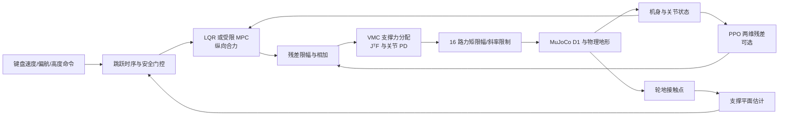

# Wheel-Legged Control Lab

[](https://github.com/LYHrmer/wheel-legged-control-lab/actions/workflows/tests.yml)

我用一台普通 Ubuntu 笔记本做的 D1 轮足控制练习。仓库从六状态教学模型开始，随后换成
`23 nq / 22 nv / 16 actuators` 的 D1 MuJoCo 整机；目前包含 VMC、LQR、受限 MPC、残差
PPO，以及一套可用键盘驾驶的多地形课程。物理频率 `500 Hz`，整机控制频率 `100 Hz`。

项目与本末科技的官方代码无关。公开 D1 资产有明确的 Apache-2.0 来源，仿真结果也没有被
包装成 sim-to-real 或数字孪生。


| 8° 坡道 | 受保护跳跃与 2 cm 横杆 |
|:---:|:---:|
|  |  |

## 先开起来

```bash
python3 -m venv .venv
source .venv/bin/activate
pip install -e ".[rl,dev]"

wheel-legged-d1-play
```

窗口打开后，按键会改变速度、转向或高度目标：

| 按键 | 动作 |
|---|---|
| `W / S` | 前进速度每次增减 `0.1 m/s`，范围 `-0.8…0.8 m/s` |
| `A / D` | 左/右偏航速度每次增减 `0.1 rad/s`，范围 `-0.6…0.6 rad/s` |
| `Q / E` | 降低/升高机身目标，每次 `1 cm` |
| `Space` | 请求一次带姿态和接触检查的跳跃 |
| `1…6` | 从起点、乱石、坡道、台阶、波浪路、跳跃道重新开始 |
| `X` | 清零前进与偏航命令 |
| `R / C / P / H` | 回起点、重置相机、暂停、显示帮助 |

D1 的四个轮子没有横向转向机构，所以 `A/D` 用左右轮差速改变航向，无法像麦克纳姆轮那样
横移。

若要现场比较经典控制和残差策略，可以加载仓库 checkpoint，再按 `L` 开关 PPO：

```bash
wheel-legged-d1-play --policy results/d1_residual_ppo/model.zip
```

策略在平地随机域中训练。跳跃、恢复、大偏航速度和明显斜坡超出训练范围，此时残差会自动
归零，终端状态显示为 `rl=gated`。checkpoint 加载前会核对基线、观察版本、奖励版本和
SHA-256。

## 地形课程的实测结果

所有行都由默认 LQR 基线在 `wheel-legged-d1-play --audit-output ...` 中重放。通过条件写在
代码和测试里，不能靠手工挑视频帧修改。

| 区域 | 通过 | 前进距离 [m] | 最大 Roll [deg] | 最大 Pitch [deg] | 四轮接触比例 | 控制步 P95 [ms] |
|---|---:|---:|---:|---:|---:|---:|
| 起点/转向区 | 1 | 1.28 | 2.36 | 8.40 | 0.893 | 1.17 |
| 12–32 mm 乱石 | 1 | 2.73 | 2.82 | 8.28 | 0.660 | 1.17 |
| 8° 坡道 | 1 | 4.91 | 0.04 | 10.50 | 0.989 | 1.00 |
| 15–75 mm 台阶 | 1 | 3.99 | 2.72 | 7.51 | 0.706 | 1.06 |
| 5–15 mm 波浪路 | 1 | 4.11 | 2.19 | 5.09 | 0.839 | 1.03 |
| 跳跃道 | 1 | 2.87 | 2.84 | 7.66 | 0.855 | 0.98 |

跳跃道的额外验收要求是四轮离地、机身峰值上升超过 `5 cm`，并让整车越过第一根横杆。
本次记录为上升 `6.77 cm`、越过 `1` 根 `2 cm` 横杆。后两根 `4/6 cm` 横杆保留给后续控制
实验，当前版本不声称已经通过。

同一探针改用 `--baseline mpc` 时通过起点、乱石、坡道和跳跃道，在台阶与波浪路上的前进
距离未达到门槛。MPC 求解本身正常，当前权重和 `0.2 s` 预测域对连续小障碍偏保守。

## 控制结构



VMC 根据四个轮地接触位置分配非负竖直支撑力，随后用 `JᵀF` 求腿关节力矩。外层状态为
`[distance, pitch, forward_speed, pitch_rate]`。距离由机身前向速度积分，转弯后不会继续
错误地追踪世界坐标 `x`。LQR 和 MPC 共用一套在“D1 + 接触 + VMC”工作点附近数值辨识的
离散模型。PPO 只修正纵向 `±45 N` 和竖直 `±80 N` 合力，接触分配和 16 路饱和仍由经典
控制层处理。

课程控制器还包含两项明确的保护：姿态过大时降低速度命令；机器人低速卡住且支撑面接近
水平时，短时放宽纵向合力上限。跳跃由蹲伏、推蹬、腾空、落地四段时序完成，没有直接改
基座位置或速度。

详细公式和代码入口见 [`docs/interactive_course.md`](docs/interactive_course.md) 与
[`docs/learning_guide.md`](docs/learning_guide.md)。

## 平地 LQR / MPC / PPO 对照

评估种子为 `21`。`push` 施加 `140 N × 0.12 s` 水平推力；`mismatch_delay` 同时改变质量、
阻尼、摩擦和执行器强度，并加入 `30 ms` 残差延迟与观察噪声。

| 控制器 | 场景 | 速度 RMSE [m/s] | Pitch RMSE [deg] | 高度 RMSE [mm] | 四轮接触比例 |
|---|---|---:|---:|---:|---:|
| D1 LQR+VMC | nominal | 0.263 | 0.930 | 13.73 | 0.987 |
| D1 MPC+VMC | nominal | 0.240 | 1.268 | 14.32 | 0.972 |
| D1 LQR+VMC+PPO | nominal | 0.250 | 0.853 | 13.30 | 0.998 |
| D1 LQR+VMC | push | 0.350 | 1.556 | 16.40 | 0.963 |
| D1 MPC+VMC | push | 0.344 | 2.055 | 16.28 | 0.918 |
| D1 LQR+VMC+PPO | push | 0.334 | 1.460 | 15.77 | 0.975 |
| D1 LQR+VMC | mismatch + delay | 0.252 | 0.905 | 13.17 | 0.990 |
| D1 MPC+VMC | mismatch + delay | 0.249 | 1.307 | 14.42 | 0.963 |
| D1 LQR+VMC+PPO | mismatch + delay | 0.252 | 0.847 | 13.17 | 0.997 |


MPC 的 P95 求解时间为 `0.3–0.6 ms`，低于 `10 ms` 控制周期。完整 CSV、曲线和动画在
[`results/d1_benchmark`](results/d1_benchmark/metrics.md)。

30 个随机域种子使用相同参数样本。LQR 和 PPO 均为 `0/30` 次摔倒，MPC 为 `1/30`：

| 控制器 | 速度 RMSE [m/s] | Pitch RMSE [deg] | 高度 RMSE [mm] |
|---|---:|---:|---:|
| D1 LQR+VMC | `0.328 ± 0.131` | `1.567 ± 0.956` | `10.080 ± 4.045` |
| D1 MPC+VMC | `0.294 ± 0.140` | `1.971 ± 2.231` | `11.024 ± 5.359` |
| D1 LQR+VMC+PPO | `0.322 ± 0.118` | `1.494 ± 0.729` | `9.859 ± 2.994` |

PPO−LQR 的配对差与 95% t 区间为速度 `-0.006 [-0.017, +0.005] m/s`、Pitch
`-0.073 [-0.209, +0.064]°`、高度 `-0.221 [-0.993, +0.550] mm`。三项均值都降低了，区间也
都跨过 0；当前 30 个样本不足以支持“统计显著优于 LQR”的说法。仓库保留这个结果以及
MPC 的一次失败。

## 重现实验

```bash
pytest

wheel-legged-d1-benchmark \
  --policy results/d1_residual_ppo/model.zip \
  --audit-episodes 30

wheel-legged-d1-play \
  --audit-output results/d1_interactive
```

无桌面环境时用 EGL 生成图像：

```bash
MUJOCO_GL=egl wheel-legged-d1-benchmark \
  --policy results/d1_residual_ppo/model.zip \
  --audit-episodes 30 \
  --gif

MUJOCO_GL=egl wheel-legged-d1-play \
  --demo-zone jump \
  --record results/d1_interactive/d1_jump_demo.gif
```

重新训练当前策略：

```bash
wheel-legged-train \
  --robot d1 \
  --baseline lqr \
  --steps 400000 \
  --envs 8 \
  --seed 7 \
  --device cpu \
  --output results/d1_residual_ppo
```

提交的模型因 PPO rollout 批次实际完成 `401408` 步。这台电脑使用 8 个 CPU 环境约需
3.5 分钟；小型 `128×128` MLP 的训练瓶颈主要在全身 MuJoCo 仿真。

## 代码地图

```text
src/wheel_legged_control/
├── model.py / controllers.py / env.py     # 六状态教学层
├── train.py                               # planar / D1 共用 PPO 入口
└── d1/
    ├── assets/                            # D1 URDF、STL 与原许可证
    ├── model.py / terrain.py              # 整机装配、接触和多地形课程
    ├── controllers.py                     # VMC、关节 PD、差速偏航
    ├── linear_model.py / hierarchical.py  # 数值辨识、LQR、MPC
    ├── env.py / rewards.py / policy.py    # 观察契约、奖励、checkpoint 校验
    ├── interactive.py                     # 键盘、跳跃、安全门控、录像与验收
    └── experiments.py                     # 固定场景、随机域审计与图表
tests/                                     # 29 项动力学、控制、策略接口和 Gym 测试
docs/                                      # 学习笔记、课程设计和模型审计
results/                                   # 当前 checkpoint、CSV、曲线和动画
```

平面入门实验仍可独立运行：

```bash
python examples/controller_walkthrough.py
python examples/reward_walkthrough.py
wheel-legged-benchmark --policy results/residual_ppo/model.zip --audit-episodes 20
```

## 模型来源和使用边界

D1 资产来自 Apache-2.0 授权的
[`Rangens/WMP-D1-loco`](https://github.com/Rangens/WMP-D1-loco)，固定到提交
`540e98d0a0c2212bc74908b98088b870a79e2f53`。结构和量级参考本末科技
[`D1 开发手册`](https://d1-development-manual-cn.readthedocs.io/zh-cn/latest/) 与公开
[`DDTRobot`](https://github.com/DDTRobot) 仓库；未复制许可证不明确的代码。本地
`d1h_wcd_description` 的检查记录在 [`docs/d1_model_card.md`](docs/d1_model_card.md)。

当前模型缺少电机电流环、热衰减、轮胎柔性、真实传感器同步、状态估计误差和 ROS2 通信
抖动。地形姿态估计目前读取 MuJoCo 接触点，跳跃只验证了低矮横杆。实机前还需要参数辨识、
估计器、通信超时、电流/姿态限制和硬件急停。
