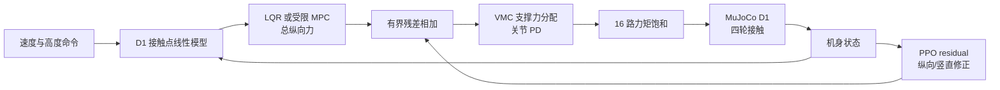

# Wheel-Legged Control Lab

[](https://github.com/LYHrmer/wheel-legged-control-lab/actions/workflows/tests.yml)

一个从六状态教学模型走到 16 执行器 D1 整机 MuJoCo 的轮足控制项目：低层 VMC 分配
四轮支撑力，接触平衡点数值辨识外层模型，再比较 LQR、受限 MPC 和 LQR 上的残差 PPO。
物理频率 `500 Hz`，整机控制频率 `100 Hz`。

这是独立学习项目，不是本末科技官方发布，也没有把仿真结果表述成 sim-to-real。


## 现在项目里有什么

| 层次 | 用途 | 状态/执行器 | 主要算法 |
|---|---|---|---|
| Planar teaching layer | 看懂线性化、Riccati、MPC QP 和奖励 | `6 / 2` | LQR、MPC、Residual PPO |
| D1 full-body layer | 验证接触、惯量、力矩饱和、延迟和随机化 | `23 nq / 22 nv / 16 actuators` | VMC、LQR、MPC、Residual PPO |

D1 层采用公开模型，仿真总质量 `48.1469 kg`。URDF 并不是只用来显示外观：碰撞体、
惯量、四个滚动轮、关节范围和每个执行器的力矩限制都进入物理计算。

## D1 固定场景结果

评估种子为 `21`。`push` 在运行中施加 `140 N × 0.12 s` 水平推力；
`mismatch_delay` 同时包含质量、阻尼、摩擦、执行器强度、30 ms 残差延迟与观测噪声。

| 控制器 | 场景 | 速度 RMSE [m/s] | Pitch RMSE [deg] | 高度 RMSE [mm] | 4 轮接触比例 |
|---|---|---:|---:|---:|---:|
| D1 LQR+VMC | nominal | 0.264 | 0.902 | 13.36 | 0.992 |
| D1 MPC+VMC | nominal | **0.244** | 1.320 | 14.81 | 0.973 |
| D1 LQR+VMC+PPO | nominal | 0.254 | **0.874** | **12.19** | **0.998** |
| D1 LQR+VMC | push | 0.345 | 1.528 | 16.32 | 0.965 |
| D1 MPC+VMC | push | 0.344 | 1.984 | 16.09 | 0.915 |
| D1 LQR+VMC+PPO | push | **0.330** | **1.430** | **14.94** | **0.972** |
| D1 LQR+VMC | mismatch + delay | **0.249** | 0.906 | 13.21 | 0.985 |
| D1 MPC+VMC | mismatch + delay | 0.252 | 1.321 | 14.38 | 0.972 |
| D1 LQR+VMC+PPO | mismatch + delay | 0.250 | **0.899** | **12.37** | 0.985 |

完整 CSV、时序图和求解耗时见
[`results/d1_benchmark`](results/d1_benchmark/metrics.md)。MPC 的 P95 求解时间约
`0.4–0.7 ms`，低于 `10 ms` 控制周期。

## 30-seed 随机域审计

三个控制器使用完全相同的 30 个种子。LQR 和 PPO 均为 0 次摔倒，MPC 为 1 次：

| 控制器 | 速度 RMSE [m/s] | Pitch RMSE [deg] | 高度 RMSE [mm] |
|---|---:|---:|---:|
| D1 LQR+VMC | `0.291 ± 0.111` | `1.245 ± 0.886` | `10.822 ± 4.345` |
| D1 MPC+VMC | `0.291 ± 0.151` | `1.898 ± 2.240` | `11.574 ± 5.289` |
| D1 LQR+VMC+PPO | **`0.285 ± 0.105`** | **`1.136 ± 0.642`** | **`9.902 ± 3.555`** |

PPO − LQR 的配对差及 95% t 置信区间分别为：速度
`-0.005 [-0.009, -0.002] m/s`、Pitch `-0.109 [-0.206, -0.013]°`、高度
`-0.920 [-1.455, -0.385] mm`。收益不大，但三个区间都没有跨过 0。项目保留了 MPC
随机域失败与 RL 的小幅收益，没有只挑有利指标。

## 控制结构



- VMC 解四个非负轮地支撑力，再通过 `JᵀF` 分配到每条腿；
- 外层状态为 `[x, pitch, vx, pitch_rate]`，输入为总纵向轮地力；
- LQR 与 MPC 使用同一个由完整 D1+VMC 数值辨识的离散模型；
- PPO 只输出 `±45 N` 纵向与 `±80 N` 竖直残差，不直接输出 16 维力矩；
- 随机化覆盖质量、阻尼、摩擦、执行器强度、初始姿态、推力、噪声和 `0–30 ms` 延迟。

算法推导、奖励每一项、观察向量与练习顺序见
[`docs/learning_guide.md`](docs/learning_guide.md)。模型来源与本地 URDF 审计见
[`docs/d1_model_card.md`](docs/d1_model_card.md)。

## 快速开始

```bash
python3 -m venv .venv
source .venv/bin/activate
pip install -e ".[rl,dev]"

pytest
wheel-legged-d1-benchmark \
  --policy results/d1_residual_ppo/model.zip \
  --audit-episodes 30
```

生成真实网格 GIF（Linux 无界面环境使用 EGL）：

```bash
MUJOCO_GL=egl wheel-legged-d1-benchmark \
  --policy results/d1_residual_ppo/model.zip \
  --gif
```

重新训练轻量残差 PPO：

```bash
wheel-legged-train \
  --robot d1 \
  --baseline lqr \
  --steps 150000 \
  --envs 8 \
  --device cpu \
  --output results/d1_residual_ppo
```

提交的 checkpoint 使用种子 `7`，请求 150k 步，按 PPO rollout 批次实际完成
`151552` 步。本机 8 个 CPU 环境实测约 3 分钟；这个小网络通常不是 GPU 瓶颈。

原来的平面入门实验仍可运行：

```bash
python examples/controller_walkthrough.py
python examples/reward_walkthrough.py
wheel-legged-benchmark --policy results/residual_ppo/model.zip --audit-episodes 20
```

## 目录

```text
src/wheel_legged_control/
├── model.py / controllers.py / env.py     # 六状态教学层
├── train.py                               # planar / D1 共用 PPO 入口
└── d1/
    ├── assets/                            # Apache-2.0 D1 URDF/STL 与许可证
    ├── model.py                           # MjSpec、浮动基座、16 执行器、域随机化
    ├── controllers.py                     # 关节 PD 与 VMC/JᵀF
    ├── linear_model.py                    # 接触闭环中心差分辨识
    ├── hierarchical.py                    # LQR+VMC、MPC+VMC
    ├── env.py / rewards.py                # 42 维观察、2 维残差、透明奖励
    └── experiments.py                     # 固定/随机评测、PNG、真实网格 GIF
tests/                                     # 19 个模型、控制、约束和 Gym API 测试
docs/                                      # 学习指南与模型卡
results/d1_benchmark/                      # 可复现指标、曲线和动画
```

## 模型来源与边界

D1 资产来自 Apache-2.0 授权的
[`Rangens/WMP-D1-loco`](https://github.com/Rangens/WMP-D1-loco)，固定到提交
`540e98d0a0c2212bc74908b98088b870a79e2f53`；改动和许可证见
[`THIRD_PARTY_NOTICES.md`](THIRD_PARTY_NOTICES.md)。结构与量级参考了本末科技
[`D1 开发手册`](https://d1-development-manual-cn.readthedocs.io/zh-cn/latest/) 和公开
[`DDTRobot`](https://github.com/DDTRobot) 仓库，但没有复制无明确许可证的代码。

当前仍不是数字孪生：没有电机电流环、热衰减、轮胎柔性、真实 IMU/编码器同步、状态估计
误差和 ROS2 通信抖动。下一阶段应先加入 EKF/延迟状态反馈与参数辨识，再讨论官方
sim2sim 或实机安全部署。
