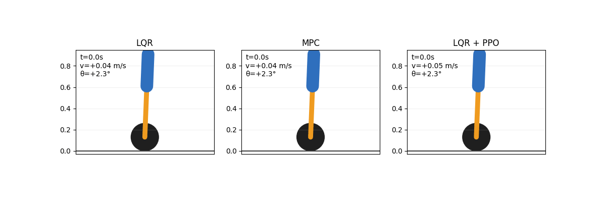
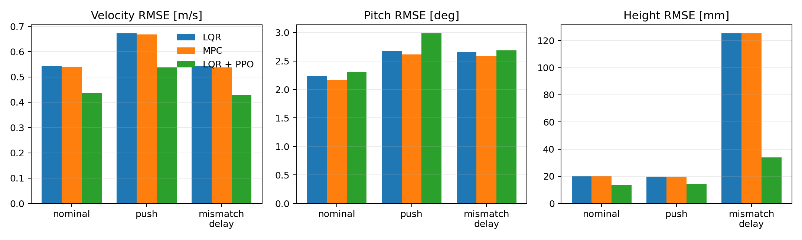
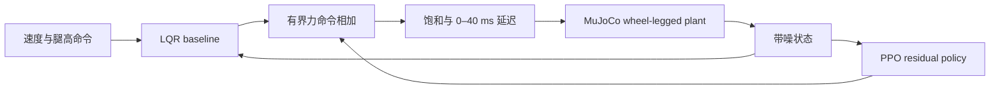

# Wheel-Legged Control Lab

[](https://github.com/LYHrmer/wheel-legged-control-lab/actions/workflows/tests.yml)

一个可复现的轮足机器人学习增强控制项目。项目在 MuJoCo 中实现平面轮式倒立摆与
对称伸缩腿模型，对比离散 LQR、带输入约束的线性 MPC，以及在 LQR 上叠加的残差 PPO。
物理仿真频率为 500 Hz，控制与策略推理频率为 50 Hz。





## 核心结果

固定评估种子为 `11`。`mismatch_delay` 将躯干质量增加 25%、阻尼增加 35%，并加入
40 ms 控制延迟、传感器噪声和一次外力扰动。

| 控制器 | 场景 | 速度 RMSE [m/s] | Pitch RMSE [deg] | 高度 RMSE [mm] | 求解 P95 [ms] |
|---|---|---:|---:|---:|---:|
| LQR | nominal | 0.544 | 2.236 | 20.31 | 0.000 |
| MPC | nominal | 0.540 | 2.169 | 20.32 | 0.417 |
| LQR + PPO | nominal | **0.436** | 2.309 | **13.74** | 0.000 |
| LQR | push | 0.672 | **2.680** | 19.75 | 0.000 |
| MPC | push | 0.668 | **2.615** | 19.77 | 0.434 |
| LQR + PPO | push | **0.538** | 2.984 | **14.10** | 0.000 |
| LQR | mismatch + delay | 0.543 | **2.663** | 125.23 | 0.000 |
| MPC | mismatch + delay | 0.538 | **2.586** | 125.23 | 0.637 |
| LQR + PPO | mismatch + delay | **0.429** | 2.687 | **33.76** | 0.000 |

残差策略明显改善速度和腿高跟踪，尤其将参数失配场景的高度 RMSE 从 `125.23 mm`
降到 `33.76 mm`；代价是抗扰场景的 Pitch RMSE 和控制努力略有增加。项目保留这一
权衡，而不是只报告 RL 占优的指标。完整数据见
[benchmark metrics](results/benchmark/metrics.md)。

另用 20 个成对随机种子进行域随机化审计，三个控制器均无摔倒。残差 PPO 相对 LQR
将平均速度 RMSE 从 `0.565` 降至 `0.480 m/s`，高度 RMSE 从 `99.28` 降至
`22.38 mm`，但 Pitch RMSE 从 `2.471°` 增至 `2.557°`。均值与标准差见
[randomized-domain audit](results/benchmark/randomized_audit.md)。

## 控制架构



- 状态：`[x, pitch, leg_extension, x_dot, pitch_dot, leg_dot]`。
- 控制：等效双轮水平力与对称腿部推力。
- LQR：MuJoCo 动力学数值线性化、零阶保持离散化、DARE 求解。
- MPC：20 步预测时域、终端 Riccati 代价、执行器 box constraints、50 Hz 重规划。
- PPO：只输出 `±18 N` 轮端残差和 `±35 N` 腿部残差，不直接接管全控制量。
- 随机化：躯干质量、关节阻尼、测量噪声、控制延迟、初始姿态和随机推力。

公式、权重、源码对应关系和循序渐进的练习见
[入门学习指南](docs/learning_guide.md)。

## 推荐学习顺序

1. 运行 `examples/controller_walkthrough.py`，确认开环不稳定、LQR 闭环稳定。
2. 阅读数值线性化和 LQR，再修改 `Q/R` 观察响应变化。
3. 学习 MPC 的预测矩阵、输入约束与 warm start。
4. 运行 `examples/reward_walkthrough.py`，逐项理解奖励而不是盲调权重。
5. 最后训练 PPO，并用固定场景和 20-seed 随机域审计验收。


## 快速开始

```bash
python3 -m venv .venv
source .venv/bin/activate
pip install -e ".[rl,dev]"

pytest
wheel-legged-benchmark \
  --policy results/residual_ppo/model.zip \
  --audit-episodes 20 \
  --gif
```

重新训练 PPO：

```bash
wheel-legged-train \
  --steps 300000 \
  --envs 8 \
  --device cpu \
  --output results/residual_ppo
```

这里的瓶颈主要是 MuJoCo 仿真而不是小型 MLP，因此在该项目上 CPU 并行通常比把
网络放到独立显卡更高效。训练结束后再次运行 benchmark 即可更新 CSV、Markdown、
曲线和 GIF。

## 项目结构

```text
src/wheel_legged_control/
├── assets/wheel_legged_planar.xml  # MuJoCo 模型
├── model.py                        # plant、域随机化、数值线性化
├── controllers.py                  # LQR 与 constrained linear MPC
├── env.py                          # Gymnasium residual-RL 环境
├── train.py                        # Stable-Baselines3 PPO 训练
└── experiments.py                  # 对照实验、指标、PNG、GIF
tests/                              # 动力学、稳定性和 Gym API 测试
docs/learning_guide.md              # 算法、奖励、训练与练习
examples/                            # 可边读边运行的最小示例
results/benchmark/                  # 可复现实验产物
```

## 为什么不是端到端力矩策略

这个仓库面向控制算法岗位。稳定基线负责局部平衡和执行器约束，学习策略专注于参数失配、
延迟及非线性补偿。这样既能进行经典控制与学习控制的消融，也能限制探索动作。纯 PPO
可以作为后续对照，但不是默认安全架构。

## 已知局限

- 当前是三自由度平面降阶模型，不包含横滚、偏航和独立左右腿控制。
- 轮端使用“轮力 = 双轮力矩 / 半径”的等效输入；可视轮没有显式滚动接触动力学。
- 质量失配带来的恒定腿部载荷也可以用积分器或扰动观测器补偿；后续应加入 LQI/ESO
  作为更强的经典基线，避免把所有稳态收益归因于 RL。
- 尚未建模电机电流环、编码器量化、通信抖动和真实机构间隙。
- 当前结果来自仿真，不能表述为 Sim-to-Real 已完成。

适合继续扩展的方向是三维双轮接触、VMC/WBC、扰动观测器、ROS2 controller，以及
在实机参数辨识后重新训练残差策略。
