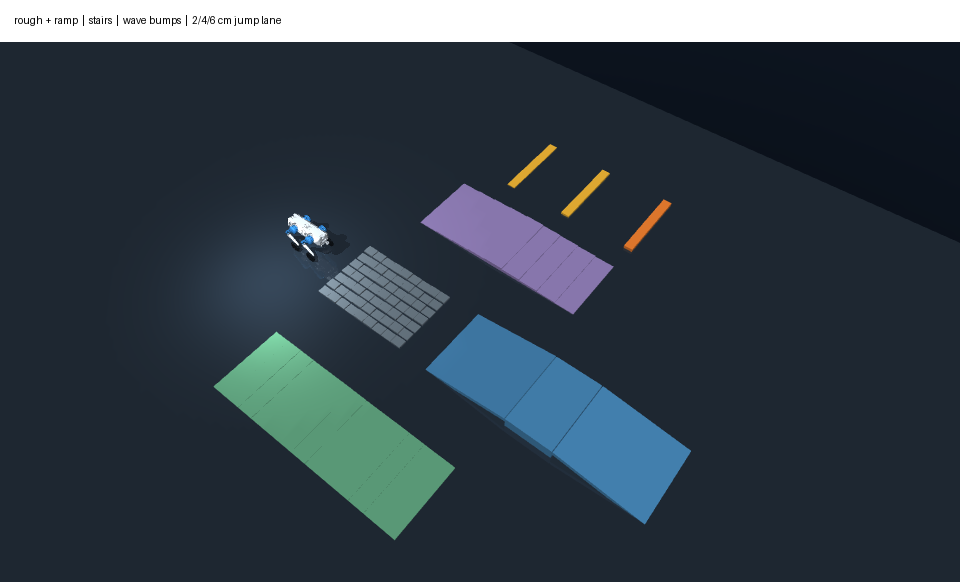
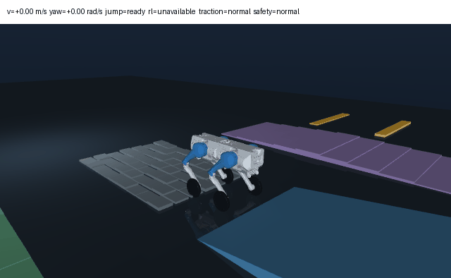
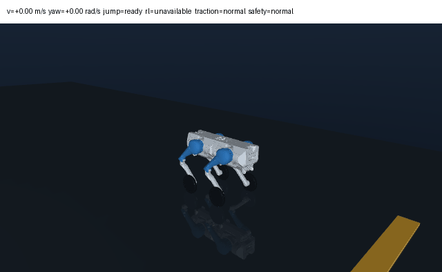
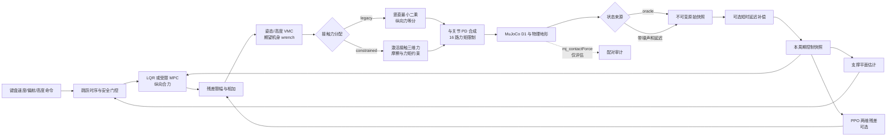
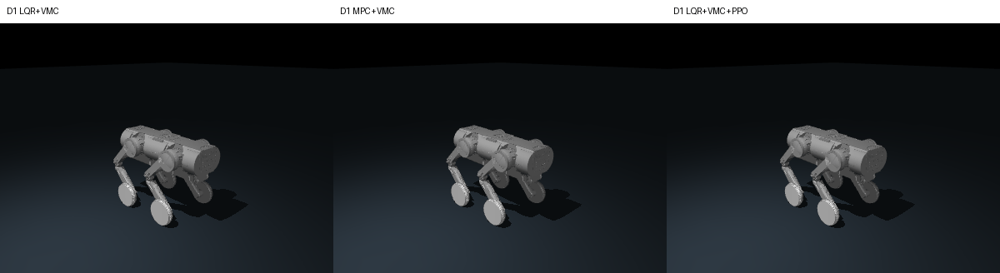
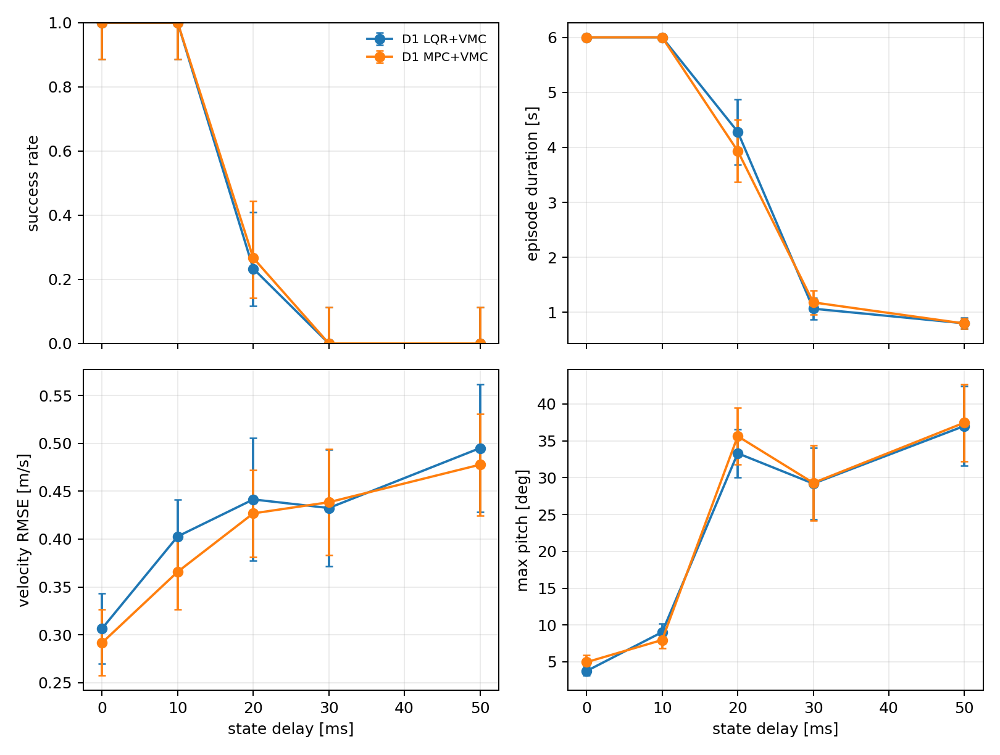
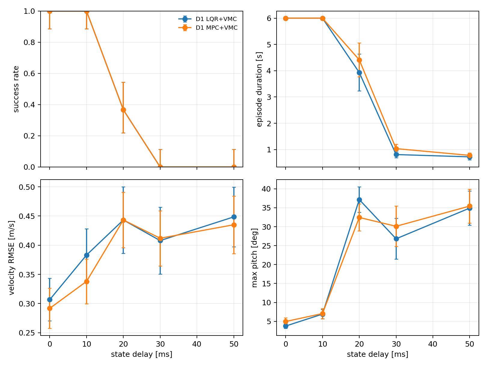

# Wheel-Legged Control Lab

[](https://github.com/LYHrmer/wheel-legged-control-lab/actions/workflows/tests.yml)

我用一台普通 Ubuntu 笔记本做的 D1 轮足控制练习。仓库从六状态教学模型开始，随后换成
`23 nq / 22 nv / 16 actuators` 的 D1 MuJoCo 整机。项目主要回答四个问题：经典控制在这套
模型和地形上能做到什么，接触约束是否改善力分配，残差 PPO 是否稳定优于 LQR，以及状态
延迟怎样改变闭环裕量。
物理频率为 `500 Hz`，整机控制频率为 `100 Hz`。

项目与本末科技的官方代码无关。公开 D1 资产有明确的 Apache-2.0 来源。本文只报告 MuJoCo
仿真结果，不主张 sim-to-real 或数字孪生。

| 边界 | 内容 |
|---|---|
| 复用 | 固定提交的 D1 URDF/STL、MuJoCo、SciPy、Gymnasium、Stable-Baselines3 |
| 本项目实现 | MuJoCo 整机装配、VMC、约束接触力分配、分配路径匹配的闭环辨识、LQR/MPC、残差 PPO、状态快照与误差通道、地形课程和配对评测 |
| 尚未实现 | IMU/编码器融合、ROS2 硬件链路、实机参数辨识与 sim-to-real |

当前有三条可以由仓库结果核对的结论：

- `oracle`/LQR 通过六个课程探针；MPC 通过五个，默认参数未达到台阶进度门槛；
- 30 个随机域种子中，已提交 PPO 相对 LQR 的三个主要误差区间均跨过 0，平均奖励还低
  `0.047`，配对区间为 `[-0.071, -0.022]`；这个 checkpoint 没有通过晋级门；
- `estimated`/LQR 与 MPC 在 `10 ms` 延迟下均为 `30/30` 成功；到 `20 ms` 已明显失稳，常速度
  外推提高了成功数，但配对区间仍跨过 0，不能算作延迟裕量已经改善。

代码主线见[控制结构](#控制结构)，评测口径见
[`docs/evaluation_protocol.md`](docs/evaluation_protocol.md)，状态时序见
[`docs/state_estimation.md`](docs/state_estimation.md)，接触分配推导见
[`docs/contact_allocation.md`](docs/contact_allocation.md)。



| 8° 坡道 | 受保护跳跃与 2 cm 横杆 |
|:---:|:---:|
|  |  |

## 先开起来

```bash
python3 -m venv .venv
source .venv/bin/activate
pip install -e ".[rl,dev]"

wheel-legged-d1-play
```

默认入口保留原来的 `legacy` 分配。下面的命令启用接触约束版本：

```bash
wheel-legged-d1-play --contact-allocation constrained
```

窗口打开后，按键会改变速度、转向或高度目标：

| 按键 | 动作 |
|---|---|
| `W / S` | 前进速度每次增减 `0.1 m/s`，范围 `-0.8…0.8 m/s` |
| `A / D` | 左/右偏航速度每次增减 `0.1 rad/s`，范围 `-0.6…0.6 rad/s` |
| `Q / E` | 降低/升高机身目标，每次 `1 cm` |
| `Space` | 请求一次带姿态和接触检查的跳跃 |
| `1…6` | 从起点、乱石、坡道、台阶、波浪路、跳跃道重新开始 |
| `X` | 清零前进与偏航命令 |
| `R / C / P / H` | 回起点、重置相机、暂停、显示帮助 |

D1 的四个轮子没有横向转向机构，所以 `A/D` 用左右轮差速改变航向，无法像麦克纳姆轮那样
横移。

若要现场比较经典控制和残差策略，可以加载仓库 checkpoint，再按 `L` 开关 PPO：

```bash
wheel-legged-d1-play --policy results/d1_residual_ppo/model.zip
```

策略在平地随机域中训练。跳跃、恢复、大偏航速度和明显斜坡超出训练范围，此时残差会自动
归零，终端状态显示为 `rl=gated`。checkpoint 加载前会核对基线、观察版本、奖励版本、
状态模式、延迟补偿、接触分配模式和 SHA-256。

仓库提交的是 `oracle` 专用、旧元数据格式 checkpoint；它的
[`training_config.json`](results/d1_residual_ppo/training_config.json) 记录了 `401408` 个实际训练
步和模型 SHA-256 `53c3b0e9…a2b5f`。旧配置缺少的状态、延迟和分配字段按
`oracle / none / legacy` 读取。因此它不能装进 `estimated` 或 `constrained` 控制回路；这些
配置需要分别训练和评估。

要让整条控制链承受状态噪声和 `20 ms` 延迟，可以直接运行：

```bash
wheel-legged-d1-play \
  --state-mode estimated \
  --state-delay-steps 2 \
  --sensor-noise 1.0
```

当前 `estimated` adapter 是可复现的状态误差/延迟通道，不是 IMU+编码器 EKF。接口、时序和
使用边界见 [`docs/state_estimation.md`](docs/state_estimation.md)。

短延迟时，也可以按快照中的机身速度、角速度和关节速度做一阶外推：

```bash
wheel-legged-d1-play \
  --state-mode estimated \
  --state-delay-steps 2 \
  --sensor-noise 1.0 \
  --latency-compensation constant_velocity
```

外推不会改写测量时间。延迟队列填满后，界面中的状态年龄稳定在 `20 ms`。

## 地形课程的实测结果

下表来自 `wheel-legged-d1-play --state-mode oracle --contact-allocation legacy --audit-output ...`
的 LQR 重放。通过阈值在 `run_scripted_demo()` 和对应 pytest 中；`estimated` 与 constrained
模式还没有生成同一组课程结果。

| 区域 | 通过 | 前进距离 [m] | 最大 Roll [deg] | 最大 Pitch [deg] | 四轮接触比例 | 控制步 P95 [ms] |
|---|---:|---:|---:|---:|---:|---:|
| 起点/乱石入口 | 1 | 1.32 | 2.48 | 6.23 | 0.917 | 1.62 |
| 12–32 mm 乱石 | 1 | 2.82 | 2.52 | 6.59 | 0.676 | 1.72 |
| 8° 坡道 | 1 | 4.89 | 0.04 | 10.49 | 0.991 | 1.33 |
| 15–75 mm 台阶 | 1 | 4.07 | 2.52 | 7.81 | 0.707 | 1.60 |
| 5–15 mm 波浪路 | 1 | 5.37 | 1.63 | 5.07 | 0.742 | 1.45 |
| 跳跃道 | 1 | 2.98 | 3.11 | 10.72 | 0.851 | 1.30 |

跳跃道的额外验收要求是四轮离地、机身峰值上升超过 `5 cm`，并让整车越过第一根横杆。
本次记录完成 `1` 次四轮离地，峰值上升 `6.83 cm`；最终基座超过前两根横杆末端。验收仍只
要求第一根，`6 cm` 横杆没有通过。

同一探针改用 `--baseline mpc` 时通过五个区域，台阶前进 `3.21 m`，低于 `3.5 m` 门槛；
其余五区通过。结果保存在 [`results/d1_interactive_mpc`](results/d1_interactive_mpc/course_metrics.md)。
外层 MPC 没有出现求解失败；当前权重和 `0.2 s` 预测域对连续台阶偏保守。

## 控制结构



`legacy` 路径保留原来的四轮竖直最小二乘和纵向力等分。`constrained` 路径只给激活接触
分配三维力，并约束单向法向力、保守摩擦棱锥和 PD 力矩之外的剩余执行器余量。
legacy 使用轮体质心 Jacobian 并单独叠加轮轴驱动力矩；constrained 使用接触点 Jacobian
映射三维接触力。外层状态为
`[distance, pitch, forward_speed, pitch_rate]`。距离由机身前向速度积分，转弯后不会继续
错误地追踪世界坐标 `x`。外层模型会经过所选低层分配路径重新辨识；legacy 和 constrained
的默认 LQR 输入权重分别为 `1e-8` 和 `1e-6`。因此配对审计比较的是两套模式匹配的闭环配置，
不把差异归因给单个分配器。PPO 只修正纵向 `±45 N` 和竖直 `±80 N` 合力，接触分配和 16 路
饱和仍由经典控制层处理。

benchmark 另从 MuJoCo `mj_contactForce` 汇总实际轮地 wrench，并在同一 `base_link` 参考点
上平均每个 `10 ms` 控制周期内的 `5 × 2 ms` 物理子步。该数据只进入评估，不反馈给控制器。

课程控制器还包含两项明确的保护：姿态过大时降低速度命令；机器人低速卡住且支撑面接近
水平时，短时放宽纵向合力上限。跳跃由蹲伏、推蹬、腾空、落地四段时序完成，没有直接改
基座位置或速度。

状态接口见 [`docs/state_estimation.md`](docs/state_estimation.md)。控制公式和课程入口见
[`docs/interactive_course.md`](docs/interactive_course.md) 与
[`docs/learning_guide.md`](docs/learning_guide.md)；场景、成功定义和统计方法统一放在
[`docs/evaluation_protocol.md`](docs/evaluation_protocol.md)。

## 接触力分配对照

先用开发种子检查实验流程：

```bash
wheel-legged-d1-contact-audit --seed 21 --episodes 3 --output results/contact_dev
```

脚本对相同随机域分别运行 legacy 和 constrained，保存逐回合 CSV、配对差置信区间、
验收门和运行清单。控制器请求、分配器解出的 wrench、MuJoCo 实际轮地 wrench 分开记录，
力与力矩也分别统计。模式匹配的辨识模型和 LQR 权重一起切换，因此这是整套配置对照。

正式评估预留种子 `121…150`，命令为
`wheel-legged-d1-contact-audit --seed 121 --episodes 30 --output results/d1_contact_allocation`。
开发中遇到的失稳、求解器退出和权重选择记录在
[`docs/contact_allocation_development.md`](docs/contact_allocation_development.md)。

## 平地 LQR / MPC / PPO 对照

这张表保留 `oracle` 模式的回归结果，评估种子为 `21`。`push` 施加
`140 N × 0.12 s` 水平推力；`mismatch_delay` 同时改变质量、阻尼、摩擦和执行器强度，
并加入 `30 ms` 残差动作延迟与 PPO 观察噪声。LQR、MPC 和 VMC 在这组旧实验中仍读取
无延迟状态快照。该批结果和所用 PPO checkpoint 都属于 `contact_allocation=legacy`。

| 控制器 | 场景 | 速度 RMSE [m/s] | Pitch RMSE [deg] | 高度 RMSE [mm] | 四轮接触比例 |
|---|---|---:|---:|---:|---:|
| D1 LQR+VMC | nominal | 0.256 | 0.930 | 13.77 | 0.987 |
| D1 MPC+VMC | nominal | 0.240 | 1.267 | 14.31 | 0.973 |
| D1 LQR+VMC+PPO | nominal | 0.250 | 0.854 | 13.29 | 0.998 |
| D1 LQR+VMC | push | 0.349 | 1.586 | 16.48 | 0.965 |
| D1 MPC+VMC | push | 0.343 | 2.040 | 16.28 | 0.918 |
| D1 LQR+VMC+PPO | push | 0.331 | 1.446 | 15.71 | 0.975 |
| D1 LQR+VMC | mismatch + delay | 0.270 | 0.940 | 10.11 | 0.990 |
| D1 MPC+VMC | mismatch + delay | 0.252 | 1.340 | 11.31 | 0.967 |
| D1 LQR+VMC+PPO | mismatch + delay | 0.249 | 0.887 | 9.87 | 0.995 |



外层 MPC 的 P95 求解时间为 `0.3–0.6 ms`，低于 `10 ms` 控制周期。完整 CSV、曲线和动画在
[`results/d1_benchmark`](results/d1_benchmark/metrics.md)。同目录的
[`benchmark_manifest.json`](results/d1_benchmark/benchmark_manifest.json) 是完成标记，记录
最终 CSV 行数、运行 provenance 和每个产物的 SHA-256。

30 个随机域种子使用相同参数样本。LQR 和 PPO 均为 `0/30` 次摔倒，MPC 为 `1/30`：

| 控制器 | 速度 RMSE [m/s] | Pitch RMSE [deg] | 高度 RMSE [mm] |
|---|---:|---:|---:|
| D1 LQR+VMC | `0.326 ± 0.124` | `1.490 ± 0.824` | `9.745 ± 3.491` |
| D1 MPC+VMC | `0.298 ± 0.152` | `2.162 ± 3.216` | `11.429 ± 9.387` |
| D1 LQR+VMC+PPO | `0.327 ± 0.121` | `1.511 ± 0.789` | `9.725 ± 3.262` |

PPO−LQR 的配对差与 95% t 区间为速度 `+0.001 [-0.009, +0.011] m/s`、Pitch
`+0.021 [-0.054, +0.096]°`、高度 `-0.020 [-0.622, +0.582] mm`。三个误差区间都跨过 0。
平均奖励差为 `-0.047 [-0.071, -0.022]`，这一项明确变差。仓库保留该 checkpoint 用于演示
残差接口和复现实验，不把它列为优于 LQR 的结果；MPC 的一次失败也保留在 CSV 中。

## 状态延迟灵敏度

代码当前固定测试 `0/10/20/30/50 ms`，汇总程序按这五个点生成配对结果。动作延迟和传感器
噪声都设为零，只改变状态年龄。每个延迟点复用同一组评测种子；程序核对域参数、动作延迟、
噪声、估计器种子以及初态、初始命令和计划推力的指纹。下列已提交结果使用 legacy 分配。

正式结果来自干净提交 `92b8785`，每个条件使用同一组 30 个评测种子。连续误差只描述摔倒前
片段，因此下表先列成功数和平均存活时长：

| 控制器 | 延迟 [ms] | Raw 成功 | 补偿成功 | Raw / 补偿存活 [s] | 补偿实际应用比例 |
|---|---:|---:|---:|---:|---:|
| LQR+VMC | 0 | 30/30 | 30/30 | 6.000 / 6.000 | 0.000 |
| LQR+VMC | 10 | 30/30 | 30/30 | 6.000 / 6.000 | 0.999 |
| LQR+VMC | 20 | 7/30 | 11/30 | 4.283 / 3.931 | 0.329 |
| LQR+VMC | 30 | 0/30 | 0/30 | 1.066 / 0.810 | 0.418 |
| LQR+VMC | 50 | 0/30 | 0/30 | 0.800 / 0.723 | 0.390 |
| MPC+VMC | 0 | 30/30 | 30/30 | 6.000 / 6.000 | 0.000 |
| MPC+VMC | 10 | 30/30 | 30/30 | 6.000 / 6.000 | 0.999 |
| MPC+VMC | 20 | 8/30 | 11/30 | 3.934 / 4.414 | 0.314 |
| MPC+VMC | 30 | 0/30 | 0/30 | 1.180 / 1.036 | 0.351 |
| MPC+VMC | 50 | 0/30 | 0/30 | 0.796 / 0.778 | 0.360 |

`20 ms` 时，补偿相对 raw 的成功率配对差为 LQR `+0.133 [-0.100, +0.367]`、MPC
`+0.100 [-0.167, +0.333]`，两个区间都跨过 0。`10 ms` 时，两种控制器保持全成功，速度
RMSE 分别降低 `0.020` 和 `0.028 m/s`，平均机械功率降低约 `82` 和 `77 W`。到 `20 ms`，
约三分之二的控制步因腿关节预测越界而拒绝外推，功率反而上升。当前证据只支持“短延迟下
一阶外推能减小部分误差”；它没有把稳定工作范围可靠地推过 `20 ms`。

| Raw delayed state | Constant-velocity compensation |
|:---:|:---:|
|  |  |

完整逐回合记录、全部指标与区间在
[`results/d1_state_delay_raw`](results/d1_state_delay_raw/state_delay_sensitivity.md) 和
[`results/d1_state_delay_compensated`](results/d1_state_delay_compensated/state_delay_sensitivity.md)。
复现命令如下：

```bash
wheel-legged-d1-benchmark \
  --state-delay-sweep \
  --state-mode estimated \
  --latency-compensation none \
  --contact-allocation legacy \
  --audit-episodes 30 \
  --seed 21 \
  --no-policy \
  --output results/d1_state_delay_raw

wheel-legged-d1-benchmark \
  --state-delay-sweep \
  --state-mode estimated \
  --latency-compensation constant_velocity \
  --contact-allocation legacy \
  --audit-episodes 30 \
  --seed 21 \
  --no-policy \
  --output results/d1_state_delay_compensated
```

两个目录分别生成逐回合 CSV、成功与存活时长、相对 `0 ms` 的配对区间和四联图。

## 重现实验

```bash
pytest

MUJOCO_GL=egl wheel-legged-d1-benchmark \
  --state-mode oracle \
  --contact-allocation legacy \
  --policy results/d1_residual_ppo/model.zip \
  --audit-episodes 30 \
  --gif \
  --output results/d1_benchmark

wheel-legged-d1-play \
  --state-mode oracle \
  --contact-allocation legacy \
  --audit-output results/d1_interactive
```

无桌面环境时用 EGL 生成图像：

```bash
MUJOCO_GL=egl wheel-legged-d1-play \
  --demo-zone jump \
  --record results/d1_interactive/d1_jump_demo.gif
```

重新训练当前策略：

```bash
wheel-legged-train \
  --robot d1 \
  --baseline lqr \
  --state-mode oracle \
  --contact-allocation legacy \
  --steps 400000 \
  --envs 8 \
  --seed 7 \
  --runs 1 \
  --device cpu \
  --output results/d1_residual_ppo
```

提交的模型因 PPO rollout 批次实际完成 `401408` 步。这台电脑使用 8 个 CPU 环境约需
3.5 分钟；小型 `128×128` MLP 的训练瓶颈主要在全身 MuJoCo 仿真。

带噪延迟状态应单独训练多个 seed：

```bash
wheel-legged-train \
  --robot d1 \
  --baseline lqr \
  --state-mode estimated \
  --latency-compensation none \
  --contact-allocation legacy \
  --steps 400000 \
  --envs 8 \
  --seed 7 \
  --runs 5 \
  --device cpu \
  --output results/d1_estimated_ppo
```

8 个并行环境会占用连续环境 seed。五次训练写入 `seed_0007`、`seed_0015`、
`seed_0023`、`seed_0031` 和 `seed_0039`，随机流不重叠。每次训练都保存状态模式、训练开始
时的源码 commit/dirty 指纹、Python 与关键依赖版本、实际设备、实际步数和模型 SHA-256。

## 代码地图

```text
src/wheel_legged_control/
├── model.py / controllers.py / env.py     # 六状态教学层
├── train.py                               # planar / D1 共用 PPO 入口
└── d1/
    ├── assets/                            # D1 URDF、STL 与原许可证
    ├── model.py / terrain.py              # 整机装配、接触和多地形课程
    ├── state_estimation.py                # 状态快照、带噪延迟来源与短时外推
    ├── controllers.py / contact_allocation.py  # VMC、关节 PD 与接触力分配
    ├── linear_model.py / hierarchical.py  # 数值辨识、LQR、MPC
    ├── env.py / rewards.py / policy.py    # 观察契约、奖励、checkpoint 校验
    ├── interactive.py                     # 键盘、跳跃、安全门控、录像与验收
    └── experiments.py / contact_audit.py  # 固定场景、配对审计、延迟曲线与图表
tests/                                     # 动力学、状态接口、控制、评测元数据和 Gym 测试
docs/                                      # 学习笔记、课程设计和模型审计
results/                                   # 当前 checkpoint、CSV、曲线和动画
```

平面入门实验仍可独立运行：

```bash
python examples/controller_walkthrough.py
python examples/reward_walkthrough.py
wheel-legged-benchmark --policy results/residual_ppo/model.zip --audit-episodes 20
```

## 模型来源和使用边界

D1 资产来自 Apache-2.0 授权的
[`Rangens/WMP-D1-loco`](https://github.com/Rangens/WMP-D1-loco)，固定到提交
`540e98d0a0c2212bc74908b98088b870a79e2f53`。结构和量级参考本末科技
[`D1 开发手册`](https://d1-development-manual-cn.readthedocs.io/zh-cn/latest/) 与公开
[`DDTRobot`](https://github.com/DDTRobot) 仓库；未复制许可证不明确的代码。本地
`d1h_wcd_description` 的检查记录在 [`docs/d1_model_card.md`](docs/d1_model_card.md)。

当前 `estimated` 模式只有可复现的整状态噪声、延迟和常速度外推，没有 IMU/编码器融合、
bias、丢包或真实传感器同步。每个车轮的多个接触点被近似成一个平均点；分配器逐步求解静力
wrench，没有接触力变化率约束。SLSQP 也不是专用实时 QP 求解器。MuJoCo contact wrench 是
仿真评估数据，不是传感器读数。模型还缺少电机电流环、热衰减、轮胎柔性和 ROS2 通信抖动。
跳跃只验证了低矮横杆。实机前还要做参数辨识、真正的估计器、通信超时、电流/姿态限制和
硬件急停。
