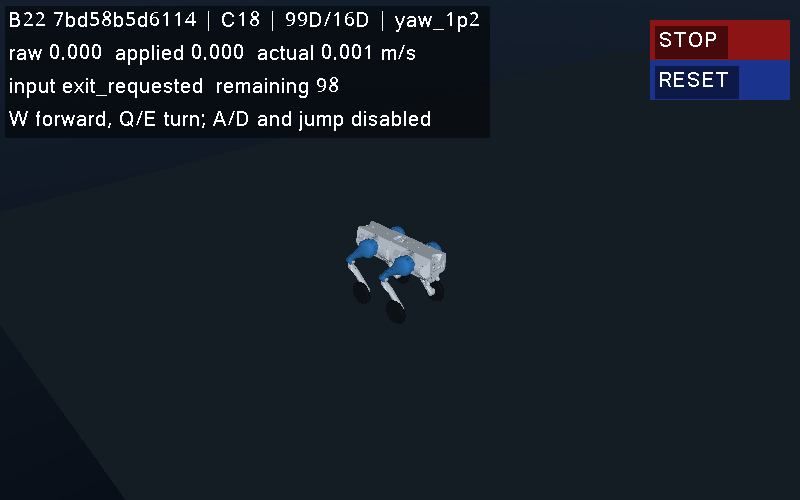
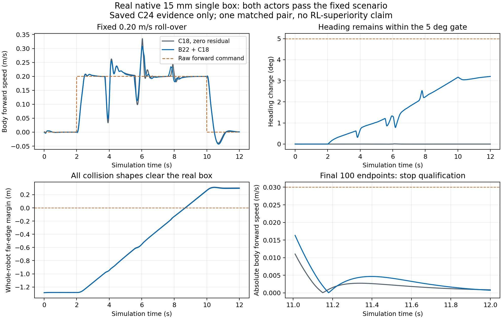

# B22 GUI 与真实 15 mm 单台阶交付

本次沿用唯一 B22 权重 `7bd58b5d6114745b12b4284be3f861f973a5d31d9d596365a5b54cb5e0d76691`、C18 combined 基控、99 维观测和 16 维残差，没有新增训练。实际 Astra ultra 制定及审阅合同，Sol 实现 GUI，root 执行测试、模型、物理、归档和集成。旧 77 份冻结文件及历史实验保持原样。

**B22 GUI 与真实 15 mm 碰撞台阶的有界仿真验收均已完成。**启动命令和操作范围见 [B22 窗口说明](b22_gui.md)。

## GUI 验收与修复记录

C23 固定低速脚本使用同一 B22 权重，在无窗口与真实 GLFW 窗口各运行 600 控制步。独立回读对初态、99 维观测、16 维动作、控制和 3000 个原生子步等 24 类数值逐项核对，一致性检查全部通过。窗口实时系数为 0.96694，实际约 11.76 FPS；轮询间隔 p95 为 176.27 ms，显示快照年龄 p95 为 199.82 ms。两次物理结果说明该显示路径保持了对应的数值轨迹。

原无窗口实时系数 0.78847 未达到 0.8，原脚本的末 100 点停车窗也没有全部落在制动完成后；这些原门限失败保留。脚本记录用于数值同轨检查，完整停止、复位、失焦和输入过期验收由键盘合同承担。

C23 的首次键盘会话实际执行 1005 控制步。机器人保持物理安全，所有控制拍均有对应观测与输入准备记录；但该会话不合格：实时系数 0.64123，显示快照年龄 p95 为 3880.87 ms，28 个实际回调只能匹配原计划的 26/27 项，末 100 点还包含两点尚未清零的伺服速度。

保存记录揭示两项测试设计问题：失焦时 GLFW 自动释放 W，之后重复要求释放已松开的 W 不会再产生回调；Esc 的原退出时间也未为末 100 点停车窗留下足够余量。旧读取器贪心匹配还把后一次合法 W 松键误配给了前一次冗余事件。新读取器保留原时间界限，按全局时间顺序进行一对一匹配，旧结果仍判定失败。

另外，R 的复位边界出现 4.5116 s 的控制暂停，同期窗口持续轮询并重复显示旧状态。完整旧 native/control 数据的纯归档重放测得：gzip 9 的同步写入为 3.5903 s，gzip 1 为 1.9434 s；节省的 1.6469 s 不足以满足原性能门，因此没有为这个候选追加物理试跑。C25 采用单独的有限修复合同，将原 gzip 9 压缩及持久化留到控制结束后，由原 owner 线程完成；只有所有原始记录与事务清单成功写入才能通过。复位等待仍计入原活动时钟。

纯数据重放中，延期归档入队耗时 1.104 ms，最终两份 gzip 解压字节、状态数组的 dtype/shape/字节和复位 JSON 全部与旧记录一致，事务清单有效且没有待写任务。另一次 2 秒真实 GLFW/XTest 输入探针没有加载模型或推进物理，确认重复按下仍被 Xserver 视为按住的 W 不会产生新回调。因此最终 C25 预注册 27 次 OS 注入：26 个有意义回调必须全部匹配，510 点单独作为 OS 按键释放清理，还须核实失焦自动释放、回焦后已松键快照和后续重新按下的完整链。旧 C23 的 27 回调合同依然失败。新 Escape 固定在 1100 点，最多 1200 控制步，末 100 点停车门限不变。

C25 的有界复验执行了 1102 控制步 / 5510 正常原生子步 / 2 次冷构造子步，但仍判失败。延期归档实际需要 11.2510 s，超过主线程旧有的固定 8 s 等待；两段物理归档虽已完整落盘，主线程的输入、渲染、性能及最终模型调用回执没有完成，不能据此恢复验收资格。C26 只修复 owner 退出同步：使用启动时已经确定的 115 s 绝对收尾期限，确认 owner 退出后才序列化共享证据，120 s 硬上限不变。实际 8.2 s 非 daemon 线程测试和短截止时间拒绝测试均通过，Writer 的 AST 与 C25 相同，控制数学和输入计划不变。

C26 唯一键盘复验通过：实际执行 **1102 控制步 / 5510 正常原生子步 / 2 次冷构造子步**，一次仿真复位；完整输入、owner 决策、渲染、模型及物理回执已落盘。冻结 B22 加载一次，torch load 三次，predict 1103 次（包含一次 32 行探针），actor 共 1134 行；critic、训练及反向传播均为零。真实非零 RL 残差由独立读取器确认。

| C26 独立复算项目 | 实测 | 预注册门槛 |
|---|---:|---:|
| 活动时段实时系数（含 R 复位） | 0.97975 | ≥ 0.8 |
| 实际绘制帧率 | 12.0913 FPS | ≥ 8 FPS |
| 输入轮询间隔 p95 | 97.64 ms | ≤ 250 ms |
| 显示快照年龄 p95 | 188.65 ms | ≤ 250 ms |
| 有意义的 OS 输入回调 | 26/26 匹配 | 全部匹配，禁止复用 |
| 末 100 点 raw/servo 前向与偏航命令 | 全部为零 | 全部为零 |
| 末 100 点平均绝对前向速度 | 0.001429 m/s | ≤ 0.04 m/s |
| 末 100 点平均绝对偏航速度 | 0.000339 rad/s | ≤ 0.05 rad/s |
| 末 100 点净空标准差 | 0.0000721 m | ≤ 0.02 m |

全部输入状态与路径、物理安全和档案完整性检查通过。12 项延期事务全部持久化，归档耗时 6.6692 s，前后物理计数不变；主线程确认 owner 退出后才写共享记录，截止时间没有重新起算。宿主在 28.97 s 内关闭，无遗留自有进程或源文件漂移。root 查看了实际驾驶及最终 PNG，按钮文字完整可读，最终 raw/applied 均为零。此次实际归档少于 8 s，因此“超过旧 8 s 仍能正确收尾”的直接证据来自前述 8.2 s 真实线程测试，而不冒称来自这一 GUI 样本。

[独立 GUI 评分](../results/d1_b22_gui_true15mm_20260930/continuation26/independent_keyboard_gui_26.json) · [实际 worker 回执](../results/d1_b22_gui_true15mm_20260930/continuation26/keyboard_gui_01/worker_receipt.json) · [宿主回执](../results/d1_b22_gui_true15mm_20260930/continuation26/keyboard_gui_01/host_receipt.json) · [Astra 最终审阅](../results/d1_b22_gui_true15mm_20260930/continuation26/final_delivery_review_26.json)

这是软件渲染的隔离 X11 自动输入验收，未声称人工试驾或用户 GPU 性能。C26 继承 C23 已完成的 24 项同轨证明，经版本化归档与退出同步源审阅确认数值路径未变；没有重新运行全部 C22 地形脚本或另做 C26 脚本配对。1.6 m/s 直行、转向和坡道等固定任务能力依据原 C22 证据；键盘目标为 1.2 m/s，不能外推为任意高速操控。

## 真实 15 mm 单台阶：通过

采用 MuJoCo 原生平面与唯一碰撞箱体，箱体中心 `(-3.1, 0, 0.0075)` m、半尺寸 `(0.18, 0.62, 0.0075)` m，顶面真实高 15 mm。机器人从 `(-3.8, 0, 0.455)` m 静止开始，控制 tick `[200,1000)` 请求 0.20 m/s，其余请求零速。这是实际碰撞几何的 MuJoCo 仿真验收，不是实物机器人试验。

唯一配对按 zero → B22 顺序各运行 1200 控制步。同一编译模型，五份初态数组逐字节相同，完整控制复位状态逐项相同。实际合计 **2400 控制步 / 12000 正常原生子步 / 2 次冷构造子步**，没有超额补跑。独立读取器没有加载模型或推进物理。

| 预先固定的指标 | zero | B22 | 门槛 |
|---|---:|---:|---:|
| 601 点速度窗均速 | 0.20021 m/s | 0.20044 m/s | ≥ 0.18 m/s |
| 对 0.20 m/s 的速度 RMS | 0.03760 m/s | 0.03481 m/s | ≤ 0.05 m/s |
| 最大世界俯仰角 | 4.950° | 4.824° | ≤ 10° |
| 最大航向变化 | 0.0065° | 3.2071° | ≤ 5° |
| 最大侧向偏移 | 0.000047 m | 0.042426 m | ≤ 0.1 m |
| 整机全部碰撞形状越过后缘的最小余量 | 0.3021 m | 0.2960 m | > 0，已计自身 margin |
| 末 100 点最大绝对前向速度 | 0.01103 m/s | 0.01632 m/s | ≤ 0.03 m/s |
| 末 100 点最大整机质心竖直速度 | 0.000736 m/s | 0.001046 m/s | ≤ 0.03 m/s |
| 末 500 原生子步四轮正载荷比例 | 各 100% | 各 100% | 各 ≥ 95% |

两者均满足全部 16 项物理门，包括真实轮—箱体正法向载荷、无非轮地面接触、整机越过、姿态、净空与停车。B22 记录到 2070 个存在正轮—箱体载荷的原生区间，接触覆盖前上缘、顶面和后上缘。

这是一个预注册固定场景下的工程资格，不能解释为统计泛化或 RL 学到了独有越阶能力。zero 同样通过；B22 的航向偏移更大，完整时窗归一化力矩平方成本为 0.021687，zero 为 0.020971，B22 高 3.41%。该成本不是能耗。“RL 超过 zero”的原六项贡献门保持未通过。

可核查的 [独立评分](../results/d1_b22_gui_true15mm_20260930/continuation24/independent_read_01.json)、[实际 worker 回执](../results/d1_b22_gui_true15mm_20260930/continuation24/step_pair_01/worker_receipt.json)、[宿主闭合回执](../results/d1_b22_gui_true15mm_20260930/continuation24/step_pair_01/host_receipt.json) 与 [Astra source GO](../results/d1_b22_gui_true15mm_20260930/continuation24/step_source_go_01.json) 随仓库保存。原始控制、每个 2 ms 原生区间、实际碰撞几何和全机质心数据在同一结果目录；额外 40834 次原生只读 body 速度查询单独计数，不计为积分子步。

## 计步与复现边界

| 合同 | 实际控制步 | 正常原生子步 | 冷构造子步 | 结果 |
|---|---:|---:|---:|---|
| C23 | 2205 | 11025 | 6 | 脚本数值同轨通过，旧性能/停车及键盘失败保留 |
| C24 | 2400 | 12000 | 2 | zero/B22 真实 15 mm 台阶均通过 |
| C25 | 1102 | 5510 | 2 | 收尾等待失败，不恢复资格 |
| C26 | 1102 | 5510 | 2 | 有界 GUI 键盘完整通过 |
| 合计 | **6809** | **34045** | **12** | 无新增训练，无预算转借 |

所有未用物理预算已关闭；零物理数据回放、纯测试、OS 输入探针和 argparse 参数错误独立记载，不冒充物理样本。C25 缺失最终模型调用账本，因此不编造跨合同模型调用总数。58 项不同纯回归用例通过，累计 64 次成功执行（含 6 次重复）；本机 CLI 文件检查核实 4070 项来源、零模型加载/零控制。最终 GitHub CI 单独验证通用测试与 lint，不替代上述物理验收。

`runtime/d1_b22/` 保存冻结权重、研究源码和版本化 manifest；入口为 `scripts/play_b22.py`。这是已经核验的本机 Linux/Python 3.10 研究运行环境，manifest 包含绝对路径和外部依赖哈希，不承诺在任意新机器直接启动。新机器移植与打包不属于本次资格。结果目录保留全部失败，旧 77 份冻结文件不修改。

发布统计勘误：旧摘要的 59 项应为 58 项不同用例；逐批日志、去重规则与原值保留在 [测试计数勘误](../results/d1_b22_gui_true15mm_20260930/pure_test_count_correction_26.json)，以 [交付回执 v2](../results/d1_b22_gui_true15mm_20260930/delivery_receipt_v2.json) 为准。此次只回读保存日志，没有重跑测试或物理。
