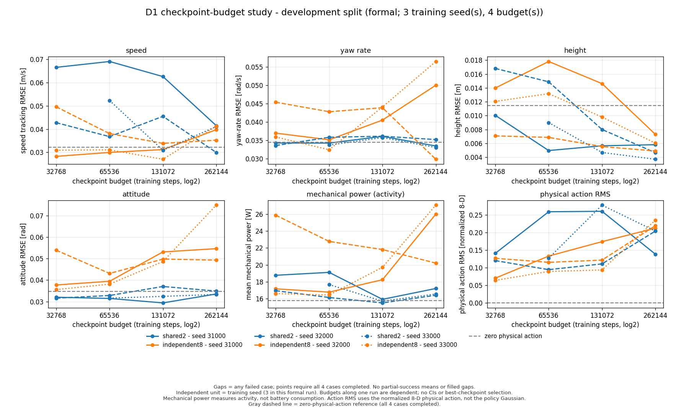
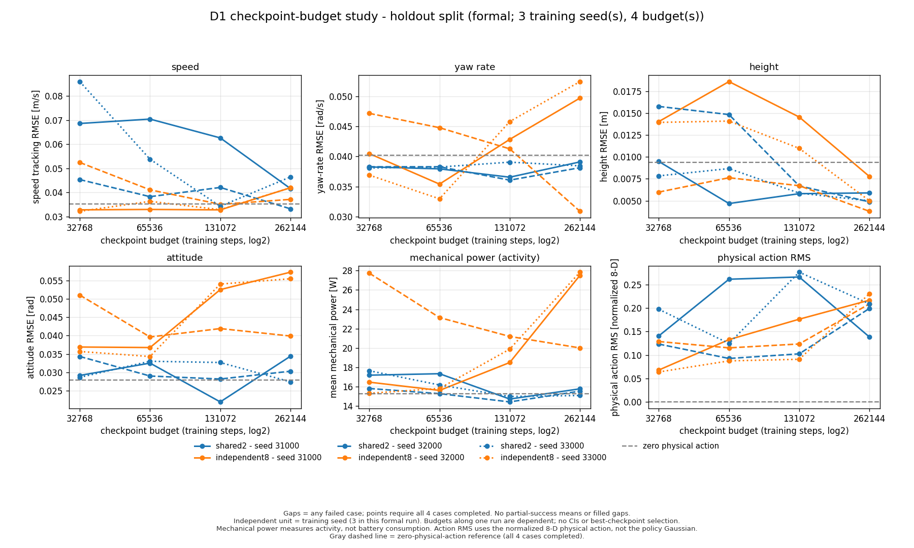

# D1 正式训练预算实验结果

把每条训练轨迹从 32768 步延长到 262144 步，没有得到两种动作结构都稳定优于零残差的结果。`shared2` 的三个种子在留出集上均比各自最早存档的速度误差低，但中间预算并非单调改善；`independent8` 则有两个种子的最终速度、姿态误差和机械活动量上升。最终预算下，两种模式的高度跟踪均有所改善，速度与姿态指标仍存在取舍。这些结果支持继续检查奖励与闭环行为，不能把增加预算本身当作已验证的改进方案。

正式实验于 2026-09-12 完成全部 56 条调度命令。独立分析核对了 **200 个评测案例、3072 次 PPO `train()` 记录**：198 例达到 60 s 时间上限，2 例因地图边界提前终止；192 例达到预定质量门槛。命令正常退出、回合完整和控制质量达标是三个不同的计数。

数据见[独立分析](../results/d1_budget_study_analysis/analysis.json)、[权重核验](../results/d1_budget_study_weights/report.json)和[绘图清单](../results/d1_budget_study_plots/manifest.json)。实验设计、保存时机及参数解释见[训练预算练习](budget_learning_lab.md)。

## 实验范围与计数

两种模式为共享两维残差 `shared2` 与独立八维残差 `independent8`，每种各有 `31000/32000/33000` 三个训练种子。每个模型只调用一次 `learn()`，连续采集 262144 次环境转移；在 32768、65536、131072、262144 步的更新完成后保存参数。六条轨迹共 1572864 次转移，24 个预算存档。同一种子的四个存档彼此相关，每模式的训练重复数仍是 3。

每个模式、种子、预算、split 对应四个评测回合：两条道路各使用两个重置种子。开发集使用 1017/1029，留出集使用 4617/4629；每个 split 另有四个零残差基线回合。因此，`2 模式 × 3 种子 × 4 预算 × 2 split × 4 回合 + 8 基线 = 200`。基线保留相同低层控制器，只将物理残差动作置零。

82 维观测、`imu_encoder_fusion` 状态源、低层控制参数及奖励保持原定配置，没有新增域随机化或测量延迟。留出集是预先固定的新地形参数和重置种子，布局家族及命令脚本并未全面更换，不能据此宣称任意地形泛化。

| 范围 | 评测案例 | 完整 60 s | 提前终止 | 质量达标 |
|---|---:|---:|---:|---:|
| 开发集，含基线 | 100 | 98 | 2 | 96 |
| 留出集，含基线 | 100 | 100 | 0 | 96 |
| 合计 | 200 | 198 | 2 | 192 |

质量达标要求回合完整，且速度、转向角速度、高度和姿态 RMSE 分别不超过 0.08 m/s、0.08 rad/s、0.025 m 和 0.15 rad。`shared2` 共 96 例，其中 94 例完整、88 例质量达标；`independent8` 的 96 例和零残差的 8 例均完整且达标。这是本协议内的描述性计数，四个预算上的回合不能视作彼此独立的训练重复。

## 所有预定预算的速度结果

下表每个数值是该种子四个回合各自速度 RMSE 的算术平均，单位 m/s。没有拼接时间序列后重新计算 RMSE，也没有筛选最好种子或最好存档。开发集唯一不完整的点显示缺口，未用两个幸存回合的均值代替四例结果。

| split | 模式 | 训练种子 | 32768 | 65536 | 131072 | 262144 |
|---|---|---:|---:|---:|---:|---:|
| 开发 | shared2 | 31000 | 0.06651 | 0.06903 | 0.06255 | 0.04148 |
| 开发 | shared2 | 32000 | 0.04276 | 0.03675 | 0.04547 | 0.02996 |
| 开发 | shared2 | 33000 | —，2/4 完整 | 0.05229 | 0.03090 | 0.04109 |
| 开发 | independent8 | 31000 | 0.02829 | 0.02998 | 0.03120 | 0.03973 |
| 开发 | independent8 | 32000 | 0.04956 | 0.03805 | 0.03386 | 0.03524 |
| 开发 | independent8 | 33000 | 0.03091 | 0.03109 | 0.02704 | 0.04126 |
| 留出 | shared2 | 31000 | 0.06860 | 0.07043 | 0.06263 | 0.04160 |
| 留出 | shared2 | 32000 | 0.04534 | 0.03824 | 0.04208 | 0.03321 |
| 留出 | shared2 | 33000 | 0.08598 | 0.05378 | 0.03427 | 0.04643 |
| 留出 | independent8 | 31000 | 0.03279 | 0.03295 | 0.03278 | 0.04195 |
| 留出 | independent8 | 32000 | 0.05243 | 0.04109 | 0.03509 | 0.03712 |
| 留出 | independent8 | 33000 | 0.03217 | 0.03633 | 0.03285 | 0.04197 |

零残差的四例均值在开发集为 **0.03213 m/s**，在留出集为 **0.03518 m/s**。最终预算的 `shared2` 只有种子 32000 在两个 split 上都低于各自零残差基线；`independent8` 的三个最终存档均高于基线。相同预算的两种模式也没有在所有种子上形成一致排名。

`shared2` 种子 33000 在留出集从 0.08598 降至 0.04643 m/s，说明这条轨迹相较早期改善明显；但 131072 步时为 0.03427，继续训练后又升高。`independent8` 在 131072 步时三个留出均值都略低于或低于基线，最终预算却全部高于基线。这个观察说明曲线有反复，不构成事后挑选 131072 步为“最优预算”的独立验证。





图中每个点须四例全部完成才显示六项指标；失败点的所有指标均留空。灰线是各 split 真实零残差基线，线型区分训练种子。图中没有置信区间、缺口插值或跨种子平滑；计数另见 [counts.csv](../results/d1_budget_study_plots/counts.csv)。

## 最终预算的改善与代价

下面只为便于阅读，展开预定最终预算 262144 的留出结果。完整预算结果仍在上面的两张图和分析 JSON 中。每行包含四个完整回合，指标定义与原审计一致。

| 模式 / 种子 | 速度 RMSE m/s | 转向 RMSE rad/s | 高度 RMSE m | 姿态 RMSE rad | 机械活动 W | 物理动作 RMS |
|---|---:|---:|---:|---:|---:|---:|
| 零残差 | 0.03518 | 0.04021 | 0.00935 | 0.02785 | 15.240 | 0 |
| shared2 / 31000 | 0.04160 | 0.03910 | 0.00589 | 0.03438 | 15.766 | 0.13835 |
| shared2 / 32000 | 0.03321 | 0.03813 | 0.00487 | 0.03030 | 15.527 | 0.19937 |
| shared2 / 33000 | 0.04643 | 0.03844 | 0.00499 | 0.02739 | 15.073 | 0.20907 |
| independent8 / 31000 | 0.04195 | 0.04969 | 0.00776 | 0.05729 | 27.518 | 0.21688 |
| independent8 / 32000 | 0.03712 | 0.03089 | 0.00379 | 0.03988 | 19.999 | 0.20904 |
| independent8 / 33000 | 0.04197 | 0.05243 | 0.00499 | 0.05549 | 27.842 | 0.23077 |

六个最终存档的高度误差都低于零残差；`shared2` 的三个最终转向误差也低于基线。但高度改善没有同时带来一致的速度和姿态改善。例如 `independent8` 种子 31000 的高度误差从最早存档的 0.01404 降至 0.00776 m，姿态误差却从 0.03689 升至 0.05729 rad，机械活动量从 16.455 升至 27.518 W。种子 33000 也出现高度下降、姿态误差和机械活动上升的组合；种子 32000 的走势不同。

机械活动量来自记录的机械功率量度，不能等同于电池功耗、能效或接触力重建。动作 RMS 使用归一化八维物理动作，因此两维策略广播后可按同一物理维度比较；它不是策略高斯分布标准差，也不能单独用于判断控制优劣。

## 两例提前终止及六例完整但不达标

两例提前终止均来自开发集 `shared2_seed33000_budget32768`：`road0_seed1017` 在 59.95 s、`road0_seed1029` 在 59.81 s 因 `map_boundary` 结束。即使接近 60 s，也按失败保留，不补齐或改作完整回合。该组另外两个 road1 回合达到时间上限，但速度 RMSE 分别为 0.08421、0.08423 m/s，超过 0.08 m/s 门槛。

同一种子和预算在留出集的四例全部完整，速度 RMSE 约为 0.08504–0.08693 m/s，也全部未达标。其余案例均达标。因此八个不达标案例中，两例属于提前终止，另六例属于完整但速度误差超限；本批没有记录摔倒终止。达标门槛允许较宽范围，达标数不能替代与零残差的实际误差对照。

非平地曝光是按保存的几何标签核对的描述量；它不代表重建了真实接触力，也不能把不同策略行进路径上的曝光差异解释成已隔离的地形难度效应。

## 训练、权重与恢复记录能证明什么

独立分析读取六条轨迹的全部 3072 次 `train()` 记录，核对更新序列、参数哈希链、GAE 和记录的高斯似然算术。全体更新中的最大绝对误差为：GAE 约 2.90e-6、returns 约 3.01e-6、更新前高斯 log-prob 约 3.30e-6、更新后约 2.75e-6。对应 [PPO 数学审计脚本](../scripts/audit_d1_ppo_math.py)的限定范围，似然样本只包含每次记录中前 128 个按 env-major 排列的样本，并非无偏 rollout 抽样；没有重放优化器，也不能把原始优势的裁剪示例当作实际 minibatch 归一化损失。

另一个[独立权重工具](../scripts/audit_d1_budget_weights.py)实际读取 24 个预算 ZIP 和 6 个根目录最终 ZIP 中的 `policy.pth`，检查固定架构的张量形状、有限值、文件哈希与参数哈希，报告为 `weights_verified`。每个根目录最终模型的参数与本轨迹 262144 步存档一致。`shared2` 有 19141 个参数，`independent8` 有 19537 个；该核验不验证优化器状态或重放训练。分析器的重载记录检查与这个直接读权重的检查是两项不同证据。

实验经历中断后恢复。两个完整中断目录分别保存在 `results/d1_budget_study_interrupted_20260911` 与 `results/d1_budget_study_interrupted_20260912`，失败子进程资料没有删除。最后一次恢复复用前 39 条成功命令，只执行第 40–56 条留出评测，六条训练轨迹没有重训。恢复记录保留原锁和原始资料，按冻结的 77 个源码文件及协议继续执行。

根目录 `summary.json` 的 `quality_claim: none` 是调度器职责边界，完成独立分析后也没有回写该历史摘要。正式质量计数应读取 `d1_budget_study_analysis/analysis.json`，而不是从调度命令成功数推断。GUI 课程控制器和人工按键复验属于另一组任务，不参与本实验的 200 例统计。

## 从保存的数据复核

分析目录清单、权重目录清单及绘图清单的输入和输出 SHA-256 已核对。正式分析 JSON 的 SHA-256 为 `1a4426dc03ed27682e34c81a05c41975c6fffc96804636d15cebaa1dc5f313a0`。图由已有绘图脚本直接读取该文件生成，没有启动新的训练、评测或策略加载。

从仓库根目录、在安装项目依赖的环境中运行以下命令。每个输出路径必须不存在，核验输出与原始结果分开保存：

```bash
rtk proxy python3 -B scripts/analyze_d1_budget_study.py results/d1_budget_study \
  --output results/my_budget_study_analysis_check
rtk proxy python3 -B scripts/audit_d1_budget_weights.py results/d1_budget_study \
  --output results/my_budget_study_weights_check
rtk proxy python3 -B scripts/plot_d1_budget_study.py \
  --analysis results/d1_budget_study_analysis/analysis.json \
  --output results/my_budget_study_plots_check
```

原始 CSV、JSONL、NPZ、模型和源码归档按项目规则通过带校验和的 Release 附件交付，获取与验证方法见[复现说明](reproducibility.md)。文件存在于本地与附件已经公开发布是两个状态，应以该页实际版本链接为准。本页结果解释由本地独立核对后整理，本次没有新增 Claude 调用；已有工具的代码贡献按各工具及对应证据记录归属。

后续可以先检查两个独立八维种子在预算后半段的高度收益与姿态、动作活动上升是否对应具体命令段，再决定是否调整奖励或动作约束。任何修改都需要新的实验协议和新的验证数据；当前留出结果已经被阅读，不能在反复据此调参后仍称其为未见测试集。
