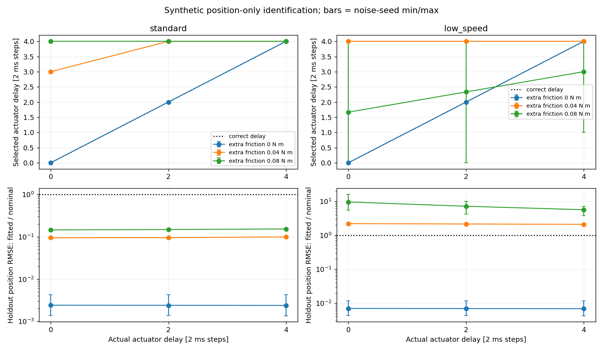
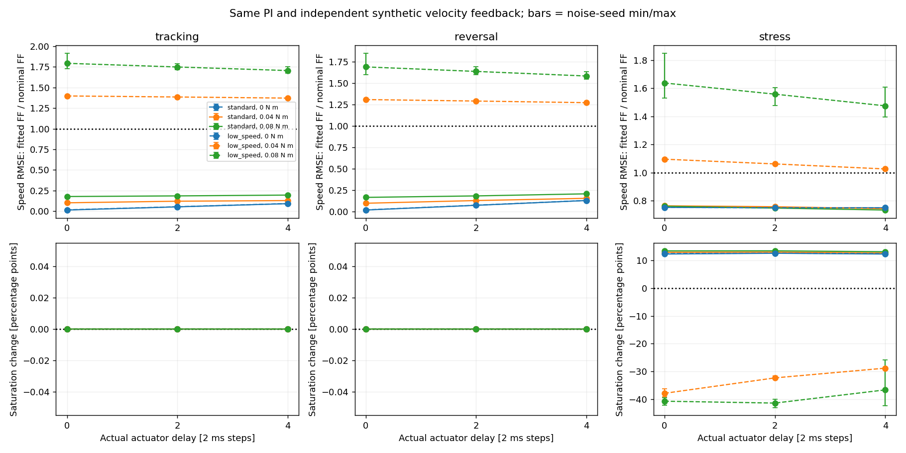

# 摩擦漏建模后，辨识出的延迟还可信吗

[位置辨识实验](encoder_identification.md)出现过一个现象：真实执行器延迟为两步，拟合却选了四步。
本次把额外摩擦、真实延迟和校准激励分开改变，检查这个错误是否重复出现，以及错误参数进入
前馈后会发生什么。对象仍是无接触、固定轴的 MuJoCo 单轮，不是 D1 真机。

无额外摩擦时，两个激励族的 18 次拟合均选对延迟；全部 54 次拟合中，24 次延迟选错，
均发生在摩擦失配条件。低幅值激励没有修好这个问题，它得到的失配模型在本轮留出预测和控制中
反而更差。所有拟合都报告收敛，因而“求解成功”不足以判断辨识是否可信。

## 改什么，保持什么

新增脚本是 [evaluate_friction_delay.py](../scripts/evaluate_friction_delay.py)。沿用原有
`EncoderLog`、仅位置损失、有界连续参数拟合和整数延迟枚举，没有改拟合器来适应新数据。

| 因素 | 固定取值 |
|---|---|
| 额外低速摩擦幅值 s，N·m | 0、0.04、0.08 |
| 真实执行器延迟 d，2 ms 物理步 | 0、2、4 |
| 校准激励族 | standard、low_speed |
| 位置测量噪声种子 | 53、67、79 |

共 `3×3×2×3=54` 次拟合，各枚举延迟 0–4，共 270 个候选。每个候选最多
`max_nfev=30`；数值 Jacobian 的额外回放没有计入 `nfev`，不能把它当成总仿真调用次数。

连续隐藏参数保持不变：附加惯量 0.017 kg·m²，阻尼 0.105 N·m·s/rad，平滑摩擦幅值
0.043 N·m；已知轮体惯量为 0.00189225 kg·m²。步长 0.002 s，请求力矩限幅 ±2 N·m，
位置噪声标准差 0.0002 rad。每段从已知静止、零力矩历史重新开始。

位置日志先写 CSV，再重新加载；只有两条 `calibration` 日志进入拟合器。生成对象、真值参数、
实际输出力矩和独立速度通道都不能作为拟合输入。测试种子只重复测量噪声，不代表三个电机。

## 被遗漏的阻力项

生成对象的总阻力为：

$$
\tau_r(v)=bv+\left[c+s\exp\left(-(v/0.3)^2\right)\right]\tanh(v/0.05).
$$

速度单位为 rad/s，力矩单位为 N·m。拟合模型只包含 `bv+c·tanh(v/0.05)`，没有 `s` 项。
这不是有静止粘滞区的库仑摩擦模型，不能将 `c+s` 直接当作实机启动摩擦阈值。

在速度远小于 0.05 rad/s 时，一阶近似为：

$$
\tau_r(v)\approx\left(b+\frac{c+s}{0.05}\right)v.
$$

例如 `s=0.08` 时，括号内约为 `0.105+(0.043+0.08)/0.05=2.565 N·m·s/rad`。
很窄的低速范围主要约束这个组合，不能轻易分开阻尼与摩擦；加速度又决定了惯量能被约束到什么程度。
这只是局部近似，不用于替换本次实际 MuJoCo 回放。

纯延迟也会改变开始响应的时刻。优化器只能用现有的惯量、阻尼、摩擦和延迟去降低位置误差，
因此遗漏阻力可能由多个参数一起承担。看到延迟增加，可以提出这种解释，但不能据此认定
模型里所有剩余参数都正确，也不能将所有拟合误差都归因于延迟。

## 两类校准与共同留出

令每条轨迹总时长 `T=3 s`，下式的力矩单位均为 N·m：

| 数据 | 请求力矩 |
|---|---|
| standard 校准 0 | `0.40 sin(2π(0.4t+1.8t²/(2T)))` |
| standard 校准 1 | `0.30 sin(2π·0.7t+1.2)+0.18 sin(2π·2.7t)` |
| low_speed 校准 0 | `0.12 sin(2π·0.35t)` |
| low_speed 校准 1 | `0.10 sin(2π·0.55t+0.7)+0.025 sin(2π·1.8t)` |
| 两族共同 validation | `0.35 sin(2π(0.6t+2.2t²/(2T))+0.2)` |
| 两族共同 holdout | 将 T 等分为七段，依次请求 `0、0.22、−0.48、0.07、0.38、−0.16、0` |

`low_speed` 是这个低幅值激励族的名称，不是证明轨迹始终落在某个固定速度区间。
比较的是两组完整激励，不是只把振幅缩小一个系数；频率和相位也不同。

同一对象和种子下，两族的 validation/holdout 命令、位置噪声和实际位置记录逐字节相同。
两族的校准输入不同，实际轨迹自然不同。控制中的标称前馈参考也按族保存了两份，但这些
重复参考不是新样本，统计时不能把它们当成额外实验重复。

## 怎样逐项复算一次拟合

每个延迟候选保存两条校准预测，保留初始点。两条轨迹共 N=3000 个命令，去掉各条轨迹的首个位置后：

$$
L=\frac{1}{N}\sum_{\text{两条校准}}\sum_{k=1}^{T/\Delta t}
\left(\frac{\hat q_k-q_k}{0.05}\right)^2.
$$

分母 0.05 rad 是残差归一化尺度，不是位置噪声标准差。若四个位置误差分别为
`0.001、−0.002、0.0005、−0.0015 rad`，则这个算术样例的损失是
`(0.0004+0.0016+0.0001+0.0009)/4=0.00075`。正式轨迹各有 1500 个命令，不能用这个
小例子的四个样本代替正式计数。

从某个条件目录按顺序检查：

1. `calibration_0.csv`、`calibration_1.csv` 各有 `T/Δt=1500` 个命令；连续的当前/下一拍位置组成 1501 个采样点，已知初始静止标记为真。
2. `candidate_delay*_calibration_predictions.csv.gz` 的时间从 0 开始，每次增加 2 ms；
   `measured_position_rad` 与对应输入日志一致。
3. 去掉两条轨迹各自的首行，按上式重算，再对比候选报告的 `calibration_loss`。
4. 只在这五个校准损失中找最小值；不要读取 validation、holdout 或闭环指标来重新选参数。
5. 对未参与选择的整条轨迹重算以 rad 表示的 RMSE、MAE 和最大误差。

独立分析脚本是 [analyze_friction_delay.py](../scripts/analyze_friction_delay.py)，
不导入仿真器、拟合器或生产控制指标函数。它检查保存的数据之间是否一致；哈希或算术检查
不能单独证明动力学模型正确。

## 实际延迟选择

下表每格按噪声种子 53、67、79 列出选中的延迟，单位为 2 ms 物理步：

| s，N·m | 实际延迟 | standard | low_speed |
|---:|---:|---|---|
| 0 | 0 | 0 / 0 / 0 | 0 / 0 / 0 |
| 0 | 2 | 2 / 2 / 2 | 2 / 2 / 2 |
| 0 | 4 | 4 / 4 / 4 | 4 / 4 / 4 |
| 0.04 | 0 | 3 / 3 / 3 | 4 / 4 / 4 |
| 0.04 | 2 | 4 / 4 / 4 | 4 / 4 / 4 |
| 0.04 | 4 | 4 / 4 / 4 | 4 / 4 / 4 |
| 0.08 | 0 | 4 / 4 / 4 | 1 / 0 / 4 |
| 0.08 | 2 | 4 / 4 / 4 | 3 / 0 / 4 |
| 0.08 | 4 | 4 / 4 / 4 | 4 / 1 / 4 |

54 次拟合里有 42 次选择搜索边界，但不能说 42 次都错了：真实延迟为 0 或 4 时，正确答案
本来就在边界。实际误判为 24 次。有摩擦失配时选对延迟，也不能推断连续参数已恢复真值。

例如 `s=0.08、实际延迟0、seed53、low_speed` 报告收敛并选择延迟 1；阻尼降到搜索下界
0.001，平滑摩擦拟合为约 0.126858 N·m。局部 Jacobian 仍报告秩 3，校准损失约
`2.0013×10⁻⁵`。这个例子同时说明了低校准误差、局部满秩、求解收敛与参数物理正确性的区别。

## 参数进入闭环后

每次拟合用三个 6 s 命令任务比较标称前馈与拟合前馈，共 324 个控制例，全部运行至时限，
未触发速度保护。PI 增益与限幅不变，使用同一对象和配对的独立合成速度噪声。
**本页闭环仍有独立速度反馈**；仅位置反馈的实验另见[编码器闭环](encoder_feedback.md)，
不要把两个实验的传感器条件混为一谈。

standard 的拟合前馈在本轮降低了三类任务的速度 RMSE，但 stress 的力矩限幅增加。
low_speed 在有额外摩擦的对象上，留出位置预测和三个控制任务的 RMSE 均高于标称参考；
stress 限幅减少也没有换来更好的跟踪。这里没有根据结果重新设计激励或修改参数边界。



上图的延迟线是三个噪声种子的均值，实际候选都是整数；误差线是观测最小值到最大值，
不是置信区间。下方先对同一条件配对，计算拟合/标称位置 RMSE 比值，再平均三个比值。



比值小于 1 表示拟合前馈误差较低；限幅变化以百分点表示，例如 40% 到 52% 是增加
12 个百分点，不是增加 12%。两项指标必须一起看。实际力矩已经过延迟队列，拟合参数
只修改前馈模型，没有自动补偿纯延迟。

## 复跑

在仓库根目录、按 README 安装依赖后执行，各输出路径必须不存在：

```bash
python scripts/evaluate_friction_delay.py --output results/my_friction_delay
python scripts/analyze_friction_delay.py results/my_friction_delay \
  --output results/my_friction_delay_analysis
python scripts/plot_friction_delay.py results/my_friction_delay \
  --output results/my_friction_delay_plots
```

正式记录入口见[摩擦／延迟实验](../results/friction_delay_cross_study/README.md)。修改激励、
模型或搜索范围属于新的实验，另建目录；保留这组固定协议下的误判和退化，才能检查下一次
改动到底解决了什么。
