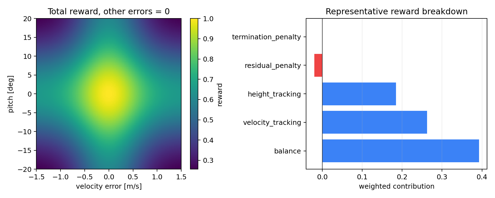

# 从降阶 LQR/MPC 到 D1 整机残差强化学习

这份说明把实验分成两个层次。先用六状态模型拆开线性化、LQR、MPC 和奖励，再到 16 执行器
D1 上处理接触、力矩分配、延迟与残差学习。中间穿插单轮辨识与闭环对照、PPO 数值计算和
一次小网络参数更新，方便把公式中的状态转移和梯度对应到代码。

学习目标是能够自己修改一个控制或训练模块，并解释实验结果。运行已有演示只是开始。
下面的验收问题可以用于准备技术面试，但做完这些实验不等于已经掌握整机部署，也不能保证
求职结果。

## 0. 学习路线

按顺序做完一次小实验，再决定要不要加大训练预算。表中的预期现象都需要测量；某项权重
调大后性能变差，也可以是一份完成的实验。

| 实验 | 对应入口 | 一次只改什么 | 自己应能回答的问题 |
|---|---|---|---|
| 1. 线性化与 LQR | [`controller_walkthrough.py`](../examples/controller_walkthrough.py)、第 1–3 节 | 初始 Pitch，或 `DEFAULT_Q` 的 Pitch 权重 | `A−BK` 的特征值稳定，为什么加上限幅后仍可能摔倒？ |
| 2. 约束 MPC | [`LinearMPCController`](../src/wheel_legged_control/controllers.py)、第 3 节 | `horizon`，先保留原 Q/R | 相同输入限幅下，预测长度改变了什么？误差改善是否伴随 P99 耗时增加？ |
| 3. 奖励与任务 | [`reward_walkthrough.py`](../examples/reward_walkthrough.py)、第 9 节 | 一个跟踪尺度，或动作代价权重 | 总奖励提高时，速度误差是否也降低？动作平方为什么不能直接叫电耗？ |
| 4. TD、GAE 与结束标记 | [`ppo_walkthrough.py`](../examples/ppo_walkthrough.py)、[PPO 数值实验](ppo_learning_lab.md) | `gae_lambda`，或末步 `terminated/truncated` | 时间上限截断时从哪个状态估值？新一局的奖励会不会传回上一局？ |
| 5. PPO 裁剪与训练 | 同一个数值例程、[`train.py`](../src/wheel_legged_control/train.py) | 先改固定样本的概率比；小预算训练时再单独改 `clip_range` | 负优势且概率增大时，哪一支仍有梯度？clip 是否保证所有比率都留在区间内？ |
| 5a. 一次真实梯度更新 | [`ppo_update_walkthrough.py`](../examples/ppo_update_walkthrough.py)、[更新实验](ppo_update_lab.md) | 先改学习率；另一轮只改价值损失系数 | 哪些张量必须冻结？如何用梯度重算 actor 和 critic 的参数变化？ |
| 6. D1 接触与 QP | 第 6.1 节、[`d1_controller_walkthrough.py`](../examples/d1_controller_walkthrough.py)、[逆动力学 QP](inverse_dynamics.md) | 先改 wrench 特征长度；另一轮只切换 `warm_start` | 求解满足约束与实际力跟踪是同一件事吗？加速度接近时内力为何还能不同？ |
| 7. 残差策略与观察 | [`d1/env.py`](../src/wheel_legged_control/d1/env.py)、第 8、11、12 节 | 先开关策略；另一次实验修改残差尺度并重新训练 | 当前策略是否优于零残差？门控覆盖了哪些训练外工况，又没有保证什么？ |
| 8. 模型误差与延迟 | 第 10、13 节、[执行器辨识台架](actuator_identification.md) | 先单独改变状态延迟；台架实验只改一个未知执行器参数 | 外推在哪种运动下失效？标定在未参与拟合的输入上是否仍有效？ |
| 8a. 单轮闭环补偿 | [PI 与前馈对照](wheel_control_lab.md) | 先只切换前馈参数；另一次只改积分增益 | 前馈收益来自结构还是参数？饱和时为何不能继续累积同向积分？ |

每次实验按同一份记录验收：

1. 运行前写下预测。比如增大 Pitch 权重后，恢复时间可能缩短，但峰值力矩也可能更大。
2. 保存基线后只改一个参数。记录代码提交和具体改动；训练实验还要记录训练 seed 与实际步数。
3. 图表链接到原始 CSV 或数值表。控制实验至少保留失败标志和跟踪误差；比较求解速度时另记
   P99 与最大耗时。耗时不作为轨迹是否一致的判据。
4. 关掉文档，用自己的话解释一处与预测不符的结果。把“测到了什么”和“猜测原因是什么”
   分开；尚未验证的原因要留作下一次实验，不能写成结论。

记录应能定位到修改的参数与对应输出。保留需要的原始结果；重复截图和过时说明可以清理，
已经报告的失败数据不要因结果不好而删除。

逆动力学 QP 可以按实验顺序学习：先用同一批状态比较冷求解与热启动，检查速度提升是否伴随输出
变化；再跑实际前进制动，观察近似相同的预测加速度是否得到相近轨迹。最后看转向和坡道，
检查轮速目标、支撑面估计与高度前馈。每次改一个参数，保留新的输出目录和失败日志。
只展示求解器耗时不足以说明控制效果，能跑完一段录像也不足以说明约束一直满足。

当前的热启动配置会改变接触内力分配，不能写成与冷求解数值等价。它仍是独立的实验路径，
尚未接入 PPO 训练或旧键盘控制器。`ppo_walkthrough.py` 只演示公式，
`ppo_update_walkthrough.py` 对小型教学网络执行一次更新；机器人训练继续使用 SB3。
IMU/编码器融合估计器也尚未实现。

模型来源、许可证和另一份本地 URDF 为什么没有上传，单独记录在
[`d1_model_card.md`](d1_model_card.md)。

---

## 第一部分：先把 LQR、MPC 和残差 RL 看懂

### 1. 六状态教学模型

平面模型保留轮足机器人矢状面最关键的三个自由度：

\[
q=[x,\theta,l]^\top,
\qquad
x_s=[x,\theta,l,\dot x,\dot\theta,\dot l]^\top.
\]

- `x`：轮轴水平位置；
- `theta`：机身 Pitch；
- `l`：对称腿伸缩量；
- `F_w`：两轮折算后的总水平力；
- `F_l`：两腿的对称推力。

运行：

```bash
python examples/controller_walkthrough.py
```

开环离散矩阵应存在模长大于 `1` 的特征值；LQR 闭环特征值应全部进入单位圆。这个检查
很重要，否则一个本来就稳定的模型也能画出“控制成功”的曲线。

### 2. 从 MuJoCo 到线性模型

[`WheelLeggedPlant.linearize()`](../src/wheel_legged_control/model.py) 直接在仿真平衡点附近对状态
和输入做中心差分：

\[
A_c[:,i]\approx\frac{f(x+\epsilon_i,u)-f(x-\epsilon_i,u)}{2\epsilon_i},
\quad
B_c[:,j]\approx\frac{f(x,u+\epsilon_j)-f(x,u-\epsilon_j)}{2\epsilon_j}.
\]

再用零阶保持离散到 `20 ms` 控制周期。线性模型只用于控制器设计，最终评估始终运行
MuJoCo 非线性模型。

### 3. LQR 与 MPC

LQR 最小化无限时域二次型：

\[
J=\sum_{k=0}^{\infty}(e_k^TQe_k+\Delta u_k^TR\Delta u_k),
\qquad \Delta u_k=-Ke_k.
\]

教学模型的权重为：

```text
Q = diag(0.4, 140, 90, 4, 14, 5)
         x    θ   l  ẋ  θ̇  l̇
R = diag(0.025, 0.004)
          Fw     Fl
```

MPC 使用同一个线性模型，但显式预测 20 步并限制执行器：

\[
X=S_xx_k+S_uU,
\qquad
\min_U \frac12 U^THU+f^TU,
\quad u_{min}\le u_i\le u_{max}.
\]

它每次只执行第一个输入，然后根据新状态重新求解。仓库记录 P95 求解时间，而不只写
“可以实时运行”。

### 4. 为什么先做残差策略

教学层的 PPO 不直接接管控制：

\[
u=\operatorname{clip}\left(u_{LQR}+
\operatorname{diag}(18,35)a_{PPO}\right),
\quad a_{PPO}\in[-1,1]^2.
\]

LQR 提供基线反馈，策略被设计为补偿基线尚未充分处理的误差，例如质量失配造成的跟踪偏差。
局部线性模型中的 LQR 稳定性并不自动覆盖加入残差和力矩限幅后的系统，需要重新做闭环评测。
奖励逐项放在 [`rewards.py`](../src/wheel_legged_control/rewards.py)，并通过
`info["reward_terms"]` 返回。
运行 `python examples/reward_walkthrough.py` 可以看到每项贡献和奖励地形。



### 4.1 在训练前算清 GAE 与 PPO 裁剪

在仓库根目录运行：

```bash
PYTHONPATH=src:.local-deps python3 examples/ppo_walkthrough.py
```

这个例程只用 NumPy 处理固定数值，不启动 MuJoCo，也不训练策略。输出先比较同一条短轨迹
在真实终止和超时截断时的 GAE，再列出正负优势对应的 PPO 裁剪分支。末尾计算 `20 ms` 与
`10 ms` 控制周期下，相同 `gamma` 对应的折扣时间。

先手算最后一步的 TD 误差，再核对输出。把一次时间上限截断当成摔倒，会错误地丢掉末状态
的价值；把截断后的新回合接进优势递推，又会让新一局的数据影响上一局。例程用两个掩码
分别处理 bootstrap 与递推边界。完整公式和练习见 [PPO 数值实验](ppo_learning_lab.md)。

训练入口默认使用 `gamma=0.99`、`gae_lambda=0.95` 和 `clip_range=0.2`，现在可以通过
CLI 单独调整。`--log-training-metrics` 会保存 SB3 的 KL、clip fraction 等诊断量，实际
超参数也写入训练配置。等能解释负优势的裁剪分支后，再按 [PPO 实验说明](ppo_learning_lab.md)
做小预算训练，并检查奖励外的跟踪指标。纯数值例程不生成网络训练曲线。

---

## 第二部分：D1 整机控制

### 5. 整机模型究竟多了什么

D1 层把整机动力学中的以下量带进了实验：

- 浮动基座 `7 nq / 6 nv`；
- 四条腿，每条 `hip/thigh/calf/wheel` 四个关节；
- `16` 个独立力矩执行器；
- URDF 惯量、关节范围和简化碰撞体；
- 四个半径 `0.087 m` 的显式滚动接触；
- 腿关节 `±80 Nm`、轮关节 `±12 Nm` 的饱和；
- `500 Hz` MuJoCo 物理与 `100 Hz` 控制。

MuJoCo 直接导入 URDF 时只有固定基座和零执行器。仓库通过 `MjSpec` 在一个入口里补齐
浮动关节、执行器、地面与接触参数，避免控制器各自偷偷修改模型。

### 6. 低层 VMC 与两种接触分配

仅靠关节 PD，模型会因重力下沉并产生明显 Pitch。低层控制器同时使用：

1. 腿关节位置 PD；
2. 四轮速度反馈；
3. 基于虚拟模型的高度、Roll、Pitch 支撑力分配。

下面先写 legacy 路径。它的目标机身 wrench 为：

\[
w_d=\begin{bmatrix}F_z&M_x&M_y\end{bmatrix}^T.
\]

四个轮地向上支撑力为 `f=[f_FL,f_FR,f_RL,f_RR]`。由轮心相对机身的位置
`r_i=(x_i,y_i,z_i)` 得到：

\[
\underbrace{
\begin{bmatrix}
1&1&1&1\\
y_{FL}&y_{FR}&y_{RL}&y_{RR}\\
-x_{FL}&-x_{FR}&-x_{RL}&-x_{RR}
\end{bmatrix}}_{A_f}f=w_d.
\]

代码用最小二乘求 `f=A_f^\dagger w_d`，再约束每个支撑力非负。机器人需要向地面施加
相反方向的力。每条腿的力矩为：

\[
\tau_i=J_i^T[0,0,-f_i]^T.
\]

constrained 路径改为每个激活接触的局部三维力
`(f_roll, f_lateral, f_normal)`。它拟合六维机身 wrench，并加入以下约束：

| 约束 | 代码中的含义 |
|---|---|
| 激活接触 | 离地轮的三维力固定为零 |
| 单向法向力 | `0 <= f_normal <= f_normal,max` |
| 摩擦棱锥 | `|f_roll| + |f_lateral| <= μ f_normal`，是摩擦圆的保守内逼近 |
| 执行器余量 | 接触力矩与已经分给关节 PD 的力矩相加后不得越限 |
| 求解器未收敛 | 候选仍满足硬约束时继续采用，并记为 `feasible_nonconverged` |
| 候选不可用 | 非有限或违反硬约束时才进入法向 BVLS `fallback` |

实现入口是 [`contact_allocation.py`](../src/wheel_legged_control/d1/contact_allocation.py)，
详细的坐标系、目标函数和诊断量见 [`contact_allocation.md`](contact_allocation.md)。legacy
用于复现原始基线；constrained 用于检查接触切换、摩擦和执行器余量。求解器结果与 wrench
跟踪结果分别记录：`converged/feasible_nonconverged/fallback` 不等同于
`tracked/limited`。后者使用 `1 N + 0.5%||F_d||` 和 `0.5 N·m + 0.5%||M_d||` 的工程容差。

### 6.1 动手练习：改一次力矩跟踪权重

在开发分支完成这段练习。先运行两个摩擦相关测试：

```bash
pytest tests/test_d1_contact_allocation.py -k "friction_pyramid"
```

选中的测试分别检查摩擦范围内的纵向力跟踪，以及摩擦棱锥是否落在 Coulomb 圆锥内。
读一下断言中的 `contact_force_world_n`：为什么切向力要和当前法向力一起判断，不能只
给切向力设一个固定上限？若测试失败，先查看违反的是跟踪误差还是摩擦约束。

再保存三组开发种子的基线：

```bash
wheel-legged-d1-contact-audit \
  --seed 21 --episodes 3 --output results/contact_dev_baseline
```

打开 `contact_allocation_summary.csv`，按 `metric` 找到以下行：

| 字段 | 观察的问题 |
|---|---|
| `contact_force_tracking_error_rms_n` | MuJoCo 实际合力离请求还有多远 |
| `contact_moment_tracking_error_rms_nm` | 实际合力矩的误差有没有同步下降 |
| `allocation_constraint_violation_max` | 分配出的力是否违反约束 |
| `allocation_fallback_ratio` | 是否依赖回退完成任务 |
| `four_wheel_contact_ratio` | 跟踪改善是否伴随更频繁的离地 |
| `pitch_rmse_deg` | 机身姿态有没有变差 |

记录 `evaluation_config.json` 中的 `run_id`、`provenance.source` 和
`protocol.constrained_allocator`。`protocol.seed_pool` 应为 `development`。

只把 `contact_allocation.py` 中的 `D1_WRENCH_CHARACTERISTIC_LENGTH_M` 从 `0.25` 改为
`0.35`。重新启动命令，输出目录换成 `results/contact_dev_length035`；新进程会重新
辨识外层模型。先写下自己的预测：`L` 增大后，目标函数对力矩误差的相对惩罚是增大还是减小？

将两次 CSV 对应行的 `constrained_mean` 并排记录，同时保留
`paired_delta_ci95_low/high`。这里的配对区间比较同一次运行中的 constrained 与 legacy，
不能直接当成两种 `L` 之间的区间。`legacy_mean` 的轨迹指标应保持一致，耗时会受系统
负载影响；若轨迹也变了，先核对种子、依赖版本及其他代码改动。

每次记录只需说明改了哪个值、预期什么、实际发生什么，并链接原始 CSV。若力矩误差降低
但 Pitch 变差，就保留这条失败观察，不用改成功门槛来迁就它。求解状态还要看
`allocation_feasible_nonconverged_ratio`，仅凭 fallback 为零不能判断每步都已收敛。

这次改动会通过重新辨识影响整套控制配置。legacy/constrained 对照还同时切换分配器和
外层 `R`，不能把其差异全算在单个分配算法上。练习结束后恢复 `L=0.25`；保留需要的两组
原始结果，再清理多余输出。正式种子 `121–150` 不用于挑参数。已报告的权重比较见
[`contact_allocation_development.md`](contact_allocation_development.md)。

### 7. 在“接触 + VMC”闭环上辨识模型

D1 外层没有复用小车的 `(A,B)`。流程是：

1. 让 VMC 在平地稳定 5 秒；
2. 保存完整 `qpos/qvel` 接触平衡点；
3. 对 `x、pitch、vx、pitch_rate` 分别做正负扰动；
4. 对总纵向轮地力做正负扰动；
5. 每次探针前清空控制器和分配器记忆，再运行一个 `10 ms` 闭环控制步；
6. 用中心差分得到所选接触分配路径的离散模型。

外层状态和输入为：

\[
x_r=[x,\theta,\dot x,\dot\theta]^T,
\qquad u_r=F_x.
\]

legacy 和 constrained 分别辨识并缓存模型。默认 LQR/MPC 参数为：

```text
Q = diag(0.2, 400, 20, 30)
R_legacy = 1e-8
R_constrained = 1e-6
|Fx| <= 180 N
```

legacy 模型的纵向速度输入导数约为 `5.75e-6`，constrained 约为 `1.62e-4`，相差约 28 倍。
早期实现把 legacy 模型直接接到 constrained 分配器，固定命令重放在约 4 秒时失稳。加入
mode-matched 辨识后，同一回归能够跑完整段。这个记录说明低层映射改变后必须重新辨识；它
本身不构成 constrained 性能更好的证据。

MPC 使用当前分配模式对应的模型、权重和终端 Riccati 代价，预测 20 个 `10 ms` 步长，并
在优化内显式施加 `±180 N` 约束。LQR 与 MPC 的区别集中在有限时域预测和约束求解。

### 8. D1 残差 PPO 的动作与观察

策略仍然不输出 16 维原始关节力矩，只输出两个归一化残差：

\[
\Delta u=\operatorname{diag}(45\text{ N},80\text{ N})a_{PPO}.
\]

- 第一维：总纵向轮地力修正；
- 第二维：总竖直支撑力修正。

低层 VMC 再把它们分配到 16 个执行器，并执行关节力矩饱和。42 维观察包括：

| 分组 | 维数 | 说明 |
|---|---:|---|
| 机身线速度 | 3 | 机体系，归一化 |
| 机身角速度 | 3 | 机体系，归一化 |
| 投影重力 | 3 | 代替欧拉角奇异表示 |
| 速度命令/高度误差 | 2 | 当前控制目标 |
| 12 个腿关节位置误差 | 12 | 轮角度不作为绝对位置输入 |
| 16 个关节速度 | 16 | 按公开速度上限归一化 |
| LQR 当前纵向力 | 1 | 策略知道基线已做了什么 |
| 上一残差动作 | 2 | 抑制高频动作 |

绝对世界位置没有输入策略，避免它记住某一段轨迹。

训练配置会保存 `baseline`、`state_mode`、`latency_compensation` 和
`contact_allocation`。加载 checkpoint 时四项必须与运行环境一致。仓库现有策略按 legacy
分配训练，不能直接放进 constrained 控制路径作为主结果；constrained 策略需要重新训练。

### 9. 奖励函数

理想状态的正奖励上限为 `4.2`：

\[
\begin{aligned}
r_v &= 2.0\exp[-((v_x-v_{cmd})/0.35)^2],\\
r_u &= 1.0\exp[-(\phi/0.22)^2-(\theta/0.22)^2],\\
r_h &= 1.0\exp[-((z-z_{cmd})/0.030)^2],\\
r_{alive} &= 0.2,\\
r_a &= -0.04(a_{x,t}^2+2a_{z,t}^2),\\
r_{\Delta a} &= -0.025(\Delta a_{x,t}^2+2\Delta a_{z,t}^2).
\end{aligned}
\]

另外惩罚软关节限位、非轮部位触地；摔倒额外为 `-10`。实现位于
[`d1/rewards.py`](../src/wheel_legged_control/d1/rewards.py)。

奖励使用速度跟踪误差，负速度命令也能正确计分。竖直动作的代价更高，是因为它的物理缩放
为 `80 N`，而纵向残差只有 `45 N`；训练日志还显示，等权动作代价会产生持续向上的偏置。

### 10. 随机化与延迟

训练时每回合改变：

| 参数 | 范围 |
|---|---:|
| 基座质量比例 | `0.90–1.12` |
| 阻尼比例 | `0.80–1.25` |
| 地面摩擦比例 | `0.65–1.30` |
| 执行器强度比例 | `0.85–1.05` |
| 残差动作延迟 | `0–3` 个 `10 ms` 周期 |
| 状态延迟（estimated） | `0–3` 个 `10 ms` 周期 |
| 初始 Roll | `±0.035 rad` |
| 初始 Pitch | `±0.045 rad` |
| 速度命令 | `-0.75–0.75 m/s` |
| 目标高度 | `0.445–0.475 m` |
| 随机推力 | `90–170 N`，方向随机 |

`oracle` 模式保留旧实验：经典控制读取统一的真值快照，`sensor_noise` 只扰动 PPO 观察。
`estimated` 模式会把带噪延迟快照同时交给 LQR/MPC、VMC、PPO、安全逻辑和地形估计。动作
延迟与状态延迟分别采样，不再共用一个队列。

这里仍没有模拟 IMU 或编码器融合。当前 source 只是确定性的误差通道，适合做灵敏度实验；
详细字段和时间语义见 [`state_estimation.md`](state_estimation.md)。

默认误差通道也会扰动接触点、接触法向和接触点 Jacobian。常速度补偿只外推基座、关节和
轮心运动，接触标志、接触点、法向及接触 Jacobian 保留在测量时刻。使用 constrained 分配
时，这些旧时刻几何仍会进入力矩约束，应作为延迟实验的一项已知近似。

延迟补偿可选 `constant_velocity`。它用快照中的机身速度、角速度和关节速度做最多 `50 ms`
的一阶外推，接触仍保持延迟测量。评估时要保留原始状态年龄，并和 `none` 使用完全相同的
评测种子；只看外推成功的常速片段会高估效果。

### 11. 训练与评估

这台电脑上使用 8 个 CPU 环境训练：

```bash
wheel-legged-train \
  --robot d1 \
  --baseline lqr \
  --state-mode oracle \
  --latency-compensation none \
  --contact-allocation legacy \
  --steps 400000 \
  --envs 8 \
  --seed 7 \
  --runs 1 \
  --device cpu \
  --output results/d1_residual_ppo
```

PPO rollout 批次使实际步数向上取整为 `401408`。仓库早期训练记录中，本机 8 个 CPU 环境
约用 3.5 分钟；这是当时配置的测量，不是运行时限保证。切换分配器或状态模式后要重新
计时，也不能从这条 CPU 记录推出 GPU 的性能。

固定场景与 30-seed 配对审计：

```bash
MUJOCO_GL=egl wheel-legged-d1-benchmark \
  --state-mode oracle \
  --contact-allocation legacy \
  --policy results/d1_residual_ppo/model.zip \
  --audit-episodes 30 \
  --gif
```

接触分配先跑三组开发审计；只有固定的 121–150 共 30 组种子具备正式晋级资格：

```bash
wheel-legged-d1-contact-audit \
  --seed 21 \
  --episodes 3 \
  --output results/contact_dev

wheel-legged-d1-contact-audit \
  --seed 121 \
  --episodes 30 \
  --output results/d1_contact_allocation
```

审计配对比较 legacy 与 constrained 的模式匹配闭环配置，包括各自的分配器、辨识模型和固定
`R`。它没有隔离单个分配器的因果贡献。

已完成的[30 组留出结果](../results/d1_contact_allocation/contact_allocation_audit.md) 没有通过
晋级门：9 个回合的可行未收敛比例超过 1%。实际 wrench 跟踪改善，但姿态与接触指标变差，
默认仍是 legacy。做第 6.1 节练习时只用开发种子，不根据这批留出成绩重新挑参数。

当前随机域结果来自 `oracle + legacy` 模式：

| 控制器 | 失败 | 速度 RMSE | Pitch RMSE | 高度 RMSE |
|---|---:|---:|---:|---:|
| D1 LQR+VMC | `0/30` | `0.326 ± 0.124 m/s` | `1.490 ± 0.824°` | `9.745 ± 3.491 mm` |
| D1 MPC+VMC | `1/30` | `0.298 ± 0.152 m/s` | `2.162 ± 3.216°` | `11.429 ± 9.387 mm` |
| D1 LQR+VMC+PPO | `0/30` | `0.327 ± 0.121 m/s` | `1.511 ± 0.789°` | `9.725 ± 3.262 mm` |

PPO − LQR 的配对均值差及 95% 置信区间：

- 平均奖励：`-0.047 [-0.071, -0.022]`；
- 速度 RMSE：`+0.001 [-0.009, +0.011] m/s`；
- Pitch RMSE：`+0.021 [-0.054, +0.096]°`；
- 高度 RMSE：`-0.020 [-0.622, +0.582] mm`。

三个误差区间都跨过 0，奖励区间全部低于 0。这个 PPO checkpoint 没有优于 LQR，只用于
练习残差接口、策略门控和配对评测。MPC 在随机域出现一次失败，CSV 保留了这条记录。

### 12. 键盘、转向和地形课程

```bash
wheel-legged-d1-play
```

交互入口使用同一个 D1 plant 和控制器。`W/S` 调前进速度，`A/D` 通过左右轮差速调偏航，
空格触发带接触检查的四段跳跃。按 `1…6` 可直接回到不同地形前。课程中使用轮地接触点拟合
支撑平面，Ramp、台阶、乱石、波浪路和横杆都参与碰撞。

加载 checkpoint 后按 `L` 可开关残差策略：

```bash
wheel-legged-d1-play --policy results/d1_residual_ppo/model.zip
```

跳跃、恢复、急转和明显斜坡会触发策略门控。PPO 的训练集尚未覆盖这些运动，门控避免把平地
结果扩写成全地形能力。场景参数、跳跃时序、验收表和调试记录见
[`interactive_course.md`](interactive_course.md)。

## 13. 模型误差实验与 sim2real 准备

固定延迟曲线已经完成。`10 ms` 下，一阶外推保持全部回合成功并降低了部分跟踪误差；到
`20 ms`，LQR/MPC 的成功数都增加，但配对区间跨过 0，且多数控制步因关节运动学边界而退回
原始状态。`30/50 ms` 两种方法都没有成功回合。原始 CSV 在
[`results/d1_state_delay_raw`](../results/d1_state_delay_raw/delay_sweep_episodes.csv) 与
[`results/d1_state_delay_compensated`](../results/d1_state_delay_compensated/delay_sweep_episodes.csv)。

这批结果适合学习延迟失稳，也保留为旧配置的回归依据。使用它们分析过失败原因后，不能再
把同一批数据当作下一种预测器的全新留出集。若继续研究基于已施加力矩的预测，应先确定
开发条件，再另设未参与调参的评测条件；成功率与机械功率的判定门槛也要在正式评测前写下。
该预测器目前尚未实现。

### 13.1 单转轴执行器辨识台架

只有电脑时，可以先用合成日志验证辨识流程。入口和数据定义见
[执行器辨识台架](actuator_identification.md)，先查看脚本参数：

```bash
PYTHONPATH=src:.local-deps python3 scripts/run_actuator_identification.py --help
```

MuJoCo 台架包含 `wheel` 和 `pendulum` 两种固定基座单转轴负载。前者是无轮地接触的自由
转子；后者用重力摆负载简化一处腿关节所承受的负载，不能称为完整 D1 单腿。两种台架都
直接接受力矩指令，模型参数是教学设定，不是实际 D1 电机的标定结果。

先读懂一条命令如何经过延迟到达执行器，再改变一个未知参数并观察响应。拟合程序能用的
数据与被辨识对象的隐藏参数必须分开。用来评估的运动也要与拟合数据分开；只重现拟合
轨迹不足以判断模型有没有预测能力。具体约束及输出含义以台架文档为准。

相同模型结构上的参数恢复用于检查程序；被辨识对象包含额外摩擦效应时，还要检查简化
模型在未见输入上的误差。后一类实验即使优化收敛，拟合参数也未必等于隐藏真值。当前台架
不包含完整 PACE 的位置 PD 数据采集流程，也没有把参数自动写入 D1 IDQP。

传感器方向可以从模拟 IMU 和编码器开始设计日志接口，无需等到拿到实机；融合估计器尚未
实现。现有 `estimated` source 仍是真值误差通道。将来拿到真实日志后，需要重新确认关节
顺序和时间戳等接口，并重新辨识参数。现在的结果只能说明合成数据上的程序行为，不能
写成已完成实际 D1 辨识或 sim2real 迁移。

### 13.2 从辨识到单轮闭环

按[单轮闭环实验](wheel_control_lab.md)在同一个固定轴非理想对象上比较 PI、名义前馈和
辨识前馈。三组使用相同反馈增益、限矩及测量噪声，并保留每个物理步的误差、P/I/前馈
力矩与延迟后的实际命令。先用一行 CSV 手算控制输出，再比较整段 RMSE。

辨识只看两条标定轨迹，三种闭环参考不参与拟合。含额外低速摩擦和力矩饱和的结果也全部
保留；本轮没有反演延迟，也没有将参数写入整机 IDQP。能解释单轮误差为何变化后，再考虑
整机补偿入口与约束重新验证。

### 13.3 保留的模型边界

第 6 节的 VMC 接触分配仍采用每轮一个平均接触点，会丢失同一车轮多个接触点形成的偶矩；
它是逐步静力分配，没有接触力变化率约束。SLSQP 的端到端 P99 会写入审计，但它不是专用
实时 QP 求解器。独立 IDQP 的动力学假设见[对应文档](inverse_dynamics.md)。MuJoCo
constraint wrench 只作为仿真评估旁路，不能替代轮端力传感器数据。

训练实验保留 `training_config.json`，原始 CSV 要能对应到那一次运行；失败视频按需要保留。
学习说明只维护一份当前版本，历史交给 Git 管理。新的对照结果写入新目录，确认记录完整后
再清理重复输出，避免覆盖已经报告的原始数据。
