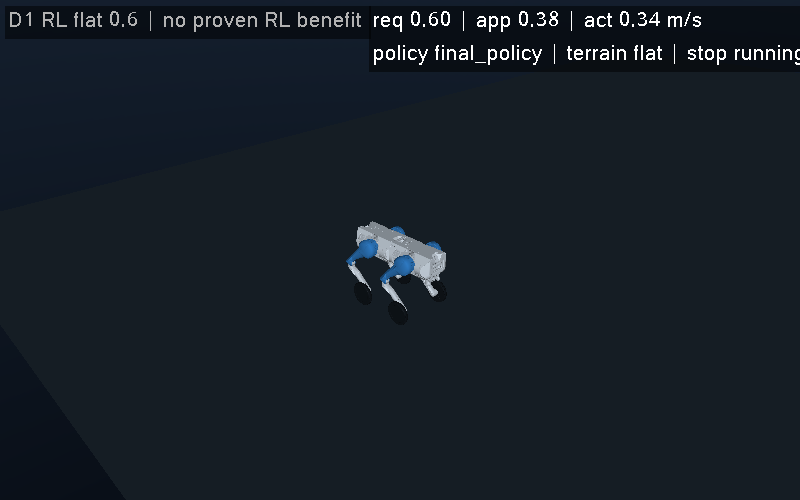

# 主路线执行记录 13：先解释稳态跟踪退化，再验证限域 GUI

本阶段沿用[主方案](main_plan_20260929.md)与冻结的 11-S 结果。11-S 的九场完整任务均通过，平地 1.6 m/s 脚本证明了单 seed 下的速度能力；四对已完成 zero/policy 比较却都显示策略跟踪 SSE 与归一化力矩平方成本上升。rough policy 中断、两场 ramp 未开始，整体资格与 RL 贡献仍未完成。本阶段不改旧训练、模型、评分或原始记录。

## 保存数据给出的新信息

[13 诊断](../results/d1_main_route_execution_20260929_13/README.md)使用已闭账的八场控制记录和完整训练数值块；139 个输入文件与旧清单一致，没有加载策略或重放物理。四个任务的**加速窗口 SSE 都下降，保持窗口 SSE 都上升**：

| 任务 | 加速 SSE：zero → policy | 保持 SSE：zero → policy |
|---|---:|---:|
| flat 0.6 | 2.0212 → 1.7570 | 0.3362 → 1.8511 |
| flat 1.6 | 2.8569 → 1.9524 | 0.9842 → 6.9747 |
| flat 1.2 + yaw | 2.6676 → 1.9047 | 33.0624 → 37.2174 |
| bumps 0.4 | 1.5180 → 1.4622 | 4.1740 → 5.1165 |

flat 1.6 保持阶段的策略额外均偏速为 0.02160 m/s；共同轮速残差乘 0.087 m 轮半径得到 0.02176 m/s，量级接近。控制器的前向 P 项提供直接作用通路，值得优先核查；腿姿态、接触和反馈同时变化，因此保存轨迹不能证明删去该残差后的反事实效果。四场 drive 平均奖励均低于 zero，当前保存的评估状态也不支持“总奖励偏好稳态超速”的说法。

[TimeLimit/bootstrap 静态审计](../results/d1_main_route_execution_20260929_13/README.md)核对了冻结源码中的 timeout 观测、一次终态 value 补偿及 GAE 边界，未见漏加或重复加的代码路径证据。历史逐转移 value、bootstrap 数值和 GAE 没有保存，无法重建精确历史 value loss，也不能据此断言 critic 梯度挤压 actor。下一项模型诊断须另立有限的前向/backward 合同，不执行 optimizer、learn 或 save；现有证据不足以直接改奖励或重训。

## 归档与 GUI 工程状态

旧 11-S gzip 写入遭中断后，`finally` 重试同名 `xb`，使 `FileExistsError` 遮蔽最初异常。阶段 13 用真实旧方法的纯测试复现了这一点；新归档模块把 gzip 与训练数组作为同一事务，先独占写 `.partial`、完成 close/fsync，再以不覆盖的硬链接发布载荷，最后发布 manifest。失败锁存首异常，不把孤立载荷算完整记录；软停止只锁存请求。root 运行的 **13 项归档纯测试全部通过**，0 物理控制、0 模型调用。

GUI13 的主线程逻辑事件、物理 owner 与快照租约边界通过 **5 项 bridge 纯测试**，独立读回通过 **5 项纯测试**。外层进程回收另有 1 项纯 OS 测试通过，共 24 项绿色测试。该 OS 测试的首次 fixture 因继承的输出管道未关闭而超时，失败测试及收据保留；第二个 fixture 关闭管道后验证真实 subreaper 回收及缺失 readiness 拒绝。软件测试均未加载机器人策略或运行物理。

第一次纯源预检发现同一批约 7.5 GB 依赖被重复哈希。原 GUI13 源码、GO 和预检记录保留，未消费物理预算。revision02 改为流式摘要、每次源检查只读一遍，并将纯预检（240 s）、执行（95 s 软停止 / 120 s 硬界限）、退出后全 SHA 核查（180 s）与外层总时限（600 s）分别闭账；没有扩大控制步或放宽性能门。

## 已完成的真实 RL 短脚本验收

冻结 final 策略 `6cf2db80…193f8e70`、seed 88813、平地 0.6 m/s 开发脚本，先运行 headless 并独立读回，合格后运行匹配 GUI。每臂恰 600 控制 / 3000 normal native + 2 compiler native；每臂 load 1、32 样本 probe 1 批、正式 predict 600，**learn/save/optimizer 均为零**。本阶段共 1200 控制 / 6000 normal native + 4 compiler native，没有重跑旧九场或进行新训练。

[独立配对读回](../results/d1_main_route_execution_20260929_13/evidence/pair_readback_13_01.json)确认两臂的 601 个状态、600 步输入/动作/命令/力矩链及 3000 行原生数值记录逐位一致。姿态最大绝对 roll 0.42915°、pitch 1.11791°，最小端点 clearance 0.454867 m，非轮接触 0；没有 warning、线程或复制租约违规。compact 原生模式未采样接触力，不将这些结果当作完整接触力资格。

| 指标 | headless | 私有软件 Xvfb GUI |
|---|---:|---:|
| 有效仿真时段 wall / RTF | 4.31994 s / 1.38891 | 5.04026 s / 1.19042 |
| 实际有效绘制 FPS | 不适用 | 12.49937 |
| poll 间隔 p95 | 不作 GUI 指标 | 88.95671 ms |
| 快照年龄 p95 | 不作 GUI 指标 | 140.19804 ms |
| 纯预检 / 执行与封存 / SHA 后检 | 47.13852 / 12.23500 / 22.55875 s | 127.67400 / 11.48692 / 57.91589 s |
| 外层完整 wall | 82.10385 s | 197.46489 s |

RTF≥0.8、FPS≥8、poll/age p95≤250 ms 均满足；初始、运动中、最终三张 PNG 的摘要、非空像素和 snapshot index 均已核验。源未变、阶段均在预算内，worker 和私有 Xvfb 已退出，无归属残留进程。完整启动仍有较重的依赖核查开销，不能用有效 RTF 代表完整启动时间。[汇总与计步](../results/d1_main_route_execution_20260929_13/evidence/execution_summary_13.json)保留实际数字。

**通过范围仅为这一个 0.6 m/s、600 步固定开发脚本。** 它验证真实策略与异步显示的数值/性能一致性；不是原 1600 步任务的再次资格、自由键盘驾驶、1.6 m/s GUI、多地形、A/D 侧移或 Space 跳跃验收。逻辑脚本事件不等于硬件键盘输入延迟，R 仍是仿真复位，物理自救未实现。`qualified_for_default_GUI=false`，也没有新增 RL 优于 zero 的证据。

模型来源另有明确边界：API 身份探测返回 `anthropic/claude-opus-5`；该 Claude 编码会话首次到 turn 上限未产出代码，恢复后因 API 402（日支出上限）退出。所留下的 verifier 草稿未执行、未验收，不能列为已采用实现。后续实际 GPT-6 Sol 独立实现的 verifier 已通过自身纯测试，并完成本次真实保存记录的读回。实际 Astra ultra 制定并审阅有界合同；root 负责集成、全部测试、物理执行、计步和结果发布。私有 stdout 与原始对话不进入公开包。

## 接下来的决策

下一研究项为保存数据上的有界 value/梯度尺度诊断：固定 512 个训练内段起点、64-step 窗口，至多 1024 个状态的 value 前向和 4 个 critic backward，0 optimizer/learn/save；另立合同后才执行。它描述 final 在旧行为数据上的拟合，不充当历史 GAE 或 final on-policy 真值。随后依据结果选择单因素学习，不能直接手减轮速残差或重复 65k 训练。GUI 下一项是固定能力范围内的真实输入与安全停止验证，再讨论 1.6 m/s GUI；新策略的 15 mm 单台阶、侧移、跳跃及缺失地形仍需单独合同。当前没有预留这些后续预算。
