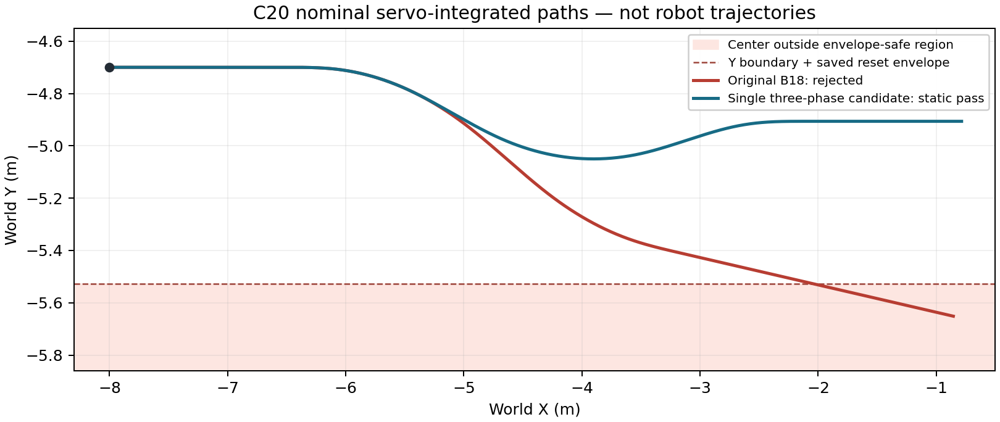

# C20：有界课程训练与几何前提失败

本轮实际执行了 [09-30 主方案](main_plan_20260930.md)的 RL 课程对照。**A 组完成 32,768 步并通过完整独立读回；B 组在 18,000 步后的复位阶段被名义路径几何检查拦截。** B 没有有效最终策略，课程收益比较未成立，未进入开发、续段或最终保留评估。此次不能判定覆盖课程有效或无效。

当前已通过七个固定仿真脚本的组合仍为 C18 基控与 C15 grouped final，保持段 1.5986 m/s、转向和完整坡道资格见 [C17–18 报告](main_route_execution_20260930_17_18.md)。A 的完整训练不等于通过这些任务；本次没有切换 GUI 或默认权重。

## 实际完成的训练

两组共用 C15 grouped 父策略及 Adam、C18 基控、99D 观测、16D 残差、奖励、网络、学习率和分组梯度裁剪。共同增加 `target_kl=0.03`：实际 minibatch KL 超过 0.045 时结束当次 train 的剩余更新，非有限值或超过 0.30 触发 KL 硬停止；完整 train 零次 optimizer 亦不合格。B 仅改变预定的转向与凸起命令覆盖。

| 实际量 | A：原课程再适配 | B：覆盖课程 |
|---|---:|---:|
| 物理控制步 | 32,768 | 18,000 |
| normal native 子步 | 163,840 | 90,000 |
| compiler native | 2 | 2 |
| 完整 rollout / train | 32 | 17 |
| 进入 epoch | 101 | 57 |
| evaluate_actions 批 | 373 | 213 |
| optimizer / backward | 351 | 202 |
| 正常 KL 提前停止次数 | 22 | 11 |
| 最大实际 batch KL | 0.056403 | 0.062323 |
| KL 硬停止 | 0 | 0 |
| host 用时 | 558.27 s | 300.03 s |
| 最终状态 | 完整训练有效、覆盖通过 | 课程几何前提失败 |

实际合计 **50,768 controls / 253,840 normal native / 4 compiler native**；actor rows 200,912、critic rows 200,882、optimizer 553。预留首段 65,536 步，B 未使用的 14,768 步不退回、不转为补训。所有实际进程已回收，来源前后哈希一致。完整计数见 [执行账本](../results/d1_main_route_execution_20260930_20/execution_ledger_20.json)。

A 的独立读回用了 312.75 s，没有模型或物理调用。它检查全部控制周期、C18 控制律与状态连续性、奖励、Gaussian 动作、实际力矩和五个原生接触子步。八个 postwarmup 槽均有三个完整有效 episode；凸起、粗糙地面和坡道的真实正载荷覆盖通过。见 [A 读回](../results/d1_main_route_execution_20260930_20/train_A_1_readback.json)。A final SHA256 为 `1a630229fe9b44abe75abe4e47c98be50a55a043f0163f20f57b0b97640904e5`，仅是未经过 heldout 资格的候选。

两组首 1,024 步的五个初态数组、完整控制复位状态及 numeric/Gaussian 数组共 64 项逐位一致，见 [配对记录](../results/d1_main_route_execution_20260930_20/first1024_pair_20.json)。这项前缀配对不能替代完整 A/B 比较。

## 失败发生在哪里

B 的 source episode 18（从零计数，第 19 个 episode）采用 `vx=1.0 m/s`，yaw 在 `[425,575)` 为 −0.25、`[575,725)` 为 +0.25 rad/s。两段 raw yaw 的积分为零，不代表车体中心线横向位移为零；实际检查按原命令 servo 积分。

保存的名义路径从 `(-8.0, -4.7)` 到 `(-0.855732, -5.651347)`。实际编译模型在复位姿态下的保守碰撞包络半径为 **0.472164 m**，因此最大 `abs(y)+radius=6.123511 m`，超出原 6.0 m 安全界 **0.123511 m**；1001 个路径点中，从点 882 开始共 119 点不合格。见 [保存几何复算](../results/d1_main_route_execution_20260930_20/failure_geometry_snapshot_20.json)。

异常发生在这个 episode 复位后的纯名义路径检查，尚未执行该 episode 的控制步。它不证明机器人实际越界、跌倒或跟踪失败。源审阅遗漏了新命令与机器人包络的联合资格；原安全检查正常拦截，应保留。后续必须在训练前对明确的有限课程范围做完整静态资格，不能只检查中心线。

上一 episode 的第 18,000 个物理控制周期已经完成，但 `DummyVecEnv` 自动复位抛出异常，使最后一次回调未返回。归档中的 numeric/full-control 各 18,000 条，Gaussian/learning transitions 为 17,999，pending index 为 17,999。这一差异原样保留；323 份 B 原子 payload 的哈希检查通过，但没有将 B 声称为完整有效训练，也没有伪造成功读回。B 的 failure checkpoint 仅供诊断，禁止用于正式评估或补训。

## 软件交付与后续边界

本轮交付版本化课程、KL 与梯度审计、全程训练记录、干净进程独立读回、开发/保留评分和续段判定模块。21 项 RL 纯测试通过，关键静态检查和干净导入通过。GUI 输入模块另有 9 项纯测试通过，覆盖限定 W/Q/E、释放/Space/X 停止、失焦/过期输入、R 复位请求和退出优先级；尚未接通并验收最新策略 GUI。

实际 gpt-6-astra ultra 制定合同、源码审阅和失败结案，实际 GPT-6 Sol 编写学习、读回和离线诊断模块；root 完成集成、全部测试、训练、计步与验证。Claude 身份探测返回 `anthropic/claude-opus-5`，但编码调用因每日额度限制失败，没有交付代码或测试，见 [实际调用记录](../results/d1_main_route_execution_20260930_20/claude_gui_attempt_receipt_20.json)。

失败后的纯数值检查已完成，见 [离线结果](../results/d1_main_route_execution_20260930_20/offline_corridor_20_02.json)。冻结的 A/B 各 source 0..79 全部列出，160 条中心线粗检查均通过；其中 35 条有自身保存几何的 flat 路径通过原包络 guard，B18 重现失败，52 条缺少自身保存几何而未资格，72 条非 flat 不适用平地避障门。这个有限列表不证明连续采样域或全部未来课程安全。

实际 servo 使原 B18 的末航向为 −0.10416 rad，尽管 raw yaw 积分为零。Astra 选定唯一修复候选：`[425,525)` −0.25、`[525,725)` +0.25、`[725,825)` −0.25 rad/s，速度仍为 1.0 m/s。窗口从 300 增至 400 ticks，raw 绝对 yaw 积分从 0.75 增至 1.0；这不是仅改变对称性。

该候选在 B18 的原保存复位几何下通过同一 guard：Y 向最小边界余量 **0.477764 m**，到半径扩张障碍盒的连续线段距离保守下界 **1.961879 m**，末航向约 0，末点 `(-0.785967,-4.906375)`。它仍有横向位移，不声称完全抵消。原始 160 条及候选共 161,000 次纯 servo advance，没有新增模型或物理调用。首次诊断启动因 ROS 的同名 `scripts` 包遮蔽项目包而在导入阶段失败；换用已验证的干净项目依赖环境后一次完成，两个启动记录均保留。

未来新训练合同可考虑复用本次 A 基线，须验证运行语义和来源桥接，并先补齐新课程范围的静态资格；新 B 从共同 C15 父模型开始，不能续训本次失败权重。静态通过不代表新训练 GO、动态安全或 RL 收益。详见 [Astra 失败审阅](../results/d1_main_route_execution_20260930_20/failure_review_20.md)及 [公开包说明](../results/d1_main_route_execution_20260930_20/README.md)。

真实 15 mm、自由键盘、横移、跳跃与物理自救没有新增资格。R 仍是仿真复位。保留原 77 份冻结源、历史实验和用户的 `results/my_course_drive_01/`。
