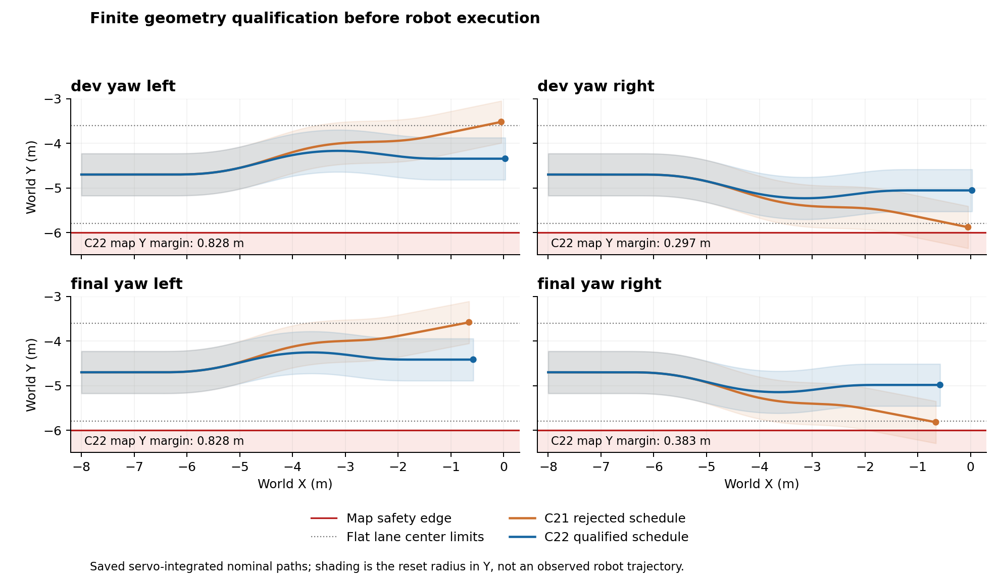

# C21–22：课程对照收益通过，RL 超过基控尚未成立

**本轮完成了唯一 B 训练和完整开发／保留评估。B 在四个保留场景上的平均归一化平方跟踪误差比 A 降低 13.50%，力矩成本降低 7.67%；预注册课程收益门通过。** B 的原七项能力、四项开发任务与四项保留任务全部通过。

结论有明确范围：这是一组共同起点、相同控制预算和公共 KL 规则下的有限课程对照。B 的保留集误差仍比 zero 高 3.60%，原六项 RL 贡献门仍为 false；不能写成 RL 已整体优于基控。新 B 是下一轮工程候选，没有自动切换默认策略或 GUI。

## 核心比较

以下比值均为 B／比较对象，越小越好；新场景采用等 case 权重。开发成绩不决定是否挑掉固定保留集，实际执行判定在保留集开始前已冻结。

| 指标 | 开发四场 | 最终保留四场 | 最终门 |
|---|---:|---:|---:|
| 误差 B/A | 0.884399 | 0.864989 | ≤0.90 |
| 误差 B/旧策略 | 0.868197 | 0.855532 | ≤0.95 |
| 误差 B/zero | 1.040441 | 1.036018 | 另列，不替代原六贡献门 |
| 成本 B/A | 0.936116 | 0.923273 | ≤1.10 |
| 成本 B/zero | 1.037522 | 1.033738 | ≤1.20 |
| 转向 drive 误差 B/A | 0.845995 | 0.817248 | ≤1.02 |
| 凸起 drive 误差 B/A | 1.017291 | 1.011544 | ≤1.02 |

收益主要来自转向。保留集转向误差降低 18.28%，凸起 drive 误差反而增加 1.15%，仍在事前 2% 容差内；不能声称所有地形均改善。保持段和 drive 中保持段以外的误差也全部保留在汇总中，没有新增保留集 hold 门或删掉不利场次。

分段诊断也有不利结果：保留集凸起保持段误差 B/A 为 0.969424，但保持段以外的 drive 误差比为 1.257625，即增加 25.76%。后者按各场 drive 减 hold 的 SSE／ticks 后等权计算，包含起步及 hold 后 drive，不含释放后的制动，也不是局部换向窗口。它是已公开的诊断结果，不追加成事后的成败门。

原六项对照中，B/zero pooled SSE 为 **1.038768**，成本比为 **1.040694**；没有 zero 失败转 B 成功的案例，仅 1/6 单项满足误差不差于 zero 的 1.02 倍，未达到至少四项及 pooled SSE≤0.85 的贡献条件。A 的贡献门也未通过。

### B 的固定脚本能力

| 已验收条件 | B 实际结果 |
|---|---|
| 平地 1.6 m/s 指令 | 保持均速 **1.601452 m/s**，速度 RMS **0.004796 m/s**；400/400 点超过 1.5 m/s |
| 高速释放停止 | 3.37 s，最大超行程 2.604964 m；通过原 4.2 s／3.2 m 门 |
| 原／镜像 1.2 m/s 转向 | yaw RMS **0.086970／0.085726 rad/s**；通过原 0.12 门 |
| 完整 0.45 m/s 坡道 | 保持均速 **0.469598 m/s**、RMS **0.022779 m/s**；上坡／台面／下坡正轮载荷和整轮离坡通过 |
| 原七项、开发四项、保留四项 | B 均通过；zero、旧策略、A 也都通过同组任务 |

这些是各自固定脚本的仿真资格，不是同时以 1.6 m/s 任意转向或连续穿越所有地形的资格。

## 实际执行与核验

| 新执行阶段 | controls | normal native | compiler native | host 用时 | 完整读回用时 |
|---|---:|---:|---:|---:|---:|
| B 唯一训练 | 32,768 | 163,840 | 2 | 571.56 s | 328.22 s |
| 开发：两 floor＋30 场 | 49,600 | 248,000 | 2 | 837.20 s | 582.25 s |
| 保留：16 场 | 25,600 | 128,000 | 2 | 491.92 s | 333.95 s |

**新执行合计 107,968 controls／539,840 normal native／6 compiler native**，三次 worker 和完整独立读回均正常关闭。actor rows 191,968、critic rows 129,344，8 次 PPO load、24 次 torch.load，355 次 optimizer。没有 A 重训、第二段 B、失败补步或历史物理批次重放。

原 77 份冻结源与三次 GO 输入闭合无变化。完整账本通过实际 C／Python／模型 API 及读回记录交叉核对；独立读回、汇总和绘图均不执行模型或物理。

B 唯一 final ZIP SHA256：`7bd58b5d6114745b12b4284be3f861f973a5d31d9d596365a5b54cb5e0d76691`。

见[执行汇总](../results/d1_main_route_execution_20260930_22/execution_summary_22.json)、[开发完整读回](../results/d1_main_route_execution_20260930_22/development_1_readback.json)、[保留完整读回](../results/d1_main_route_execution_20260930_22/final_1_readback.json)和[Astra 终审](../results/d1_main_route_execution_20260930_22/final_review_22.md)。

## 本次实验回答的问题

比较同一 C18 基控上，从 C15 grouped final 和同一 Adam 状态继续学习时，B 的预定命令覆盖课程是否比 A 的原课程再适配更好。两者共用 99D 观测、16D 残差、奖励、128×128 Tanh 网络、学习率和分组梯度裁剪；共同 `target_kl=0.03`，实际 batch KL 超过 0.045 时该批不执行 backward／optimizer，并结束该次 train 的后续更新；超过 0.30 或非有限值触发硬停止。

A 复用已完整读回的 C20 A1，没有重训；B 从共同 C15 父策略重新开始，没有续用 C20 失败权重。来源桥接与新一轮初态／前 1,024 步配对共 64 项逐字节一致。A/B 的实际优化次数分别为 351/355，这是共同 KL 停止规则的结果，不补更新凑齐。比较对象是整个预注册课程包在该学习规则下的效果，不能单独归因于某一个端点或窗口。

B 的 32,768 个控制步、163,840 个 normal native 子步和 2 个 compiler native 均已闭合。32 次 train 共进入 104 个 epoch、评估 377 个 minibatch、实际更新 355 次，22 次正常 KL 提前停止，没有硬停止。独立训练读回通过，33 次实际复位几何与完整状态核验通过；八个 postwarmup 槽各有三个完整有效片段，指定正／负 yaw 端点各覆盖 171 步，bumps/ramp/rough 有效正载荷片段为 3/6/3。

## 先修正几何前提，再进行训练

C21 正式纯几何预检执行了 184,800 次 servo 积分：160 条有限训练课程全部通过，16 条评估命令中四条新转向命令失败，未启动机器人或模型。开发／保留右转的扩张包络分别达到 `abs(y)+radius=6.352636/6.291914 m`，超过原 6 m 安全界；左转则离开原平地通道。此处是名义路径资格失败，不是机器人实际摔倒或越界。

C22 将这四条转向的三个子段固定为 100/200/100 ticks，保持原速度、幅值、总 400 ticks 与绝对 raw yaw 面积，修正带符号积分。执行一次 6,400 次 servo 的增量预检；四条新命令全部通过，其余 160 条训练及 12 条评估按哈希复用，不重复积分。开发／保留右转最小 Y 安全余量为 0.296658/0.382583 m。C21 失败报告原样保留。

图只表示保存的 servo 名义路径和复位碰撞半径，不是实际机器人轨迹。静态模板不替代动态证据；运行在每次实际复位、首个控制前保存几何与完整初态，并由独立读回复核。

## 如何解释比较

新开发和保留集各有两条转向、两条凸起命令，每条固定 1,600 ticks，zero／旧策略／A／B 均真实执行。原七场的 A/B 新跑；zero／旧策略依照合同复用 C18 证据，没有重跑历史批次。旧记录桥接核对保存初态／首记录、几何、命令和评分源，并由冻结 reset 源码推导隐状态同态；旧 C18 未实际归档完整 context／PI／reset payload，不能称为旧隐状态直接测存配对。新 A/B 及四方新场另有完整保存的 reset 状态配对。最终保留集使用唯一预算末端权重，不按开发成绩选择 checkpoint，也没有第二段或补训。

新场景误差是各 case 内 `mean((vx_error/0.25)^2 + (yaw_error/0.4)^2)`，四个 case 等权；yaw/bumps 各两项等权。原六贡献门继续使用原 pooled SSE，镜像独列，不能混合两种池的分母。成本为实际执行的归一化电机力矩平方均值，不是能耗或焦耳数。释放制动由基控以零残差执行，不能归功于 RL。

这是一对训练实现、oracle 观测和确定性仿真脚本的结果。改变 seed 标签不构成独立物理随机样本；不能据此声称多种子鲁棒性、任意地形连穿或实机部署成立。

## 证据与尚未交付的能力

实际 gpt-6-astra ultra 制定、审阅合同并终审；GPT-6 Sol 完成有界几何和发布模块，独立 Astra 完成读回、评分及计步模块；root 执行测试、全部训练／仿真、独立回读、集成与发布。C22 必要纯测试 20 项通过，干净导入和关键 Ruff 检查通过。没有将未成功执行的 Claude 调用列为本轮贡献。

完整 control/native 归档保留在本地，公开包包含报告、源代码、最终策略、关键数值及首块样本，并给出全量本地文件哈希。公开子集不足以独立重跑完整 native reader，见[包说明](../results/d1_main_route_execution_20260930_22/README.md)和[计步账本](../results/d1_main_route_execution_20260930_22/execution_ledger_22.json)。

最新 99D/16D 策略的通用 GUI 仍未完成，旧 `d1-rl` 与 `run_d1_course_drive.py` 不会因此自动加载 B。真实 15 mm 单台阶、任意高速转向、A/D 横移、Space 跳跃和物理自救没有新增资格；R 仍是仿真复位。原 77 份冻结文件、历史实验、C20/C21 失败证据及用户的 `results/my_course_drive_01/` 均保留。

## 下一项工程推进

本轮到此关闭，不因开发或保留门通过追加训练。B22 冻结为下一工程候选；当前默认资格锚点 C18＋C15 保留。先按[主方案](main_plan_20260930.md)交付实际 99D/16D、C18 基控的版本化策略 GUI，并分别验证脚本数值、W/Q/E、释放停止、失焦、R 复位和性能；再单独冻结真实 15 mm、候选 0.20 m/s、至多 2,400 controls／12,000 normal native 的完整几何／轮载荷／整轮清除／停车合同。该候选速度与时窗仍须先证实可行，不能直接沿用旧策略资格。

横移、跳跃和物理自救后置；新 GUI 与真实台阶尚未交付的范围见[当前状态](current_status_20260930_22.md)。
