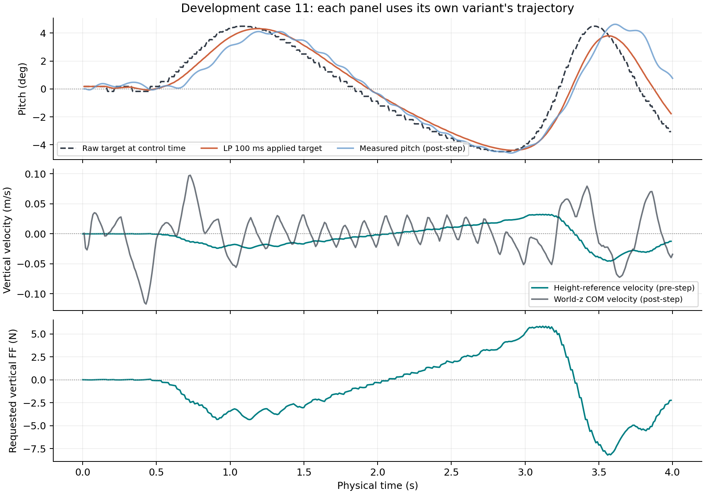

# 从颠簸失败分析参考动态

本页的 CSV 和源码归档随 Release 提供，见[下载与复算](reproducibility.md)。

本节对应 [120 回合开发集实验](../results/d1_reference_dynamics/README.md)。没有训练 RL，残差始终为零。先把传统控制器的失败拆开，再决定学习策略需要补偿什么。

实验没有产生可直接推广的控制器升级。竖直前馈让颠簸末秒速度 RMSE 均值从 0.11535 降到 0.11190 m/s，通过数仍为 1/12；给姿态目标加 50 ms 或 100 ms 低通后，颠簸通过数降到 0/12。

## 同一个 RMSE，可能对应不同问题

令最后 1 s 的速度误差为 `e_i = v_i - v_cmd,i`，本实验共 100 个样本。定义：

```text
bias     = mean(e)
variance = mean((e - bias)²)      # ddof=0，描述本窗口，不估计总体方差
RMSE²    = bias² + variance
```

这个恒等式把误差分成平均偏差和围绕均值的变化，不能单凭它诊断系统失稳。最后 1 s 只有有限的地形片段，窗口里的方差也会包含正常过渡过程。

| 开发案例 | 末秒 bias（m/s） | 末秒标准差（m/s） | 末秒 RMSE（m/s） | 本窗口的主要误差 |
|---|---:|---:|---:|---|
| 04：5 mm，0.25 m/s | -0.11693 | 0.01312 | 0.11766 | 持续欠速 |
| 10：10 mm，0.25 m/s | +0.02571 | 0.10262 | 0.10579 | 速度摆动 |
| 11：10 mm，0.40 m/s | +0.12461 | 0.13780 | 0.18578 | 均值超速也很明显，方差稍大 |

`bias_dominant` 的判据是 `bias² >= variance`。它只是记录中的分类标签。比如 case 11 被分为 `oscillation_dominant`，不能忽略 +0.125 m/s 的偏差。

case 10 加前馈后，标准差下降到 0.02851 m/s，但平均误差变成 -0.07306 m/s，末秒 RMSE 仍有 0.07842 m/s。它从摆动较大变成了欠速，尚未通过该案例的 0.0625 m/s 门槛。

## 移动地面高度为什么会影响阻尼项

在静态、沿 y 方向不变的地形上，局部地面高度可写成 `h(x)`。机体净空目标不变时，世界系高度目标仍会随位置变化：

```text
z_ref(t) = h(x_origin(t)) + clearance_cmd
dz_ref/dt = dh/dx * vx_origin
dh/dx = -tan(ground_pitch)
```

最后一个负号来自本项目的 pitch 约定：沿世界 x 正方向爬升的地面对应负 pitch。不要把图像里“抬头”的直觉直接代入公式。

原 VMC 的竖直部分包含 `Kp * (z_ref - z) - Kd * vz`。如果目标高度在动，增加 `Kd * dz_ref/dt` 可将阻尼项写成 `Kd * (dz_ref/dt - vz)`。本实验只增加这一项，`Kd=180 N·s/m`，继续使用已有的 ±500 N 前馈限幅；没有同时调整刚度和姿态增益。

需要区分“公式中的点”和“当前接口中的点”。地面高度在可见的 `base_link` 原点采样，`D1StateEstimate.base_linear_velocity_world` 则是基体惯性 COM 的速度。现有探针沿用了 COM 速度，严格的原点速度需要：

```text
v_origin_world = v_COM_world - omega_world × (R_body_to_world * r_origin_COM_body)
```

COM 偏置非零时，旋转会使两点速度不同。这批数据没有控制前的完整速度和角速度，不能事后精确补出漏掉的项。前馈效果应称为当前接口下的近似补偿，不能称为精确高度导数补偿。任何原点速度修正都应另开版本，对照原结果。

前馈请求在全批实验中最大只有 8.203 N，没有触发 ±500 N 限幅。把这点小改善解释成“解决了前馈饱和”没有数据依据。

## 平滑姿态目标会付出多少延迟

三个姿态变体对 roll/pitch 目标使用一阶低通，每拍只更新一次：

```text
alpha = 1 - exp(-dt / tau)
filtered[k] = filtered[k-1] + alpha * (raw[k] - filtered[k-1])
dt = 0.01 s
tau = 0.02 / 0.05 / 0.10 s
```

对应的 `alpha` 约为 0.39347、0.18127、0.09516。更小的 alpha 会减缓目标变化，也会使控制器使用更滞后的目标。本实验同时把滤波后的命令交给 LQR 和 VMC，保证两者收到同一个姿态目标；奖励目标和观测末尾的地面目标仍是原始值。

这个设置适合无 RL 的单变量探针。已有策略若依赖原先的目标与控制关系，不能无说明地装上滤波器继续评估，然后宣称仍是同一个控制任务。



上图第一行取自 100 ms 滤波变体，后两行取自前馈变体，不能把不同变体的轨迹当成同一次运行。第一行能看到原始姿态目标的阶梯及滤波后的滞后。原始目标来自离散碰撞地形的局部切面；观察到阶梯，不等于已经证明阶梯是跟踪失败的主因。全量对照里，低通 50 ms 和 100 ms 的质量通过数更少，当前结果不支持采用它们。

## CSV 的前后时刻怎么读

每行记录一次控制转移：先读取当前命令，再执行一步仿真，最后记录状态和奖励。第 k 行中的 `time_s = k * dt` 是控制结束时刻。

| 字段 | 对应时刻 | 用途 |
|---|---|---|
| `control_pitch_target_rad` / `control_roll_target_rad` | `(k-1) * dt` | 本次控制实际取用的命令 |
| `reward_pitch_target_rad` / `reward_roll_target_rad` | `k * dt` | 新位置处的原始地形姿态目标 |
| `measured_pitch_rad` / `measured_roll_rad` | `k * dt` | 控制后的姿态 |
| `height_velocity_reference_mps` | `(k-1) * dt` | 本次前馈计算中的高度变化率 |
| `body_vertical_velocity_mps` | `k * dt` | 实际是世界 z 方向 COM 速度，名称保留原样 |

设 `c[k]` 为 CSV 第 k 行的控制目标，`r[k]` 为同一行的奖励原始目标。第 2 行起应检查：

```text
c[k] = c[k-1] + alpha * (r[k-1] - c[k-1])
```

直接拿 `r[k]` 代入会引入一拍错位。独立审计从第 2 行起检查两轴的全部递推，最大误差为零；第 1 行仅作为记录中的初值使用，重置时的原始目标没有独立日志。

`applied_vertical_feedforward_n` 也是有限的证据：记录器对请求值执行一次 `clip` 并写入 CSV。审计可以证明请求等于 `180 * height_velocity_reference_mps`，也可以证明记录的限幅结果正确，但这个字段并非独立的执行器力测量。

## 跟着数据做一次检查

从仓库根目录运行：

```bash
env PYTHONPATH=src python3 scripts/audit_d1_reference_dynamics.py
env PYTHONPATH=src python3 -m pytest tests/test_d1_reference_audit.py
```

先打开 derived_metrics.csv（`../results/d1_reference_dynamics/derived_metrics.csv`） 找到 baseline 的 case 04。用末秒的 bias 和标准差计算 RMSE，结果应为 0.11766 m/s；再比较 case 10。回到时序图，检查数字是否符合曲线。

接着读 `tests/test_d1_reference_audit.py` 中的一拍错位测试。测试先构造符合上一行关系的滤波序列，再故意改成同一行原始目标，审计必须抛出错误。质量门槛也分别做了失败测试，避免把“400 步没摔倒”误记成质量通过。

如果要继续改控制器，先补齐控制前原点/COM 的世界速度日志，核对它们的转换。随后可单独比较原点速度前馈，保持原有 24 个开发案例及门槛不变。通过开发集后再冻结方案，另建未使用过的地形评估；本节这些案例已经参与分析，不能继续充当独立测试集。
