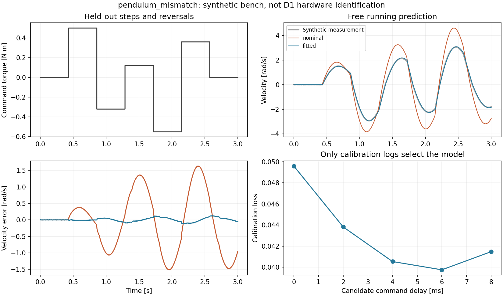

# 单轴合成辨识结果

这一组结果用于检查教学台架的辨识流程。数据全部由 MuJoCo 生成；没有真实 D1 采集数据，
没有在整机 IDQP 或 PPO 上验证控制收益。`pendulum` 是单摆负载，不是完整 D1 单腿。

## 如何生成

在仓库根目录、已安装项目依赖的环境中执行：

```bash
python scripts/run_actuator_identification.py \
  --bench both --scenario both --output results/my_actuator_reproduction
```

这里使用默认 `seed=7`、每段 `3 s`、`dt=2 ms`。每种工况两段标定运动、一段验证扫频、
一段阶跃/换向留出测试。只用前两段选参；验证和测试运动没有参与选择损失权重或优化预算。
四组拟合和输出在本次 CPU 运行中共花 `21.51 s`，期间还运行了其他测试，因此不作性能基准。

生成端参数为 `armature=0.017 kg·m²`、`damping=0.105 N·m·s/rad`、
平滑摩擦幅值 `0.043 N·m`，真实合成延迟为 `2` 个物理步，即 `4 ms`。
位置噪声标准差 `0.0002 rad`，速度噪声标准差 `0.002 rad/s`；这两个测量通道独立加噪。

所有拟合器使用同一个名义初值和搜索范围。`mismatch` 仅在生成器加入 `0.08 N·m` 的
速度相关额外摩擦，拟合模型没有这一项。限矩、负载惯量和力矩命令单位在本台架中已知。

## 未见阶跃与换向的预测

数值来自 [metrics.csv](metrics.csv) 中的 `split=holdout` 行。每次从第一个测量状态出发
完整向前积分，不用后续测量纠正预测状态。

| 工况 | 名义速度 RMSE [rad/s] | 辨识速度 RMSE [rad/s] | 名义位置 RMSE [rad] | 辨识位置 RMSE [rad] | 选中延迟 [ms] |
| --- | ---: | ---: | ---: | ---: | ---: |
| wheel，结构一致 | 0.926318 | 0.002142 | 0.293401 | 0.000574 | 4 |
| wheel，缺失低速摩擦 | 0.929848 | 0.140818 | 0.319491 | 0.084409 | 8 |
| pendulum，结构一致 | 0.868489 | 0.002008 | 0.125386 | 0.000231 | 4 |
| pendulum，缺失低速摩擦 | 0.878351 | 0.055094 | 0.126896 | 0.008522 | 6 |

同结构时，两个台架都选中设定的 `4 ms` 延迟。加入模型缺项后，拟合仍比名义模型更接近
这段未见运动，但延迟已经偏离生成值。wheel 的最优候选还碰到了 `8 ms` 搜索上界。
不能把这些有效拟合参数直接当作电机的真实物理参数。

这几组数据也说明：局部雅可比满秩不足以证明模型正确。四组报告的连续参数雅可比秩均为 3，
而结构失配造成的系统误差仍然存在；低速误差和样本数在 CSV 中另列。扩展延迟搜索范围或
摩擦模型应作为后续开发实验，并另留测试运动，不能反复用本表调参。



## 查看原始数据

- [实验配置与源文件 SHA](experiment.json) 记录了实际运行依赖；运行时工作区未提交，
  `git_dirty=true`，因此复核算法版本请使用 `source_sha256`，不能只看父提交号。
- [完整汇总](summary.json) 包含所有轨迹指标及耗时。
- [校验清单](manifest.json) 覆盖生成器输出的原始 CSV、拟合参数及图表，不包含这份后写的说明。
- [wheel 结构一致的拟合过程](wheel_matched/fit.json) 与
  [wheel 结构失配的拟合过程](wheel_mismatch/fit.json) 可以直接比较各延迟候选。
- [pendulum 结构失配留出日志](pendulum_mismatch/holdout_3.csv) 与
  [对应预测](pendulum_mismatch/holdout_3_predictions.csv) 可用于自己重画图。

只有一个合成参数对象和一个噪声种子。这里没有给出统计置信区间，也没有声称具有跨对象
鲁棒性。保持同一被控对象、让辨识参数实际进入控制器的闭环对照，留待下一阶段。

推导与练习见[单转轴辨识说明](../../docs/actuator_identification.md)。
