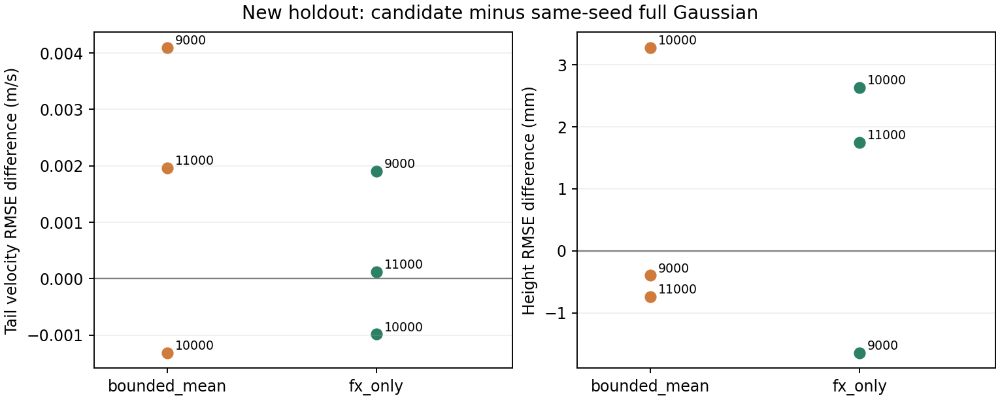
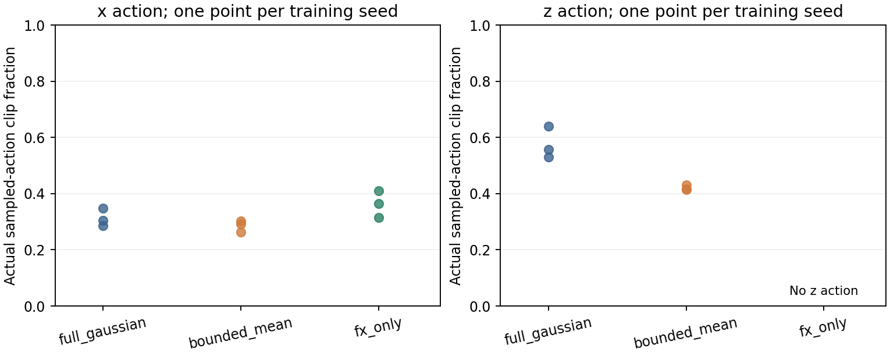
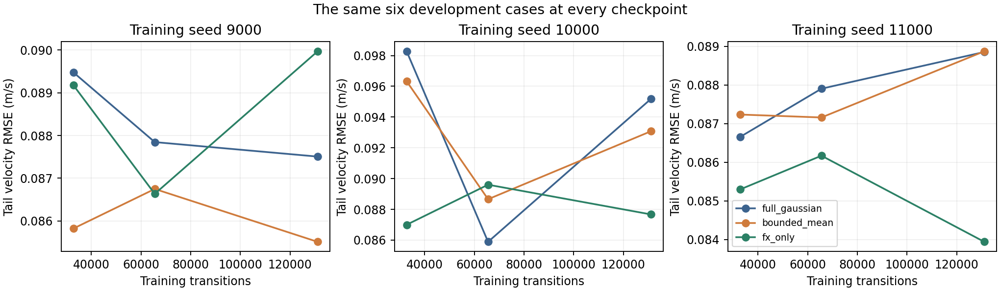

# 动作参数化实验：九个新模型的结果

这轮数据没有支持把默认方案换成 `bounded_mean` 或 `fx_only`。均值约束减少了竖直动作的采样裁剪，控制指标却没有稳定地跟着改善。只学习纵向力的方案在三个种子上的全程速度 RMSE 都高于相同种子的二维 Gaussian。

完整 Gaussian 相对零残差基线的全程速度 RMSE 在三个种子上都有小幅下降，但尾段误差和高度误差并不一致改善。这是有限收益，还不足以证明整个控制任务被 RL 稳定改进。

## 固定预算与数据范围

每种参数化训练 `9000 / 10000 / 11000` 三个种子，每个模型 131072 条 transition。九个模型合计 1179648 条；每个模型完成 256 个 rollout，即 SB3 记录的 1024 个 PPO epochs。4 个环境、128 步 rollout、4 epochs 和 batch size 128 对应每个模型 4096 次 minibatch 优化器更新。

所有正式比较使用最后的固定预算检查点。新留出集共 24 个案例，参数在训练前已写入协议。九个策略各运行一遍，零残差基线只运行一遍，共 240 个回合。这批留出结果已被查看，不再用于本轮调参后重复宣布“泛化提升”。

[算法说明](../../docs/action_parameterization.md)记录了动作映射和高斯概率公式。[checkpoint_audit.csv](checkpoint_audit.csv)包含全部 27 个预算检查点的 SHA 及真实保存计数。

## 新留出集

以下均为 24 个案例的平均值。速度单位为 m/s，高度误差单位为 mm；奖励为未缩放的回合 return。十个控制器都完成了 24/24 回合，质量门槛还要求进度、尾段速度误差等同时合格。

| 策略 | seed | 质量通过 | 全程速度 RMSE | 尾段速度 RMSE | 高度 RMSE | return |
| --- | ---: | ---: | ---: | ---: | ---: | ---: |
| 零残差 | 单次基线 | 14/24 | 0.10048 | 0.06933 | 13.239 | 1549.26 |
| full Gaussian | 9000 | 14/24 | 0.10020 | 0.06795 | 14.895 | 1508.60 |
| bounded mean | 9000 | 14/24 | 0.10274 | 0.07205 | 14.501 | 1524.81 |
| Fx only | 9000 | 14/24 | 0.10147 | 0.06986 | 13.250 | 1533.50 |
| full Gaussian | 10000 | 14/24 | 0.09708 | 0.06969 | 10.588 | 1548.38 |
| bounded mean | 10000 | 14/24 | 0.09983 | 0.06838 | 13.867 | 1541.76 |
| Fx only | 10000 | 15/24 | 0.09978 | 0.06871 | 13.221 | 1540.62 |
| full Gaussian | 11000 | 15/24 | 0.09800 | 0.06943 | 11.508 | 1552.89 |
| bounded mean | 11000 | 14/24 | 0.09838 | 0.07139 | 10.773 | 1547.73 |
| Fx only | 11000 | 14/24 | 0.10066 | 0.06955 | 13.257 | 1541.54 |

完整数据见 [holdout_controller_means.csv](holdout_controller_means.csv)，逐案例结果见 [holdout_episode_metrics.csv](holdout_episode_metrics.csv)。一次尾段速度改进不等于全程改进；质量通过数相同，也不说明轨迹表现相同。

图中每个点是一个训练种子，值为候选减去相同种子的 full Gaussian。零线以下表示该误差更低。`bounded_mean` 的尾段速度差值随 seed 改变符号；`fx_only` 的高度差值也改变符号。没有把 24 个地形案例当作 24 次独立训练来计算置信区间。

## 旧的遮挡动作实验，不能替代重新训练

[残差反馈实验](../d1_residual_feedback/README.md)曾在固定的旧模型上把 Fz 置零，观察到六个开发案例的平均高度 RMSE 降低约 2.7 mm。那个实验改变了已训练策略的执行动作。

这次 `fx_only` 从初始化开始就是一维策略。相对本轮相同种子的二维模型，高度 RMSE 的差值分别为 `-1.645 / +2.633 / +1.749 mm`；全程速度 RMSE 的差值分别为 `+0.001277 / +0.002694 / +0.002661 m/s`。原来的遮挡收益没有在三个新训练种子上重复出现，不能继续把“去掉 Fz 会改善高度”作为项目结论。

两种实验的干预方式不同，使用的模型与评估案例也不同。后续可以研究控制参考或奖励分项，但本轮数据不支持凭这条旧结论替换策略结构。

## 裁剪少了，任务未必更好

下表统计训练时真实采样的越界比例，分母为每个模型的 131072 条 transition。它不是根据均值与标准差推算的理论概率，也不是 PPO 目标里的 `train/clip_fraction`。

| seed | full 的 x 裁剪率 | Fx only 的 x 裁剪率 | full 的 z 裁剪率 | bounded mean 的 z 裁剪率 |
| --- | ---: | ---: | ---: | ---: |
| 9000 | 34.88% | 40.94% | 63.96% | 41.58% |
| 10000 | 30.46% | 36.54% | 52.96% | 41.52% |
| 11000 | 28.50% | 31.56% | 55.69% | 43.16% |

`bounded_mean` 的训练均值未越过 ±1，但高斯探索样本仍被裁剪。`fx_only` 没有 z 通道，不能把缺失通道写成“z 裁剪率为零”后拿来比较。

[training_action_statistics.csv](training_action_statistics.csv)还列出均值极值和标准差范围。约束均值同时会改变反向传播梯度；删掉一个动作则改变联合分布及后续探索轨迹。裁剪比例下降不能单独解释成性能提升的原因。

## 开发曲线的分母保持一致

每条线使用同一组六个开发案例。三个面板的纵轴分别缩放，应读刻度，不能凭线的斜率跨面板比较。种子 10000 的 full Gaussian 在 65536 步时尾段速度误差较低，到了 131072 步又升高；种子 11000 的 Fx only 则在最终预算下降。训练步数增加没有带来一致的单调改进。

[development_fixed_six.csv](development_fixed_six.csv)保留可比较的曲线；[development_final_24.csv](development_final_24.csv)单独列出最终完整开发集。正式留出比较仍按预先规定使用 131072 步检查点，没有事后挑一张较好的开发曲线代替最终模型。

## 复算与限制

[audit.json](audit.json)记录本次独立复算：324 个开发回合和 240 个留出回合。从逐步 CSV 复算的指标与汇总数据最大差为 `2.50e-12`；检查了 489 个训练文件及 255 个留出文件的 SHA。原始产物在分析前后没有变化。

NPZ 中的 `raw_action` 按普通对角高斯密度重新计算 `log_prob`。float64 复算与训练 float32 日志的最大差为 `2.82e-6`，低于 `1e-5` 容差；全部执行动作与逐元素裁剪结果一致。每个 rollout 的采样比例和均值统计也由 NPZ 重算，和 CSV 的最大差为零。

分析脚本没有调用训练入口的指标汇总函数，且不启动仿真。[input_inventory.json](input_inventory.json)记录每份输入的 SHA，分析依赖版本也保存在其中。[analysis_source.tar.gz](analysis_source.tar.gz)是本次计算使用的源码快照，其源码 SHA 由清单记录。墙钟耗时不能从状态 CSV 重建。文件一致性也不能证明仿真模型具备真机精度。

仅有三个训练种子。此处报告配对差值，不作统计显著性或 sim2real 性能宣称。

复算命令见[算法说明](../../docs/action_parameterization.md#本地检查)。旧版裁剪图曾有边缘文字裁切，修正后已重新生成并实际查看；旧派生文件可从 `/tmp/d1-action-analysis-layout-v1-MwVwmX/analysis` 恢复。训练目录和正式留出目录没有移动或覆盖。
