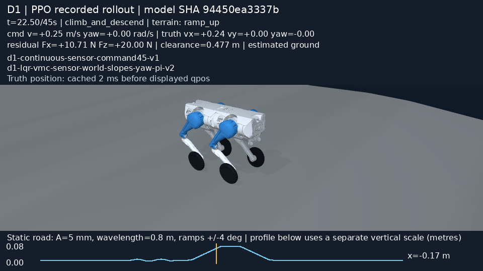
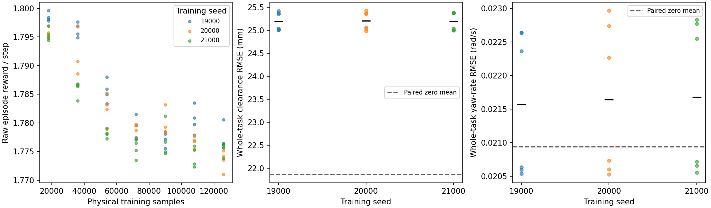

# 传感器闭环的连续任务 PPO

本页的 CSV 和源码归档随 Release 提供，见[下载与复算](../../docs/reproducibility.md)。

三个新策略都能跑完固定道路上的 45 s 和 50 s 任务，但没有通过完整质量判据。纵向速度误差略有下降，离地高度误差增加约 3.34 mm。当前结果不支持用 PPO 替换零残差基线。

正式数据在 [sensor45_v1](sensor45_v1)。三个训练种子为 19000/20000/21000，每个训练 131072 个物理环境步，总计 393216 步。32768、65536、131072 的九个 checkpoint 全部保留。训练前冻结的配置见 [protocol.json](sensor45_v1/protocol.json)，控制与观测由真实仿真 IMU/编码器估计提供，动作仍是 `[Fx, Fz]` 残差，偏航转矩由 PI 支路产生。

[](videos/seed19000_sensor45_45s.mp4)

[PPO 完整视频](videos/seed19000_sensor45_45s.mp4) · [同条件零残差视频](videos/zero_sensor45_45s.mp4)。两份视频都是 960×540、20 fps、901 帧，播放时长 45.05 s，已完整解码检查。模型和观测 schema 直接写在画面上；最后一帧保留 `quality_pass=False`。

## 固定最终预算的结果

每个模型评价相同六个留出条件：测量噪声种子 617/629/643，分别跑 45 s 和 50 s。地图没有更换，这里只检查新的噪声序列与命令时长，不能称为新地形泛化。

表中的差值为“PPO 减同条件零残差”，先在每个训练种子的六个配对条件上取均值。零残差基线的六次记录只保存一份，复用数值不增加样本量。

| 训练种子 | 完成 / 条件数 | 质量通过 | 纵向速度 RMSE 差 / m·s⁻¹ | 离地高度 RMSE 差 / mm | 偏航角速度 RMSE 差 / rad·s⁻¹ |
|---|---:|---:|---:|---:|---:|
| 19000 | 6/6 | 0/6 | -0.001566 | +3.339 | +0.000630 |
| 20000 | 6/6 | 0/6 | -0.000712 | +3.344 | +0.000701 |
| 21000 | 6/6 | 0/6 | -0.001541 | +3.335 | +0.000741 |
| 零残差 | 6/6 | 0/6 | 0 | 0 | 0 |

独立单位只有三个训练种子。4500/5000 个控制步用于计算单次误差，不作为独立重复。完整数值在 配对表（`analysis_sensor45_v1/paired_cases.csv`） 与 按训练种子的汇总（`analysis_sensor45_v1/holdout_by_training_seed.csv`）。

开发条件 seed17/45 s 下，零残差只有左转阶段高度 RMSE 26.27 mm 超过 25 mm 门槛。seed19000 最终 PPO 的左转为 29.20 mm，另有停车等阶段也超限。它依然完成了全部阶段和地形；视频能展示连续运动，但不能把画面中的完成误认为控制质量提升。



左图显示每个完成 episode 的原始回报除以步数，散点包含四个 worker。三个种子的训练回报均有下降，不能从“模型已更新”推断“策略在变好”。右侧按完整任务计算的高度 RMSE 也高于配对基线。阶段质量门槛需要另看逐阶段数据，不能直接套到全程 RMSE 上。

## 动作记录

| 训练种子 | Fx 原始样本被裁剪的比例 | Fz 原始样本被裁剪的比例 |
|---|---:|---:|
| 19000 | 37.62% | 65.27% |
| 20000 | 32.23% | 70.31% |
| 21000 | 35.25% | 78.76% |

比例来自实际训练样本，保存在各 `training_seed*/training_samples.npz` 的 `raw_gaussian` 和 `clipped_action`。这些数字提示需要检查动作维度与训练更新，但仅凭裁剪率不能认定 PPO 概率计算错误。下一次动作实验应另存协议，不能继续用本次已查看的留出条件调参后再宣称独立通过。

## 怎样复核

[独立审计](analysis_sensor45_v1/independent_audit.json) 检查了 266 个产物 SHA，以及归档内的 36 个源文件。42 次原始运行中，九次是零残差；其余策略评价有十五次开发条件和十八次最终留出条件。从 CSV 重算的 RMSE 与原汇总差为零。九个模型 zip 内部的 `num_timesteps` 与 `_n_updates` 也按固定协议核验，最终每个模型记录 256 次 rollout 和 1024 次 PPO epoch 更新。

[重载复演](replay_sensor45_cli/replay_check.json) 使用磁盘里的 seed19000/131072 checkpoint，重新执行 seed17 的完整 45 s，并重跑同条件零残差。两次复演的全部状态数组和 CSV 都与原始运行逐字节一致。无需重新训练：

```bash
rtk env PYTHONPATH=src:.local-deps OPENBLAS_NUM_THREADS=1 OMP_NUM_THREADS=1 MKL_NUM_THREADS=1 \
  python3 scripts/replay_d1_continuous_policy.py --run results/d1_continuous_policy/sensor45_v1 \
  --output results/my_sensor45_replay
```

当前底层有一个应记住的时间约定：`mj_step` 最后一个 2 ms 子步结束后，`qpos` 已积分，CSV 通过 `xpos` 取得的机体位置仍来自该子步积分前。全部 42 次运行都满足 `truth_xyz = qpos_xyz - 0.002*qvel_xyz`，按 1e-12 m 容差核验。两种相位之间最大的坐标差为 1.081 mm。视频使用积分后的状态，真值误差使用原控制循环的取样方式；此版本不宣称两者完全同步。

训练结束并完成重载复演后，只改过 renderer 的文字面板：schema 改成深底白字，并标明上述 2 ms 取样差。新的 renderer SHA 写在每个视频 sidecar 中；[改动记录](rendering_revision.json) 保留训练前后的哈希。训练时使用的旧 renderer 仍在 `source.tar.gz`，仿真和策略源文件没有变化。

详细的奖励、传感器先验和重跑命令见 [连续任务文档](../../docs/continuous_task.md)。正式训练完成后，三个短 smoke 目录和重复的临时复演目录已移出仓库，恢复位置见 [清理记录](cleanup.json)。它们不计入上述成绩。
