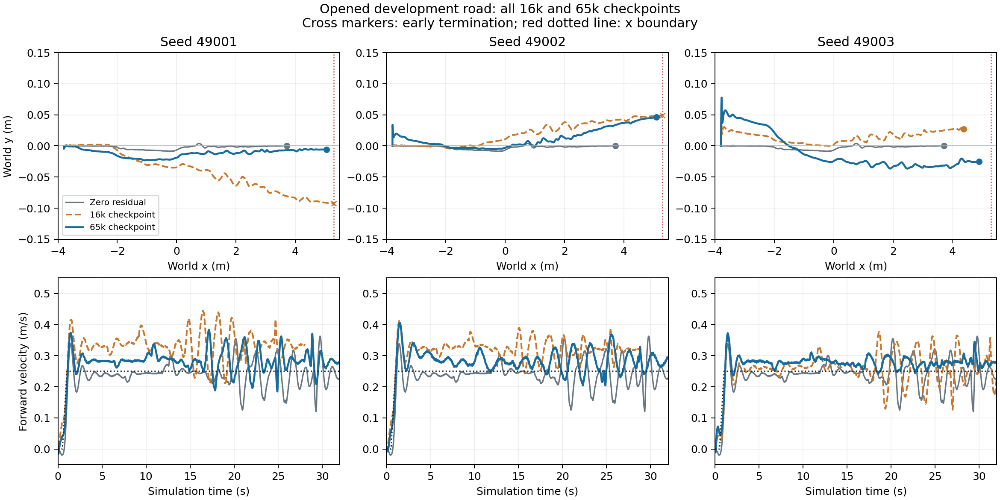

# Fresh heading-task learning: all three seeds and both checkpoints

All three 65,536-step models complete the opened 32 s development road. At 16,384 steps, one of three completes; the other two hit the **x boundary** because of forward-speed overshoot. These are development results, not complete stopping/turning/GUI or obstacle acceptance.

| Checkpoint | Actual duration | Velocity RMSE m/s | Height RMSE m | Heading RMSE rad | Final cross-track m |
| --- | ---: | ---: | ---: | ---: | ---: |
| 49001 / 16384 | 28.04 s, x boundary | .091651 | .014186 | .016159 | -.092291 |
| 49001 / 65536 | 32 s | .046530 | .012154 | .004164 | -.005690 |
| 49002 / 16384 | 28.91 s, x boundary | .076870 | .002757 | .005756 | .048789 |
| 49002 / 65536 | 32 s | .046475 | .009063 | .011244 | .046679 |
| 49003 / 16384 | 32 s | .046179 | .013309 | .004505 | .027381 |
| 49003 / 65536 | 32 s | .034297 | .008532 | .012635 | -.025322 |
| Zero residual | 32 s | .039972 | .011102 | .001243 | .000568 |

These values use each branch's **actual complete duration**, which differs for the two failures. [Common-prefix comparisons](development/common_prefix.json) separately compare every policy with zero and each seed's 16k/65k pair without padding. All observations, requested/applied actions, qpos/qvel and full per-step metrics remain in NPZ and lossless gzip JSONL.



The zero controller remains competitive. Seed49003 at 65k improves velocity and height RMSE but has three leg residual channels near ±1 for almost the entire episode (overall eight-channel edge occupancy 37.37%); seed49002 has one leg channel permanently at −1. Seed49001 has no action-edge occupancy. The lowest velocity error is insufficient to select a GUI default. All three models and zero must next face the same stopping, turning and perturbation checks.

`training/` is the complete saved runner output: 3 fresh seeds × 65,536 = **196,608 actual training transitions**, 1,536 completed PPO train calls, 6,144 optimization epochs. The fixed curriculum denominator is 16,384; later episodes remain at level 3. Both checkpoints per seed are saved after completed updates in a single uninterrupted learn call. Six reload checks execute six additional physical steps **outside** the training count. Episode records and installed versions are included; this directory does not claim to contain every training rollout state.

`development/` contains all seven final evaluation episodes, **21,695 actual transitions**. `first_16k_check/` retains the earlier independent seed49001 check and zero, another **6,004 evaluation transitions**; these repeats are not additional training or independent seeds. `zero_physical_parity.json` verifies that the new task's zero-policy qpos/qvel/applied actions and original82 observation prefix match the prior heading-hold zero baseline bit-for-bit for all 3,200 transitions.

`source/analyze_results.py` recomputes heading errors from recorded quaternions, actual roll/pitch peaks, terminal lengths and the figure. [Physical metrics](physical_metrics.csv) distinguish actual attitude from the environment's ground-relative attitude error. The [frozen protocol](../heading_task_implementation/heading_training_protocol.json) preceded training. User yaw command is always zero during this training; nonzero turns are outside its trained support. New reward/observation/task semantics differ from the old82 task, so this is not a single-factor PPO algorithm claim.

Reproduce using the source commands from repository root with a new output directory:

```bash
PYTHONPATH=.local-deps:src:. OPENBLAS_NUM_THREADS=1 OMP_NUM_THREADS=1 \
python3 -B -m scripts.run_d1_heading_study --mode train --output /tmp/d1-heading-training-new \
  --evaluation-protocol results/d1_driving_stability_development/heading_task_implementation/heading_training_protocol.json
PYTHONPATH=.local-deps:src:. OPENBLAS_NUM_THREADS=1 OMP_NUM_THREADS=1 \
python3 -B -m scripts.evaluate_d1_heading_study --training-root /tmp/d1-heading-training-new \
  --output /tmp/d1-heading-evaluation-new
```
