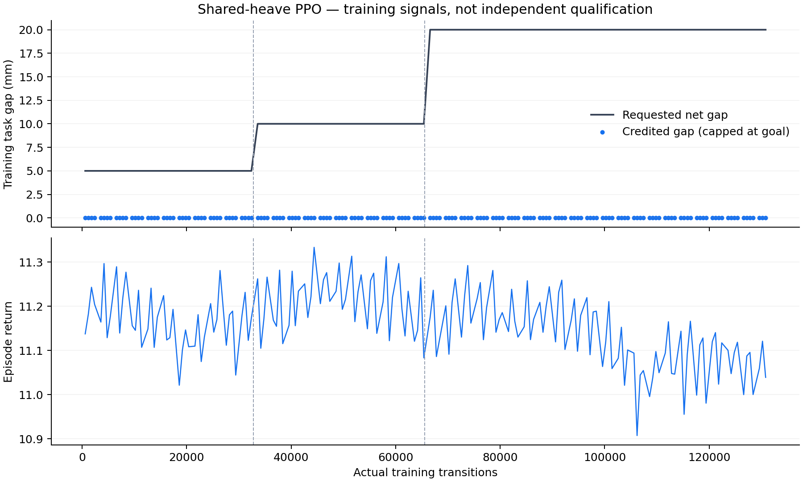
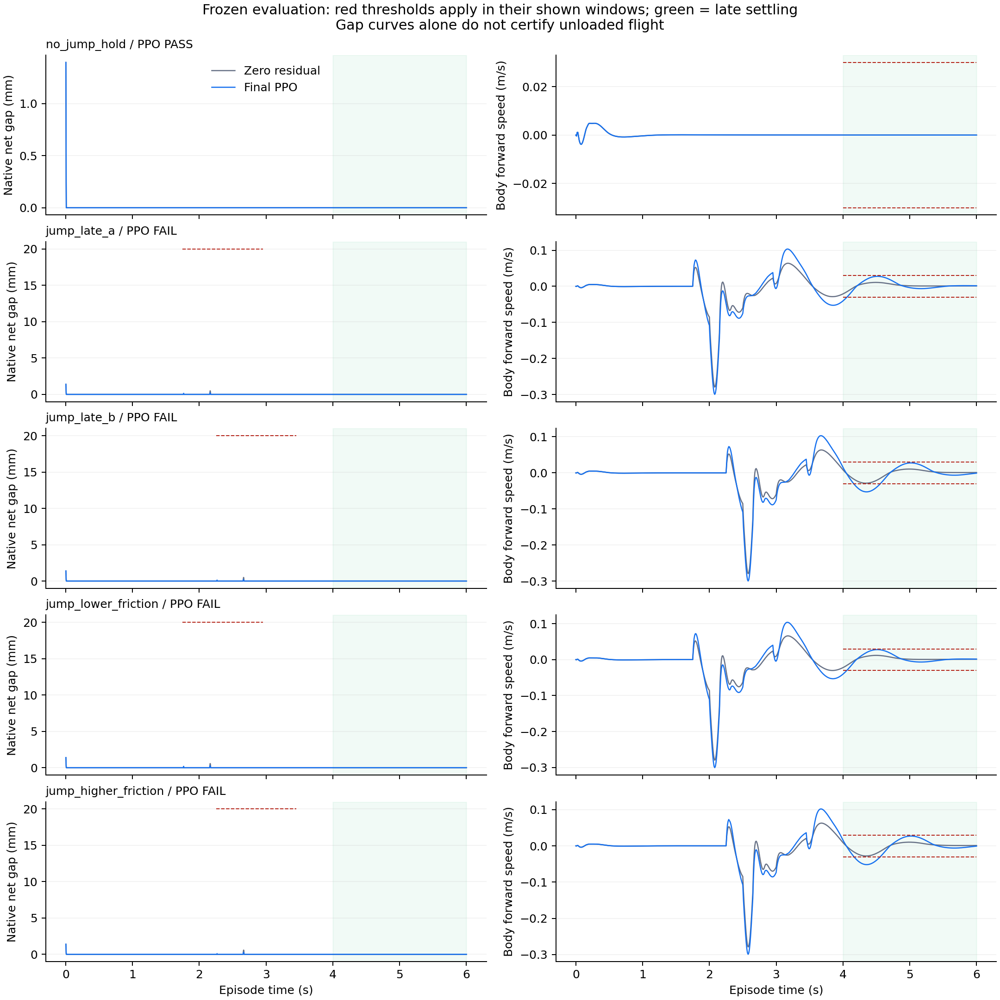

# 共享腿动作 PPO：记录有效，跳跃验收失败

新 seed62002 从零训练131072控制步，最终策略五个冻结条件仅静止保持通过（1/5），四个跳跃均失败。静止保持由窗外零动作门控恢复原基线，不能称为策略学会了稳定站立。完整目标未完成。

## 固定实验与实际执行

输入、奖励和验收门槛见 [冻结合同](frozen_contract/contract.md)。外层标量仅在请求窗映射为四腿共同残差，物理动作始终为原8维，轮残差为0；原95维观察、动作历史、PD/PI及额定保护保留。实现来源为提交 `3812eb7c6ccfa55d3daa7a1fbf8953e3737f51ba`，接口及640步 smoke 的独立公开包见 [上一阶段](../jump_shared_heave_interface_01/README.md)。共享动作实现由主代理编写；实际 Claude 请求因用户报告额度耗尽而取消，没有生成代码。方案由实际 gpt-6-astra ultra 子代理制定并审查。

| 项目 | 实际完成 |
|---|---:|
| 新 smoke，权重弃用 | 640控制 / 3200 native |
| 正式训练 | 131072控制 / 655360 native |
| PPO 更新 / optimization epochs | 1024 / 4096 |
| episode | 218个完整600步 + 272步partial |
| 正式训练墙钟 | 816.195547秒 |
| 最终评估 | 10场各600控制，共6000 / 30000 native |
| 本方案合计（含上一包 smoke） | 137712 / 688560 |

32768、65536、131072三个保存点均完成无积分严格重载；仅最后一个进入验收。没有恢复 smoke 权重、挑选中间模型或追加训练。所有219个含partial训练episode的 flight/progress/landing 事件与奖励进度均为0。训练实际发生，不是训练入口空转；也没有学到可验收的跳跃。

## 最终物理结果

下表净空为请求窗内四轮同时最小轮底净空，已经扣除1mm contact margin；持续卸载只列起始COM向上者。原门槛为净空20mm、连续20ms真实离地和完整落稳链，不更改评分。

| 最终策略条件 | 净空峰值 mm | 最长卸载 ms | 晚段最大 body vx 绝对值 m/s | 结果 |
|---|---:|---:|---:|---|
| 静止，无跳跃 | 不适用 | 不适用 | 通过0.03门槛 | 通过，与zero全程逐位相同 |
| jump_late_a | 0.225625 | 8 | 0.040561 | 跳跃及晚段速度失败 |
| jump_late_b | 0.223874 | 8 | 0.052524 | 跳跃及晚段速度失败 |
| lower_friction | 0.284593 | 8 | 0.040440 | 跳跃及晚段速度失败 |
| higher_friction | 0.276964 | 6 | 0.051735 | 跳跃及晚段速度失败 |

四个跳跃条件的晚段高度RMSE、COM竖直速度、累计平面路径及轮载荷占比均通过，但body vx超过0.03m/s。全程姿态/航向/漂移及实际力矩保护门槛通过，不等于跳跃成功。静止最大漂移0.001088662m；四跳最大漂移分别0.056034/0.055834/0.057298/0.054588m。初始化的全局净空峰值不计为请求跳跃能力。

## 验证范围与限制

[训练审计](provenance/shared_heave_formal_independent_audit_01.json)检查全131072行动作映射、命令、奖励、课程、reset seed、更新次数和预算，215个冻结输入一致。训练日志为紧凑记录，没有每个native步的完整状态/接触；其655360步依据真实调用计数和样本摘要，不能称为全部训练native独立重放。紧凑日志也不足以独立重算每轮12Nm边界。

[主代理评估审计](provenance/shared_heave_evaluation_root_audit_01.json)检查全部6000控制行与30000完整native记录、T/T+1、时序/状态链、零外力、保持控制和逐执行器80/12Nm边界。五对初态一致；hold全600控制/601状态观察/3000 native与zero逐位一致，四跳请求前前缀包括请求起点状态及观察也一致。五条zero记录在核对初态、命令、摩擦后，与上一次独立8动作实验对应zero的状态及95维观察数组逐位相同。

评估审计使用已记录的几何与法向载荷，没有重新求解全部接触力或独立重建全部native几何。接口94项非积分检查和审计通过不改变能力失败。两次正式RL的seed不同，不能把结果差异当作单变量因果证据，也不能据此断言机器人不能跳或强化学习无效。

第一次训练审计helper只接受smoke的214项来源，遇正式215项时在读取轨迹前停止。归档保留原helper、仅扩展正式来源身份的第二版及适配回执；没有因这次审计错误重跑训练。

## 文件与重建

`training/`保存更新、episode、checkpoint及运行回执；`evaluation/`保存十场完整记录和原始评分；`provenance/`保存审计及绘图脚本、输入身份；`next_terminal_plan/`是只读下一方案，本轮未执行。所有已发布leaf身份由 `publication_manifest.json` 固定。

完整训练gzip按原始字节分成三块，未重新编码；重建后 **82,852,678 bytes**，SHA256为 `f4dce015bf995d32544b3acd46a856af734bb8827f1ce936b0622f39f9aaa266`。重建脚本已经对真实分块完成核验，回执见 `provenance/training_trace_reconstruction_01.json`。不要把分块当作可独立解压的gzip流。

截至本轮，本次续进累计315424控制 / 1577120 native，不含旧三个65k与24场G1。唯一下一任务见 [单15mm台阶合同](next_terminal_plan/next_contract.md)：先几何/真实接触资格，再最多2400 / 12000的固定zero低速滚越readiness。此处没有新训练预算，不能继续第三次平地跳跃增训。有效但失败的zero轨迹可作为后续独立RL任务基线；原地20mm跳跃不作为低台阶滚越前提，跳跃仍未完成。
