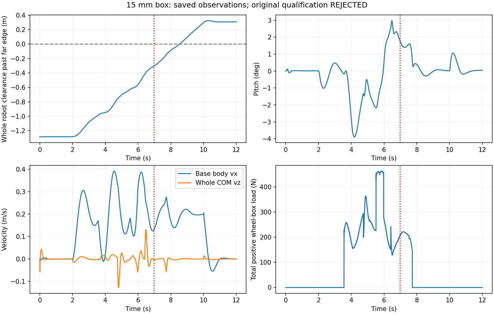

# 真实15mm台块：平地通过，台阶接触资格未通过

固定低速zero基线两场全部完成，总计**2400控制步 / 12000 native子步，预算用尽**。无RL训练，无重试或追加场景。完整目标“稳定直行 → 可靠越障 → 提高速度”尚未完成。

原[冻结合同](frozen_contract.md)要求原生plane加一个真实0.36×1.24×0.015m box，原控制器、zero8残差、seed77301、world-z=0.455m。每场1200控制步：前200拍静止，中间800拍forward=0.2m/s，最后200拍停车。box在compile前加入，机器人/solver/摩擦/margin与原模型一致；启用/关闭box的同版本plant使用独立完整缓存。所有源输入及原始归档身份见[运行协议](physical/protocol.json)与[原始manifest](physical/manifest.json)。

| 条件 | 控制/native | 原始记录判定 | 原始任务判定 |
|---|---:|---|---|
| plane_only | 1200 / 6000 | 有效 | 通过 |
| single_15mm_box | 1200 / 6000 | 无效：box法向几何检查报错 | 未通过 |

两场均完成12秒，无物理提前终止、native异常、重试或填充；[总回执](physical/batch_receipt.json)保留原scorer错误。前1779个native返回状态/扭矩与无box对照逐值相同，随后第一次真实正载荷轮-box接触出现。正式批次另外记录4985次forward与2次setConst，不冒充积分步数。

## 唯一接触异常及零积分取证

台阶6000子步保存了11053条box接触，其中11032条有正法向载荷且几何特征检查通过。21条无正载荷接触中有1条异常：native3486/contact5、后左轮，接触点高于box顶面，box→robot法向却近乎向下；active=true但法向载荷为0。其cone residual=1.0，不能通过放宽0.0021的小角度解释容差解决。

主代理以原builder和已保存qpos，仅运行4次kinematics/comPos/collision/geomDistance，**0 native、0 forward**。3485、3486、3487的步前姿态重建出与原记录逐值相同的全部geom/frame/pos/dist；3486步后姿态不匹配，符合原生求解缓存相位。见[完整静态取证](provenance/static_contact_forensic_01.json)。实际Astra ultra又独立计算轮的圆柱support，最低点仍高于box顶面0.676532493mm，与原生geomDistance相符。记录转换或相位错误不能解释这条已复现的异常。

已确认的是**原生未载荷候选法向异常**。具体narrowphase内部原因尚未确认；[MuJoCo 3.12.0相关源码](https://github.com/google-deepmind/mujoco/blob/3.12.0/src/engine/engine_collision_convex.c#L798-L895)只提供下一步排查位置。零载荷表示该条记录的直接接触wrench为零，不能据此断言删除约束不会影响整个求解。原评分与物理输入全部保留，不删候选、不反转法向、不放宽门槛。

## 保存轨迹的补充观测

以下由[独立统计脚本](../../../scripts/summarize_d1_single_step_observations.py)读取存档得到，[结果JSON](observations_01/observations.json)明确 `qualification_granted=false`。这些读数不能替代原评分或宣布可靠越障。

| 台阶轨迹观测 | 数值 |
|---|---:|
| 最终所有collision geom越过远边的最小余量，已扣原margin | 0.308176m |
| 全端点和native最大pitch / heading | 3.891924° / 0.005392° |
| 非轮地形接触（native/endpoint） | 0 / 0 |
| 末100端点最大body vx绝对值 | 0.004056m/s |
| 末100端点最大whole COM vz绝对值 | 0.000425m/s |
| 末100端点world-z RMSE | 6.607mm |
| 末500 native四轮正载荷占比 | 全部1.0 |

## 复核、来源与下一步

原77冻结输入、前轮215正式输入、本轮193实验输入及24个原始归档文件全部一致，见[运行后身份核验](provenance/postrun_identity_audit_01.json)。先前失败的几何前检也保留；不得只摘取通过项。前检的静态forward、mock计步与实际积分分别列账。

实际 `gpt-6-astra / ultra` 完成方案和独立复审；实际Claude返回 `claude-opus-5 / firstParty`，生成有界几何/环境/评分模块及小测试。主代理负责集成、实际测试、计步与物理验证。一次Claude大测试请求超时无代码，回执保留；后续缩小任务成功。物理前47项纯测试、后续7项审计测试通过，共54项、无额外本地积分；14个新增源码/测试文件Ruff通过。实际调用、原始输出、集成差异和测试回执在provenance。

下一步严格遵循[零积分接触资格合同](next_terminal_contact_plan_01/next_contract.md)，先分离记录忠实性、候选几何异常和正载荷接触证据，再决定后续合同。**本包不启动RL，不授权重跑已完成的两场，也不追加第三次平地跳跃训练。** 原跳跃任务、新RL GUI、物理自救、更高速度均未完成；R仍为仿真reset。

`publication_manifest.json`固定本包各leaf的SHA256。所有文件都是新证据；旧记录没有覆盖。执行记录留在工作目录stability_20260922，最终GitHub提交及对应CI以该目录的final_publication_receipt_01.json为准。
