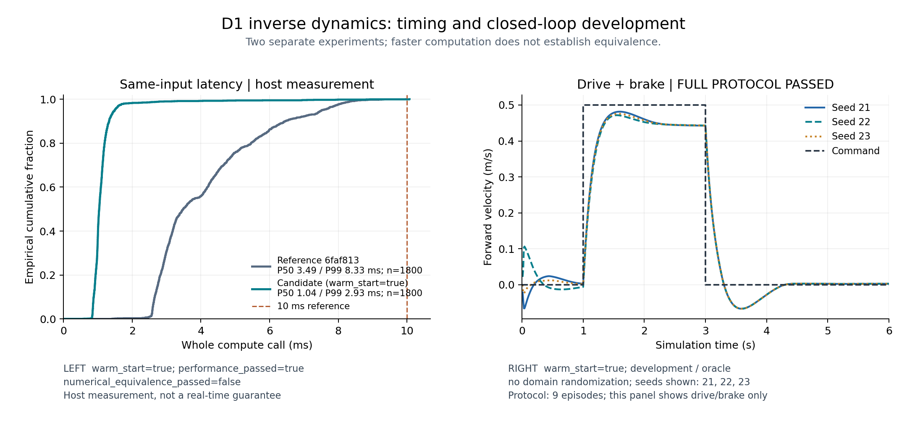
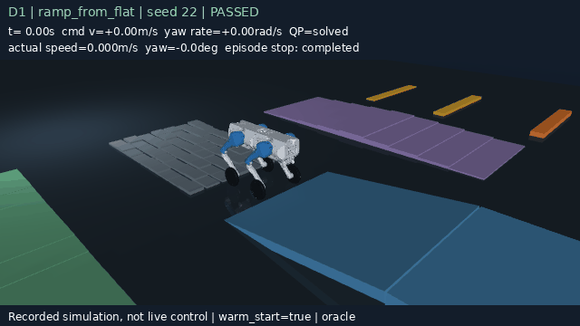
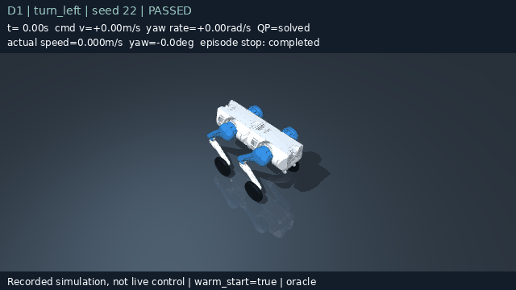

# 热启动逆动力学：耗时与运动实验

2026-09-06，代码固定在 `178267fb9b2e3682ba5edcc8152765f360591f31`。四份实验报告均记录
`git_dirty=false`。先完成 187 项测试，再顺序运行耗时对照和运动回放，测速时没有并行训练、
测试或渲染。旧的[冷求解开发结果](../d1_inverse_dynamics/README.md) 保留不动。

热启动配置达到了本次耗时目标，也通过了 9 个平地回合和 15 个转向/坡道回合。它会改变
内部力分配，仍是独立实验配置，没有替换默认控制器，也没有接入 PPO 或键盘控制。

## 同输入耗时对照

使用 i7-14650HX 笔记本，Linux 6.8、Python 3.10.12、MuJoCo 3.12.0、OSQP 1.1.3。
未设置 BLAS/OMP 线程环境变量，没有绑核或实时调度。参考控制器来自 `6faf813`，模型和依赖
均使用本次环境；只冻结参考控制器文件，不是两个完整历史环境的比较。

种子 22 生成一条 600 步前进制动状态轨迹，每版交替先后顺序测三遍，共 1800 次调用。
构造和首次调用耗时在 JSON 中单独记录；另做 10 次预热，均不计入下表。1800 次来自重复轨迹，不能看作
1800 个独立实验。两次对照分别运行，各自使用同批输入和同进程参考值。

| 对照 | 配置 | P50 (ms) | P99 (ms) | P99.9 (ms) | 最大值 (ms) | 超过 10 ms |
|---|---|---:|---:|---:|---:|---:|
| 热启动 | 参考 | 3.488 | 8.332 | 9.278 | 9.974 | 0/1800 |
| 热启动 | 本次配置 | 1.039 | 2.935 | 8.843 | 10.077 | 1/1800 |
| 冷求解 | 参考 | 3.669 | 8.801 | 9.898 | 10.857 | 2/1800 |
| 冷求解 | 本次默认配置 | 2.910 | 7.790 | 8.661 | 10.133 | 1/1800 |

预设目标为 P50 至少下降 25%、P99 至少下降 15%，且不能有拒绝解。热启动分别下降
70.2%、64.8%，通过；冷求解下降 20.7%、11.5%，未通过性能门槛，报告保留失败状态。
热启动最慢一次仍超过控制周期，不能据此声称 100 Hz 硬实时。

冷求解的逐项数值对照通过：最大力矩差 `3.83e-6 Nm`、接触力差 `8.50e-6 N`、广义加速度
差 `1.20e-12`。热启动对应差异为 `12.99 Nm`、`28.76 N`、`4.08e-5`，没有通过数值等价门槛。
因此它必须单独做实际控制回放。广义加速度差使用各自由度原生单位。

[热启动完整记录](latency_warm.json)含独立计时后的性能剖析：预热之后 600 步中有 597 次
更新、3 次重建。[冷求解记录](latency_cold.json)也保存全部原始耗时，没有只保留通过的对照。



## 实际控制回放

全部使用热启动、仿真真值状态和名义参数。开发种子 21–23 只改变初始 roll/pitch，范围
±0.01 rad，没有质量/摩擦随机化。它们参与过排错，不是留出种子。

平地 9/9 通过，共 5400 个控制步。RMS 列取三个回合的均值，末速列取三者中的最大值：

| 场景 | 速度误差 RMS (m/s) | 高度误差 RMS (mm) | 最后一秒水平速度 RMS 最大值 (m/s) |
|---|---:|---:|---:|
| 站立 | 0.00937 | 4.953 | 0.00279 |
| 0.5 m/s 前进后制动 | 0.07707 | 3.618 | 0.00279 |
| 120 N、0.12 s 推扰 | 0.04519 | 4.271 | 0.00287 |

前进制动位移为 0.879–0.884 m。峰值姿态误差最大约 0.445°，高度误差最大约 8.163 mm。
这些结果满足各自门槛，并不说明所有控制误差都优于旧冷求解。详见
[平地摘要](flat/summary.json)与[逐步数据](flat/steps.csv.gz)。

移动协议 15/15 通过，共 15000 个控制步。下表误差均取同场景三个回合中的峰值，末速取
最后完整一秒的水平速度模长 RMS 最大值：

| 场景 | 姿态误差 (°) | 净空误差 (mm) | 末速 (m/s) |
|---|---:|---:|---:|
| 低速左转 | 0.446 | 8.438 | 0.00477 |
| 低速右转 | 0.446 | 8.438 | 0.00476 |
| 8° 坡中站立 | 0.207 | 2.200 | 0.00092 |
| 坡中驶上平台 | 0.648 | 7.123 | 0.00135 |
| 平地入坡、驶上平台 | 1.003 | 13.118 | 0.00036 |

左转最终转角为 0.540–0.543 rad，右转为 −0.538 至 −0.534 rad，均在预设范围内。
两种驶上平台场景均满足最后完整一秒四轮接触平台、接触点在平台内部，并且停稳；坡中
起步的停车观察时间为 5.28–5.30 s，平地起步为 7.52–7.63 s。

姿态误差在转向时指绝对 roll/pitch，坡道时指相对命令的跟踪误差。净空根据输出接触点
拟合的支撑面计算；拟合无效时使用保持的估计，不是真实地形净空的独立测量。详细协议、
拟合有效性和每项门槛见[移动摘要](mobility/summary.json)及[逐步数据](mobility/steps.csv.gz)。

24 个回合均无拒绝解，输出力矩未越界，已应用步的最大约束数值违反量约为 `4.50e-5`，小于
`1e-4` 门槛。约束行单位混合，不能把这个数解释成统一物理误差。安全及接触验收采样于
100 Hz 控制端点，未逐个检查 2 ms 物理子步。

| 从平地进入坡道并停在平台 | 低速左转与制动 |
|:---:|:---:|
|  |  |

两段均为种子 22 的记录回放，通过保存的 `qpos/qvel` 渲染，没有重跑控制器，也没有裁掉
起步或停车阶段。它们不是实时键盘操作。[坡道录像元数据](ramp_from_flat.json)和
[转向录像元数据](turn_left.json)记录每帧仿真时间、源数据与 GIF 的 SHA256。

## 复现

从上述代码提交、安装项目及开发依赖后运行。每次使用新输出目录，脚本不覆盖已有记录：

```bash
python scripts/benchmark_d1_inverse_dynamics.py --warm-start --profile --output /tmp/idqp-warm.json
python scripts/benchmark_d1_inverse_dynamics.py --output /tmp/idqp-cold.json
# 冷求解本次性能门槛未通过，返回非零是预期行为；先查看报告，再运行下一项。
python scripts/evaluate_d1_inverse_dynamics.py --warm-start --output /tmp/idqp-flat
python scripts/evaluate_d1_inverse_dynamics_mobility.py --output /tmp/idqp-mobility
python scripts/plot_d1_inverse_dynamics.py --latency /tmp/idqp-warm.json \
  --rollout /tmp/idqp-flat --output /tmp/idqp-plot.png
MUJOCO_GL=egl python scripts/render_d1_inverse_dynamics_mobility.py \
  --rollout /tmp/idqp-mobility --scenario ramp_from_flat --seed 22 --output /tmp/idqp-ramp.gif
```

测速是本机测量，其他电脑不必得到相同毫秒数。CSV 哈希校验用于核对原始记录；更改代码
或运行环境后，应生成自己的新报告。推导、转向积分和起步位置排错见
[逆动力学文档](../../docs/inverse_dynamics.md)。

目前没有验证带噪声状态、延迟、随机域或实机；也没有验证这套控制器的台阶、跳跃、下坡
与坡上转向。下一步先固定噪声与接触切换协议，报告最坏耗时、失败位置及安全检查的物理
子步覆盖，再另设从未参与调参的种子。旧留出审计不拿来反复调参。
