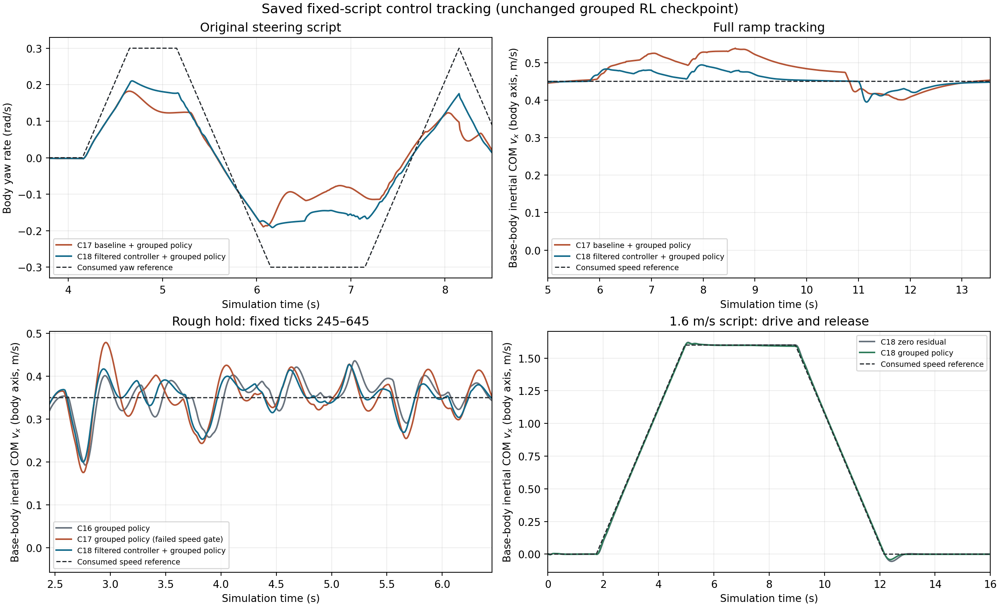

# C17–18 控制修复与固定脚本资格证据

[中文报告](../../docs/main_route_execution_20260930_17_18.md) · [最终汇总](stage18/qualification_summary_18.json) · [逐场 CSV](stage18/task_results_18.csv) · [Astra 终审](stage18/final_review_17_18.md)

C18 grouped 七场景全部通过；RL 贡献判据为 `false`，默认 GUI 资格为 false。这是固定 oracle 确定性脚本，不是独立随机样本。C17 的 rough 回归与 6/7 结果保留在 stage17；stage18 包含唯一滤波候选和完整后续证据。

新控制入口是 [controller18.py](stage18/controller18.py)，纯算术为 [residual18.py](stage18/residual18.py)，独立读回为 [read_eval18.py](stage18/read_eval18.py)。实际测试记录见 [pure_tests_receipt_18.json](stage18/pure_tests_receipt_18.json)。源码与旧依赖身份列于阶段计划，phase 的实际 invocation 列于 reservation/session/receipt。

唯一策略仍是父包的 [grouped final_model.zip](../d1_main_route_execution_20260930_15_16/stage15/grouped_01/final_checkpoint/final_model.zip)，SHA256 `1fcfe833d8a7cfdbbc224c9007a35e44c035674ce948b51557434b77838476fb`。本轮没有新增训练或权重。

[publication_manifest.json](publication_manifest.json)列出公开 payload 身份；[copy_receipt.json](copy_receipt.json)保留原路径及复制校验；[本地全档清单](stage18/local_archive_inventory_17_18.json)区分已上传和未上传文件。约 200.1 MB 精选资料来自约 1.09 GB 的本地全量档案。只上传少量 control/native gzip 样本，其余对应 manifest 作为身份记录保留，不能据公开子集声称已重新验证全部接触力链。

复核完整读回需要本地全量 control/native 块、冻结依赖与记录中的目录布局；脚本包含历史绝对路径，尚非通用一键复现包。已有输出与 reservation 均为独占记录，不能原位重跑覆盖。图表来自保存记录，没有生成新模型或物理步。

GUI、自由键盘、实机、侧移、跳跃、15 mm 单台阶与物理自救不在本次资格范围内；R 仍为仿真复位。
