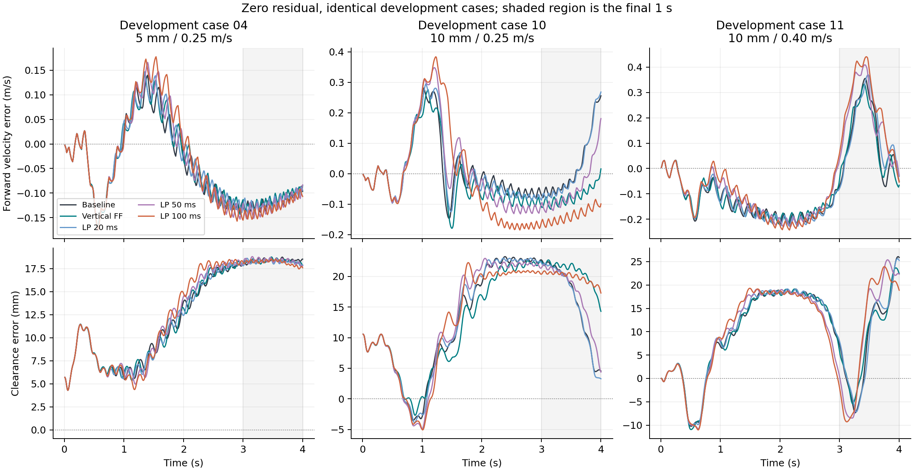
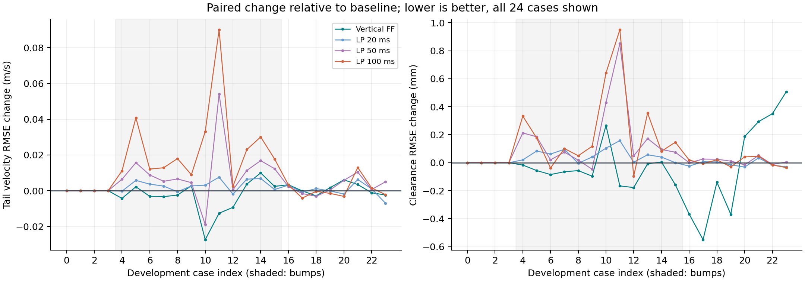

# 参考动态：120 回合开发集对照

本页的 CSV 和源码归档随 Release 提供，见[下载与复算](../../docs/reproducibility.md)。

竖直前馈有小幅改善，但没有增加通过的案例。姿态目标加 50 ms 或 100 ms 低通后，颠簸跟踪更差。这批实验保留为诊断记录，未替换项目默认控制器，也没有据此挑选 RL checkpoint。

## 实验结果

5 个控制变体分别运行同一组 24 个开发案例：4 个平地、12 个颠簸、8 个坡道。每个案例跑 4 s，100 Hz 控制，残差动作始终为零，没有策略接管或失败后重置。全部 120 回合均完成 400 步。

表中 RMSE 是各回合 RMSE 的等权平均。高度误差指机体相对局部地面的净空误差。

| 变体 | 全集质量通过 | 全程速度 RMSE（m/s） | 颠簸末秒速度 RMSE（m/s） | 颠簸质量通过 | 全集净空 RMSE（mm） |
|---|---:|---:|---:|---:|---:|
| 原控制器 | 13/24 | 0.09902 | 0.11535 | 1/12 | 13.241 |
| 竖直前馈 | 13/24 | 0.09887 | 0.11190 | 1/12 | 13.212 |
| 姿态低通 20 ms | 13/24 | 0.10045 | 0.11841 | 1/12 | 13.266 |
| 姿态低通 50 ms | 12/24 | 0.10348 | 0.12564 | 0/12 | 13.334 |
| 姿态低通 100 ms | 12/24 | 0.10852 | 0.14038 | 0/12 | 13.360 |

原控制器的平地和坡道共 12/12 通过，失败集中在颠簸。前馈使 12 个颠簸案例的末秒 RMSE 平均下降 0.003448 m/s，部分案例仍有退步；坡道末秒 RMSE 平均反而增加 0.001004 m/s。不能只展示最有利的 case 10。



阴影是计分使用的最后 1 s。case 04 的末段长期欠速；case 10 的原控制器速度摆动较大；case 11 是原先触发质量失败的 10 mm 颠簸案例。三张时序只是解释案例，全量比较见下图和 derived_metrics.csv（`derived_metrics.csv`）。



## 复算覆盖了什么

[独立审计脚本](../../scripts/audit_d1_reference_dynamics.py)不调用原实验的 `summarize_episode`，从原始 CSV 重算质量判定。它核验了 123 个原始文件的 SHA-256，逐步检查 48,000 个控制样本；34 个冻结源文件的当前 SHA 也都匹配。

原指标与复算值的最大绝对差为 `2.0464e-12`，发生在浮点求和范围内。末秒误差的 `RMSE² = bias² + variance` 最大残差为 `1.0354e-17 (m/s)²`。两轴姿态滤波递推及前馈请求/裁剪记录的复算误差均为零。前馈请求最大绝对值为 8.203 N，没有触及 ±500 N 限幅。

这些核验有边界：

- 滤波检查从第 2 个控制样本开始，使用上一行的控制后原始目标。重置时的原始目标没有单独记录。
- CSV 没有控制前的完整世界系速度，无法单凭日志完整复算高度导数。采样地面高度的位置是 `base_link` 原点，前馈却沿用惯性 COM 速度；两点速度相差角速度叉乘项。
- `applied_vertical_feedforward_n` 是记录器重算的限幅值，不是独立测得的执行器输出。`body_vertical_velocity_mps` 实际是控制后的世界 z 方向 COM 速度，字段名有歧义，原始文件保留不改。
- 每个案例只有一次确定性运行。这里没有统计置信区间，也不提供未见地形的泛化证据。

详见 [derived_audit.json](derived_audit.json)。原始 `manifest.json` 保持不变；复算数据和图片的 SHA 由 [derived_manifest.json](derived_manifest.json)单独记录。

## 复现

在仓库根目录复算并生成图，不会覆盖原始实验数据：

```bash
rtk env PYTHONPATH=src:.local-deps python3 scripts/audit_d1_reference_dynamics.py
rtk env PYTHONPATH=src:.local-deps python3 -m pytest tests/test_d1_reference_audit.py
```

重新进行真实仿真时须指定尚不存在的输出目录：

```bash
rtk env PYTHONPATH=src:.local-deps python3 scripts/diagnose_d1_reference_dynamics.py \
  --output /tmp/d1-reference-dynamics-reproduction
```

下面的命令应以质量失败退出，用于复现原症状；它失败不代表脚本出错。输出目录同样必须不存在。

```bash
rtk env PYTHONPATH=src:.local-deps python3 scripts/diagnose_d1_reference_dynamics.py \
  --variants baseline --case-indices 11 --require-quality \
  --output /tmp/d1-reference-case11-red
```

算法推导和逐步练习见 [参考动态学习记录](../../docs/reference_dynamics.md)。
