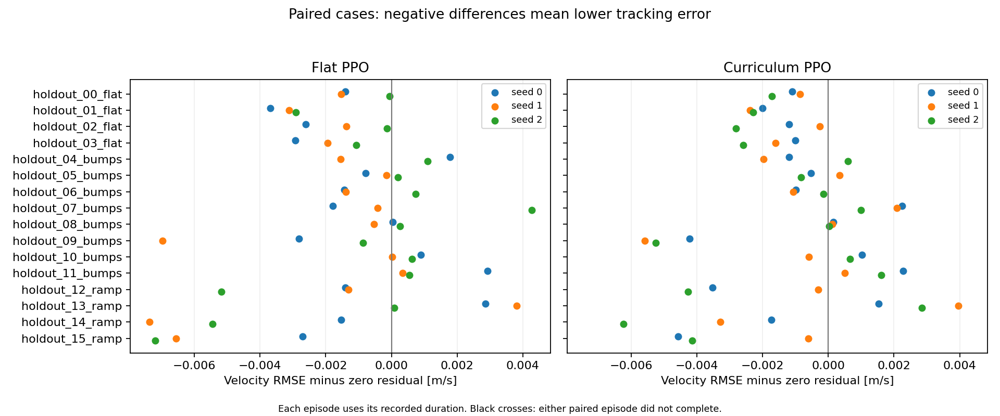
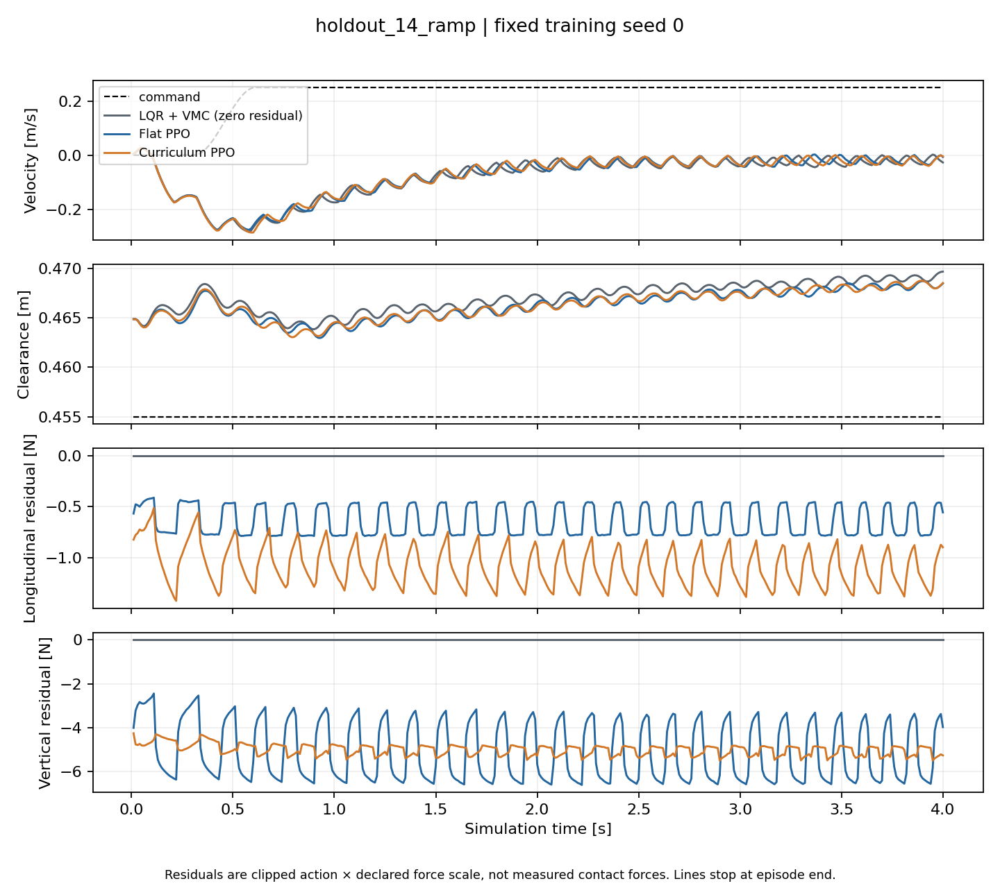
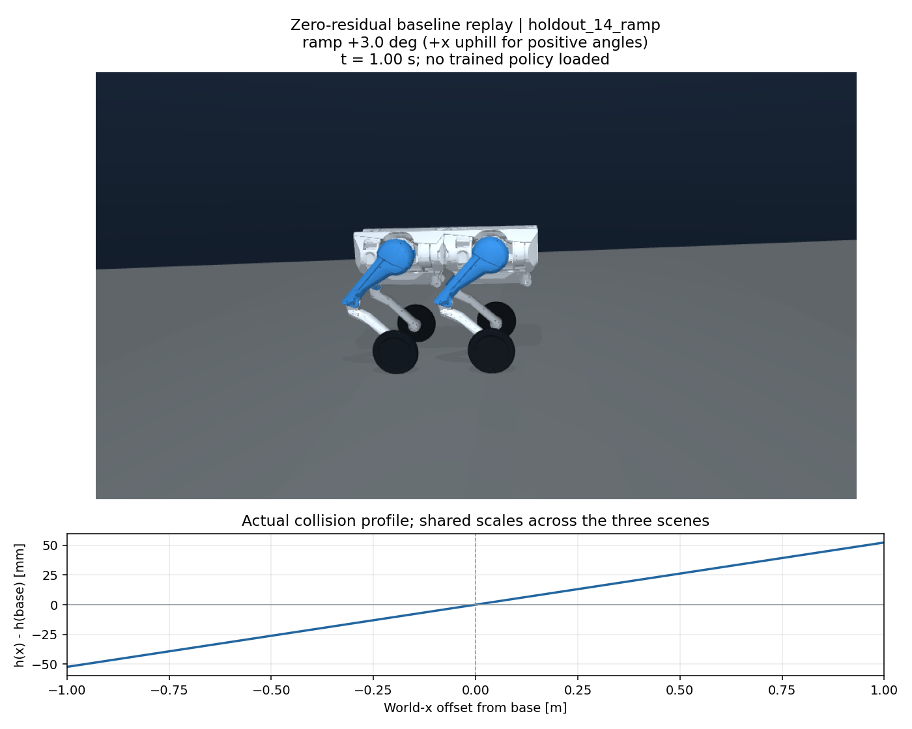

# D1 多地形有限预算对照

本页的 CSV 和源码归档随 Release 提供，见[下载与复算](../../docs/reproducibility.md)。

这轮完成了多地形训练和配对评测，但没有证明课程训练优于只训平地。
课程 PPO 的总体速度 RMSE 比零残差低约 0.5%，只训平地的 PPO 则低约 0.6%。
两组改变量都很小，上坡倒滑也没有解决。以下保留这次冻结实验的全部结果。

## 预算与比较范围

两类 PPO 各训练 seed 0、1、2，每次 32768 个控制转移，4 个 CPU 环境，每局 4 s。
每次有 64 个完整 rollout、256 个 PPO epoch；总训练转移为 196608。
模型均取预算结束时的 final checkpoint，保存后重载，再用确定性动作评测。

16 个 case 包括 4 个平地、8 个小起伏和 4 个 ±3° 坡道。零残差每个 case 只跑一次，
学习组每种子各跑 16 次，总共 112 个评测回合、44800 个控制转移。
训练波长为 0.8/1.0/1.2 m，留出为 0.7/0.9/1.1 m；±3° 未在训练中采样，
但位于 ±2°/±4° 的范围内。本实验不代表任意未知地形泛化。

参数、case 和命令见 [protocol.json](protocol.json)。开发基线单独保存在
[d1_terrain_development_baseline](../d1_terrain_development_baseline/README.md)，
正式预算在查看本轮留出成绩前确定。没有据这些成绩改奖励、重训或选择 checkpoint。

## 测到了什么

下表先对每个训练 seed 的同类 case 等权平均，再对三个 seed 平均。零残差只有一套固定 case，
没有复制成三套独立样本。数值单位为 m/s，越小越好。

| 地形 | 零残差 LQR＋VMC | 平地 PPO | 课程 PPO |
|---|---:|---:|---:|
| 平地 | 0.10402 | 0.10213 | 0.10237 |
| 起伏 | 0.20517 | 0.20496 | 0.20476 |
| ±3° 坡 | 0.27267 | 0.27001 | 0.27098 |
| 全部16个case | 0.19676 | 0.19552 | 0.19572 |

总体 clearance RMSE 分别为 13.136、12.719、12.666 mm。
零残差 16/16、两类 PPO 各 48/48 存活到 4 s；这只表示没有触发终止。
学习组的策略路径全程启用，门控比例为 0。小幅收益并非通过在难地形上关闭策略取得。

相对零残差的总体速度 RMSE 差，三个训练 seed 分别为：

| 训练 seed | 平地 PPO − 基线 [m/s] | 课程 PPO − 基线 [m/s] |
|---|---:|---:|
| 0 | −0.000911 | −0.000928 |
| 1 | −0.001877 | −0.000719 |
| 2 | −0.000942 | −0.001473 |

没有据三个点作显著性结论，也没有把控制步作为独立样本。
逐 case 的配对图能看到改善和恶化同时存在：



原始数据为 metrics.csv（`metrics.csv`） 和 `evaluation/` 中的逐步 CSV。
绘图脚本会独立重算 RMSE，拒绝缺失或重复配对。按地形聚合的三个 seed 点见
[terrain_seed_differences.png](figures/terrain_seed_differences.png)。

### 上坡仍在倒滑

固定代表案例为协议中的第一个正坡 `holdout_14_ramp`：+3°，目标 0.25 m/s，seed 0。
零残差最终 x=−0.316 m，平地 PPO 为 −0.311 m，课程 PPO 为 −0.309 m；
该回合的命令积分是 +0.886 m。三条曲线都没有达到前进目标。



该图同时保留了非零残差请求。残差 N 是动作乘缩放系数后送入控制器的请求，
不等于独立测得的接触力。另一个固定代表案例见
[首个起伏案例](figures/representative_bumps.png)，没有挑选收益最大的案例展示。

场景图是按相同 case 参数重新运行的零残差控制，固定取 1 s 画面，未加载训练策略：



## 策略实际练过哪些地形

三个课程 seed 的有效阶段步数均为 `[9600, 8000, 8000, 7168]`。
这与名义四等份不同：阶段变更只作用于下一次 reset，向量环境会先完成旧地形回合。
不能把名义阶段边界直接当成每个采样步的实际地形标签。

| 训练 seed | −4°步数 | −2°步数 | +2°步数 | +4°步数 |
|---|---:|---:|---:|---:|
| 0 | 1184 | 3792 | 1600 | 400 |
| 1 | 1792 | 3792 | 400 | 400 |
| 2 | 1600 | 3184 | 1200 | 400 |

每个 seed 只在 +4° 上采到 400 个转移，也就是一局。当前预算对这个工况的覆盖仍然稀疏。
这能解释为什么需要查看实际曝光记录，但不能单凭计数断言增加数据就一定会解决倒滑。
每局的地形参数、阶段、向量环境编号和速度命令保存在各训练目录的 `episode_starts.json`。

最终更新日志中的 critic explained variance 均接近 0，约为 −0.0012 至 −0.0004。
这不支持“价值函数已经拟合良好”的判断。后续应在开发集检查回报尺度和 critic 拟合，
不能把当前负结果简单归因于训练时间短，更不能据此声称 PPO 不适合轮足控制。

## 复算与来源

运行入口：

```bash
python scripts/run_d1_terrain_curriculum.py --steps 32768 --envs 4 \
  --seeds 0 1 2 --episode-seconds 4 --evaluation-split holdout \
  --output results/my_terrain_curriculum

MUJOCO_GL=egl python scripts/visualize_d1_terrain_curriculum.py \
  --run results/my_terrain_curriculum \
  --output results/my_terrain_curriculum/figures --render-scenes
```

这是复算命令，不是继续调参时可反复使用的独立留出集。本轮成绩公开后，下一轮优化应回到
开发集，另设最终未见测试，避免逐渐针对这 16 个 case 调参。

基线提交为 `cbfdb2d336111739f572f5527acd4067132906a3`，本次运行包含未提交修改。
[source.patch](source.patch)保存相对该提交的五个运行文件改动，可在该提交的独立副本中应用。
当前工作区无需重复应用。其余源文件和资产由该提交提供；具体 SHA 和依赖版本见
[provenance.json](provenance.json)，每个模型 SHA 见对应 `training/*/metadata.json`。
[summary.json](summary.json)确认运行期间源码未变。

根 [manifest.json](manifest.json)校验 165 个训练/评测产物，包含源码补丁，不包含运行后添加的
本说明和图表。图表另有 [figures/manifest.json](figures/manifest.json)，记录输入 CSV、
可视化源码和图片的 SHA。

本机六次训练部分各耗时约 51–66 s，不含向量环境创建和后续评测；
metadata 的内存值只覆盖父进程。没有隔离系统负载，这些时间不能当成严格性能基准。

本轮全仓库 649 项测试通过，耗时 112.15 s，另有 15 条已有的 Matplotlib 环境警告；Ruff 通过。
旧提交的 42 维环境与当前保留路径还做了独立数值比较：
随机域开/关各 100 步相同动作，观测、奖励与状态逐字节相同。新地形验证涵盖碰撞高度、
无穿透出生，以及步前控制目标和步后高度奖励的时序。

下一轮优先在开发集检验坡度重力前馈，并检查 critic 的回报尺度与拟合；这些目前都是待验证项。
如果要判断课程调度本身的价值，还缺一组“从头随机混合全部地形”的同预算训练。
当前仍使用 oracle 状态与地形参考，没有实机或 sim-to-real 结论。
