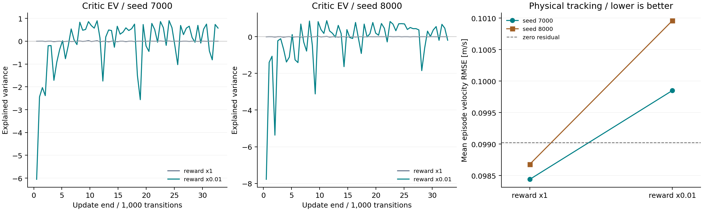

# 奖励单位 A/B：数值诊断与控制成绩

把训练 reward 乘以 0.01 后，两个种子的全程速度误差都略增，任务达标数没有变。critic 的日志有变化，但这次没有测到整体控制收益。

## 比较范围

两组都使用第二版地形环境：LQR＋VMC 跟踪当前地面切线，两维残差的上限保持 11.25/20 N。状态和地面参考来自 MuJoCo 真值，没有实机。

每组训练 seed 7000、8000，各 32768 个控制转移，4 个 CPU 环境，每局 4 s。mixed 从第一局起固定在 stage 3；两组 protocol 唯一差异为训练 reward scale。每个种子的 84 条 episode_starts 完全相同，地形和速度命令也相同。模型取预算结束时的 final checkpoint。

评测使用同一套 24 个开发 case。每组有 24 次零残差评测，以及两个策略各 24 次评测。两组的零残差 CSV 逐字节相同，统计时不能把它们当成两套独立样本。

训练 wrapper 只缩放送给 PPO 的 reward 标量。Monitor、info 的奖励分项仍是原单位，评测没有 wrapper。time-limit bootstrap 使用缩放后的价值单位，不能再把整个 bootstrap 项乘一次 0.01。

## 控制结果

| seed | reward scale | 全程速度 RMSE [m/s] | 最后 1 s RMSE [m/s] | 原单位回报 | 达标 case |
|---|---:|---:|---:|---:|---:|
| 7000 | 1 | 0.098441 | 0.075431 | 1550.93 | 13/24 |
| 7000 | 0.01 | 0.099850 | 0.073799 | 1515.67 | 13/24 |
| 8000 | 1 | 0.098681 | 0.074188 | 1555.91 | 13/24 |
| 8000 | 0.01 | 0.100959 | 0.075226 | 1480.94 | 13/24 |

零残差的全程速度 RMSE 为 0.099022 m/s，达标 13/24。所有策略都存活到 4 s。没达标的都是 11 个起伏 case，触发的是最后 1 s 速度误差门槛，没有发生跌倒。

门槛在运行前写入 protocol。回合必须完整，进度比例在 0.65–1.35 内，最后 1 s 速度 RMSE 不超过 max(0.06, 0.25×目标速度) m/s。相对地面高度 RMSE 上限为 30 mm，最大偏航上限为 0.15 rad，平均关节限矩比例上限为 0.05。进度分母由逐步速度命令积分计算，包含启动时的零速和渐变。

缩放组的动作也更大。两个种子的请求动作 RMS 为 0.519/0.884，原尺度组为 0.086/0.138；相对地面高度 RMSE 从 13.38/12.72 mm 增至 15.25/16.11 mm。动作 RMS 按两个归一化分量和所有评测控制步计算。这些变化与原单位回报降低同时出现，本轮没有逐项归因。

## critic 日志怎么读



原尺度组两个种子的 final EV 为 −0.00110、−0.00095。缩放组为 0.57224、−0.19486，种子间的差别仍很大。最后 10 个训练日志点的 EV 均值分别为原尺度 −0.00212/−0.00165，缩放后 0.20540/−0.05180。

图的横轴根据 n_updates/n_epochs×rollout_size 还原。SB3 常在下一批采样结束时输出上一批训练日志；最后一次显式 flush 没有 time/total_timesteps。图中仍把它放在 32768 步，没有丢掉，也没有提前一批。EV 直接使用采样时记录的 value；训练后没有重算它。右图纵轴采用局部范围，两个种子的误差差值约为 0.0014/0.0023 m/s。这里只有两个训练 seed，没有作显著性判断。

缩放组 final value loss 为 0.001536/0.001655，除以 0.01² 后为原单位的 15.36/16.55；原尺度组为 3541.77/3561.93。两种策略产生的 GAE 目标已经不同，不能用这个比值报告“同一批目标上的误差下降”。单独的[固定批次拟合探针](../../scripts/diagnose_d1_terrain_ppo.py)控制了这个变量，本表没有这样做。

## 数据与复算

本目录和[原尺度组](../d1_terrain_reward_ab_raw/README.md)各有 92 个运行产物通过 SHA 检查，四个模型的实际步数和保存文件也已核对。144 个回合的速度 RMSE 等统计量已从 CSV 独立重算，逐回合任务判定也已核对。

运行和奖励单位的解释见[第二版地形学习记录](../../docs/terrain_tracking_v2.md)。[源码快照](../d1_terrain_tracking_v2_source/README.md)说明如何还原训练代码。本页的补充绘图脚本为运行后新增，使用仓库中的 `scripts/visualize_d1_terrain_reward_ab.py`，不在原训练快照内。以下命令在项目根目录执行，输出目录必须不存在：

```bash
python scripts/run_d1_terrain_curriculum.py --profile tracking-v2 \
  --conditions mixed --reward-scale 0.01 --steps 32768 --envs 4 \
  --seeds 7000 8000 --episode-seconds 4 --evaluation-split development \
  --output results/my_reward_ab_scaled

python scripts/visualize_d1_terrain_reward_ab.py \
  --raw-run results/d1_terrain_reward_ab_raw \
  --scaled-run results/d1_terrain_reward_ab_scaled \
  --output results/my_reward_ab_figures
```

把第一条命令的 reward-scale 改为 1，并更换输出目录，即可运行原尺度组。这次使用的是开发集，不能再称为盲测。后续多地形比较需要保留独立测试，不能按留出集的成绩回选奖励尺度。

原 [manifest](manifest.json) 保持不变。本说明与 figures 是运行后新增文件，图表输入和 PNG 的 SHA 另记在 [figures/manifest.json](figures/manifest.json)。
