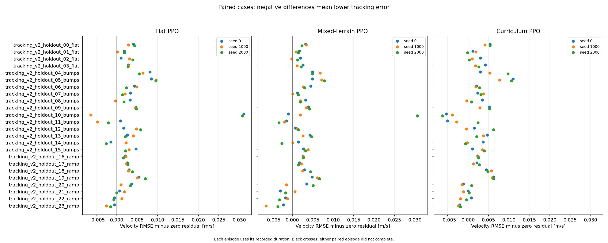
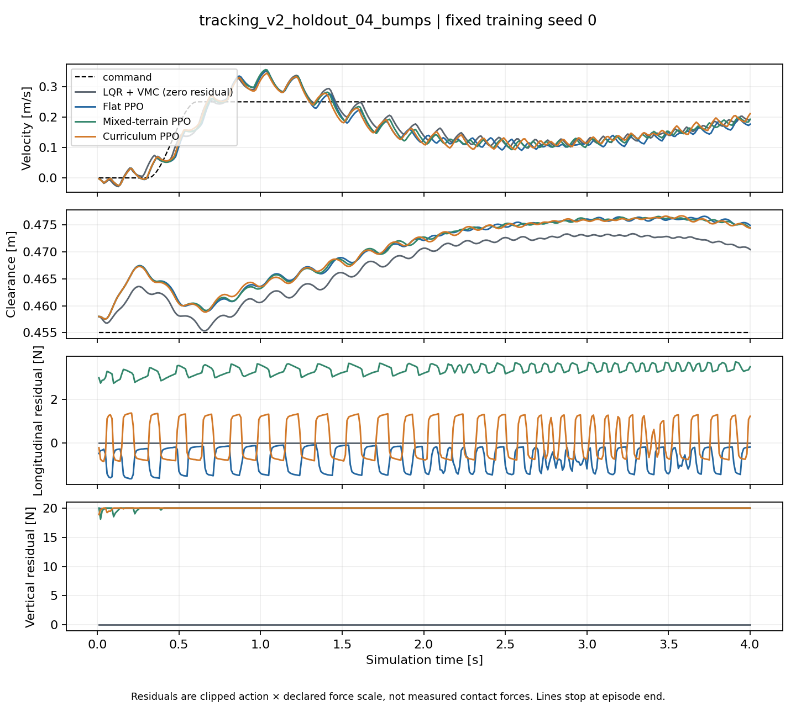

# D1 第二版多地形对照

本页的 CSV 和源码归档随 Release 提供，见[下载与复算](../../docs/reproducibility.md)。

9 个 PPO 模型各训练 65536 步，总计 589824 条环境转移；随后完成 240 个配对评测回合。
所有回合都运行到 4 s，最终前进位移均为正。不过，当前结果没有证明 RL 优于共同的经典控制基线。

## 测了什么

控制器为 LQR＋VMC，机身姿态目标随当前位置的地面切线变化。两维 PPO 残差仍限于
±11.25 N 纵向力和 ±20 N 竖直力。地面和机身状态都来自仿真 oracle，没有真实感知或硬件实验。
修改依据及奖励检查见[学习记录](../../docs/terrain_tracking_v2.md)。

平地、直接混合地形、四阶段课程各训练 seed 0、1000、2000。三组使用相同 PPO 设置和
0.01 奖励尺度，均取固定预算结束的 checkpoint，没有按评测成绩挑选。训练奖励尺度的
[先行 A/B](../d1_terrain_reward_ab_scaled/README.md)也未显示控制收益；采用这个尺度是统一数值单位，
没有把它当成已验证最优的控制参数。

留出集在训练前固定，共 24 个工况：4 个平地，12 个 5/10 mm 起伏，8 个缓坡。
起伏波长为 0.75/0.95/1.15 m，相位为 0.53/2.17；坡度为 ±2.5°/±3.5°。
训练波长仍为 0.8/1.0/1.2 m、坡度仍为 ±2°/±4°，没有为评测改小训练地形。
精确速度、环境 seed 和验收阈值均见 [protocol.json](protocol.json)。

这些是训练范围附近的新参数，不能称为大范围分布外泛化。旧 v1 留出成绩已经公开，本轮没有再把它当盲测。

## 结果

下表误差是各回合 RMSE 的等权均值。RL 组再对三个训练 seed 等权平均；基线每个工况只跑一次，
没有复制成三个独立实验。

| 组别 | 全程速度 RMSE m/s | 最后 1 s RMSE m/s | 高度 RMSE mm | 达标数，按 seed 0 / 1000 / 2000 |
|---|---:|---:|---:|---|
| 零残差 LQR＋VMC | 0.10106 | 0.07003 | 13.32 | 15/24，单次基线 |
| 只训平地 PPO | 0.10444 | 0.07358 | 16.15 | 14/24、14/24、13/24 |
| 直接混合 PPO | 0.10336 | 0.07078 | 16.15 | 14/24、14/24、14/24 |
| 课程 PPO | 0.10324 | 0.06839 | 16.17 | 13/24、14/24、14/24 |

课程组的末段平均速度误差略低，但全程误差更大，任务达标数也少于零残差基线。
三个 seed 不足以支持细小差异的显著性结论。完整逐 seed 数据在 metrics.csv（`metrics.csv`），
没有丢掉较差的种子。



图中负值表示速度 RMSE 更小。所有回合都完整结束，图里没有表示提前终止的黑叉；
这不意味着全部通过了任务门槛。

### 问题集中在哪里

平地和缓坡在全部模型下均达到预设门槛。起伏地形仍有明显速度波动：

| 组别 | 平地达标 | 起伏达标 | 缓坡达标 |
|---|---:|---:|---:|
| 零残差 | 4/4 | 3/12 | 8/8 |
| 只训平地 PPO | 12/12 | 5/36 | 24/24 |
| 直接混合 PPO | 12/12 | 6/36 | 24/24 |
| 课程 PPO | 12/12 | 5/36 | 24/24 |

RL 行按三个 seed 累计，不能把这里的 36 次评测当成 36 个独立训练实验。
240 个回合共 139 个达到任务门槛。其余 101 个都超过末段速度误差上限，其中 10 个还未达到进度比例下限，
没有跌倒或驶出地图。逐回合的失败原因保存在 CSV 的 `quality_failure_reasons`。



这张图固定选协议中的第一个起伏工况及 seed 0，没有按成绩选画面。速度有持续波动，三个 PPO 的
竖直残差也大多贴着 +20 N 上限。对全部评测步统计，竖直动作达到上边界的比例为
平地组 99.993%、混合组 92.330%、课程组 97.753%，以归一化动作 ≥1−1e-7 判断。
这与高度误差增加同时出现，但本轮没有通过单变量实验确认原因。
动作边界和关节力矩限幅是两件事；本轮日志中的关节限矩比例均为 0。

不能把“增加训练地形”或“调整奖励单位”直接写成性能提升。后续应先在开发集测量
Fx/Fz 残差对起伏速度波动的影响，再判断动作定义、姿态参考或价值估计还缺什么。
本轮留出成绩已经读过，继续调参时需要另设留出工况。

## 实际训练曝光

三次课程训练的阶段步数都为 `[17600,16000,16000,15936]`，总和恰为 65536。
阶段只在下一局 reset 生效，所以不等于四个精确的 16384 步。
六个多地形模型都采到了正负 2°、4° 坡道。
每局实际地形、速度和阶段见 `training/*/episode_starts.json`，总计见各模型的 `metadata.json`。

直接混合组从第一局起采用第 3 阶段分布，其累计非平地曝光比课程组更多：坡道更多，起伏反而略少。
这里比较的是完整采样策略，没有单独控制课程顺序。要只研究排序，应固定同一批地形回合后再重排。

训练在 CPU 上以 4 个环境进行。单模型记录的训练时间为 114–190 s，包含 PPO 初始化、采样及更新，
不含向量环境启动和后续评测，也受机器同时运行的任务影响；它不是控制器的真机实时性测量。

## 重跑与核验

在仓库根目录执行，输出路径必须不存在：

```bash
python scripts/run_d1_terrain_curriculum.py --profile tracking-v2 \
  --conditions flat mixed curriculum --reward-scale 0.01 --steps 65536 --envs 4 \
  --seeds 0 1000 2000 --evaluation-split holdout --episode-seconds 4 \
  --output results/my_d1_tracking_v2

MUJOCO_GL=egl python scripts/visualize_d1_terrain_curriculum.py \
  --run results/my_d1_tracking_v2 --output results/my_d1_tracking_v2/figures \
  --render-scenes
```

[源码快照](../d1_terrain_tracking_v2_source/README.md)可以从记录的 HEAD 恢复这轮运行代码，
48 项源码 SHA 已在独立临时索引中核对。运行期间源码没有变化。
[manifest.json](manifest.json)覆盖 316 个原始产物，9 个模型各自记录 SHA；
图表另有 [输入和输出清单](figures/manifest.json)。

[独立复算记录](independent_audit.json)核对了这 316 个产物的 SHA，读取 9 个模型保存的训练步数，
并从每局起点重建了地形曝光计数。另用不导入训练脚本的实现复算 240 份轨迹，
指标最大绝对差为 6.67e-16。所有 RL 评测步都启用了策略，没有门控回退。
这份核验记录是在训练结束后新增的派生文件，不在原 manifest 中；原清单未改。

本地完整回归为 `746 passed`，Ruff 检查通过。测试有 15 条既有 Matplotlib/PyParsing 警告，
包括 Matplotlib 的 3D 投影不可用；本轮二维统计图与 MuJoCo 离屏场景图均已生成并检查。

`figures/baseline_scene_*.png` 是新建仿真中的零残差重放，不是 PPO 策略录像。
它们用于检查实际碰撞地形和模型外观。性能曲线来自保存的逐步评测 CSV。

本轮只验证 4 s 的纵向小起伏和缓坡任务，未覆盖横坡、台阶、跳跃或长期连续行驶。
新模型不能直接装入旧 42 维键盘演示。旧代码和历史负结果保留，避免把不同控制契约的成绩混在一起。
