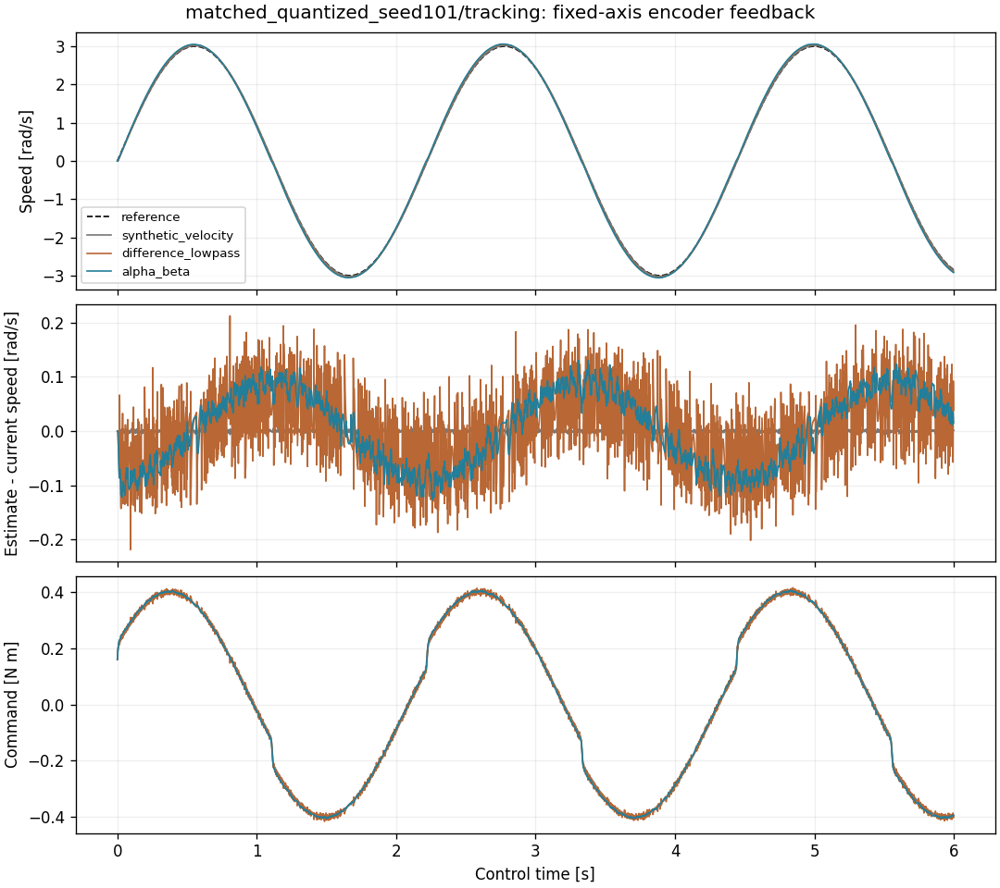
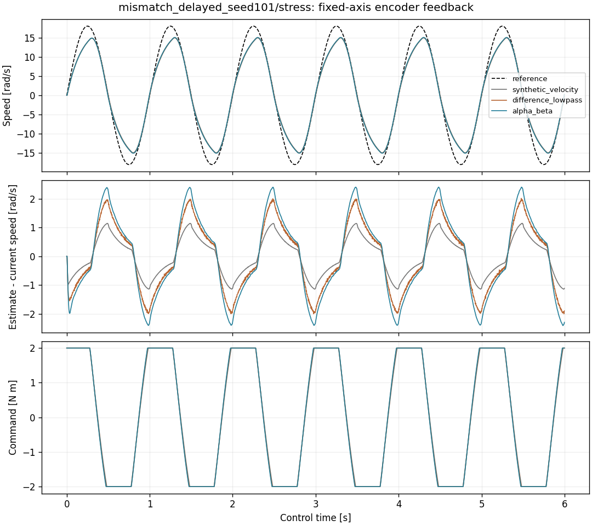

# 位置编码器能否独立支撑单轮速度闭环

162 个固定轴 MuJoCo 案例均运行至 6 s，没有触发速度保护。改用位置反馈后可以闭环，
但在 tracking/reversal 任务中，本次固定滤波参数的速度跟踪误差高于独立合成速度测量参考；
这两类任务加入 10 ms 测量延迟后，三种反馈的误差都增加。stress 任务则出现误差下降、
力矩饱和增加的取舍。本实验没有验证 D1 整机，也没有实现延迟补偿。

## 条件与结果

两个被控对象的惯量、阻尼、平滑摩擦和 4 ms 执行器延迟相同；`mismatch` 额外加入
0.08 N·m Stribeck 摩擦，而拟合模型没有这一项。每个对象只用 seed 89 的两段位置校准轨迹
辨识一次，随后三种反馈共用同一前馈参数与 PI 增益。控制噪声 seeds 为 101、103、107。

下表为 `tracking` 速度 RMSE，单位 rad/s；每格是三个配对噪声 seed 的均值。
它们不是三个独立辨识模型或训练种子。

| 对象 / 测量条件 | 独立速度参考 | 差分低通 | α–β |
|---|---:|---:|---:|
| matched / 位置噪声 | 0.015724 | 0.038917 | 0.056329 |
| matched / 加位置量化 | 0.015724 | 0.038938 | 0.056339 |
| matched / 加 10 ms 延迟 | 0.053745 | 0.090781 | 0.109657 |
| mismatch / 位置噪声 | 0.057213 | 0.087473 | 0.104472 |
| mismatch / 加位置量化 | 0.057213 | 0.087544 | 0.104457 |
| mismatch / 加 10 ms 延迟 | 0.101923 | 0.138439 | 0.157246 |

位置噪声标准差 0.0002 rad；量化步长假设为一圈的 1/4096，**不是 D1 编码器规格**。
独立速度通道标准差为 0.002 rad/s，不承受位置量化，因此不是等效传感器精度对照。
延迟条件则对三个反馈臂施加相同的 10 ms 传输延迟。估计器只接收位置和采样时间，
当前真值速度仅用于日志和评分。

matched 识别到正确的执行器延迟 2 步；mismatch 选到搜索上界 4 步，仍然估错。
两次拟合均报告优化收敛。收敛只描述拟合过程，不能据此断定模型结构正确。
`stress` 各例的力矩饱和率为 55.57%–61.20%；完整运行不能视为跟踪能力通过。
`reversal`、`stress` 的逐例指标也全部保留在结果中，没有从汇总里删除差结果。

## 复现与学习

在仓库根目录、已安装依赖并设置 `PYTHONPATH=src` 的环境运行，输出必须是新目录：

```bash
python scripts/evaluate_encoder_feedback.py --output results/my_encoder_feedback
```

固定协议见 [protocol.json](protocol.json)，全量指标和两次拟合的所有候选见
[summary.json](summary.json)。源码哈希见 [source.json](source.json)，运行结束检查见
[source_consistency.json](source_consistency.json)，生成时产物清单见
[manifest.json](manifest.json)。这份说明是在实验结束后添加的，不在原生成清单中。

原始轨迹按 `对象_条件_seed` 分目录；每个目录含三个命令任务的三种反馈轨迹和三张图。
推导、逐步手算、采样时刻与控制时刻的区别见[编码器闭环学习文档](../../docs/encoder_feedback.md)。




