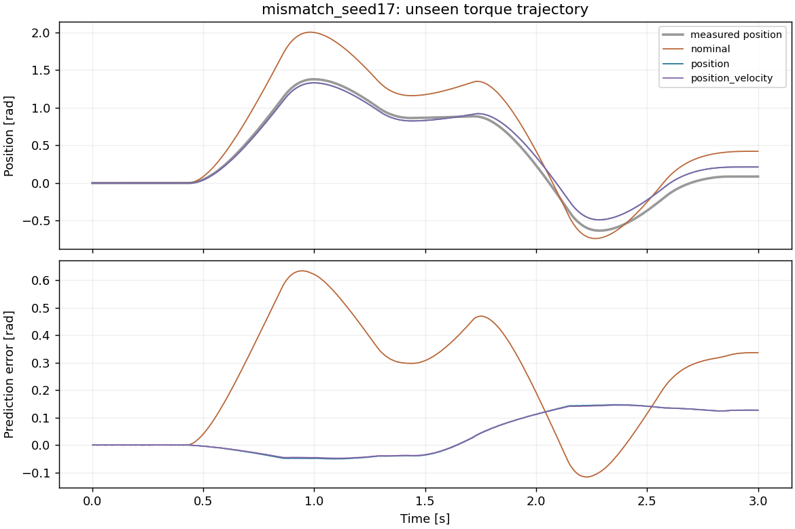
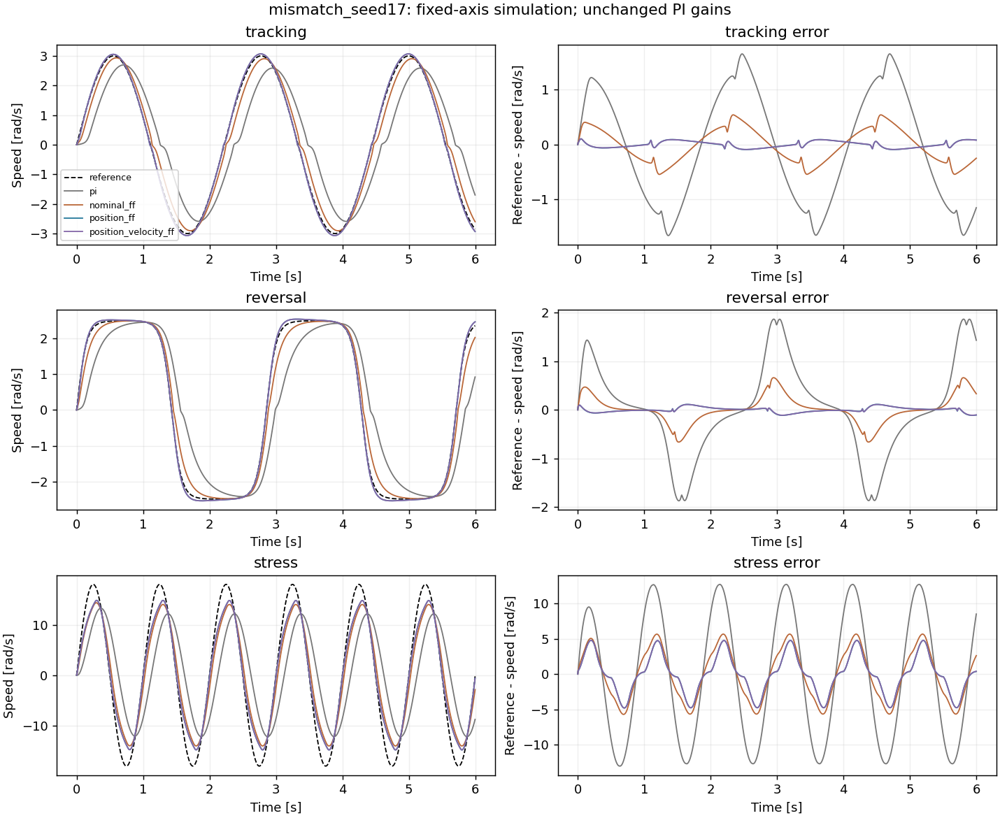

# 位置编码器辨识与单轮前馈对照

2026-09-10。PACE 启发的独立单轮练习，不是 D1 整机实验，也没有新 RL 训练。
仅位置拟合得到的参数在本次两类合成对象上都改善了闭环跟踪；但模型失配时，两种拟合方法
都估错了延迟。不能把曲线改善直接解释成所有物理参数都辨识正确。

方法、已知量、公式和手算例子见[学习文档](../../docs/encoder_identification.md)。
这份报告只描述当前目录的固定实验，不替换旧 q+v 台架或 v0.6.0 的结果。

## 协议与完整性

协议在 [protocol.json](protocol.json)，原始指标在 [summary.json](summary.json)。

- 一个无接触单轮对象，已知负载惯量；物理步长 2 ms，力矩限制 ±2 N·m。
- 隐藏参数为附加惯量 0.017 kg·m²、阻尼 0.105 N·m·s/rad、平滑摩擦 0.043 N·m、
  延迟 2 步。mismatch 对象额外加入 0.08 N·m 的 Stribeck 摩擦，拟合模型没有该项。
- 噪声种子 17、29、43；每条轨迹从已知静止状态、零命令队列重新采集。它们是同一个对象的
  三次噪声重复，不是三个训练 seed，也不代表机器人参数分布。
- 两条 3 s 校准轨迹进入拟合；另外一条 3 s 验证和一条 3 s 留出轨迹完全不参与选参。
  位置噪声标准差 0.0002 rad；q+v 参考多一个标准差 0.002 rad/s 的独立合成速度通道。
- 两方法共享命令、位置、初始速度为零的先验、连续参数范围和初始化；均枚举延迟 0–4 步，
  每个候选最多 30 次 nfev。损失不同，不用校准损失大小比较两方法。
- 四个闭环控制臂共享对象、PI 增益、参考及同拍测量噪声，只改变前馈参数；速度反馈仍是
  独立合成测量。每个臂执行 tracking、reversal、stress 各 6 s。

最终包含 12 次拟合、60 个候选、72 行位置预测指标和 72 个闭环例。72 行预测包含校准
指标，不能全部称为留出结果。所有控制例均执行 3000 步，没有触发速度保护；这只表示跑满
协议，并不代表所有跟踪精度达标。全部 60 个候选报告收敛，原始候选没有筛掉。

## 未见轨迹预测

各单元格为三个噪声 seed 的位置 RMSE 等权均值，单位 rad，排除用于初始化的第一个位置。
q+v 与仅位置都在同一条位置记录上评分。

| 场景 | 整段轨迹 | 标称模型 | 仅位置拟合 | q+v 拟合 |
|---|---|---:|---:|---:|
| matched | validation | 0.229569 | 0.000329 | 0.000330 |
| matched | holdout | 0.293601 | 0.000285 | 0.000282 |
| mismatch | validation | 0.241401 | 0.017503 | 0.016873 |
| mismatch | holdout | 0.319744 | 0.085076 | 0.084441 |

匹配模型下两种拟合的留出误差相近，不能据此宣布仅位置方法更精确。失配时，仅位置
留出误差增至 0.085076 rad；虽优于标称模型，仍有明显的累计偏移。下图固定展示第一个
预声明种子 17，不按成绩选图，其余两种子的图与完整预测都在各自目录。



## 闭环速度跟踪

各单元格为三个噪声 seed 的速度 RMSE 等权均值，单位 rad/s。比较同拍真实速度与参考，
不使用下一拍状态。PI 增益固定为 Kp=0.12、Ki=0.6；未单独给纯 PI 调参，所以此表也不是
最优 PI 与最优前馈的算法排名。

| 场景 | 参考 | 纯 PI | 标称前馈 | 仅位置前馈 | q+v 前馈 |
|---|---|---:|---:|---:|---:|
| matched | tracking | 0.997705 | 0.292234 | 0.015670 | 0.015673 |
| matched | reversal | 0.921996 | 0.275373 | 0.020003 | 0.020005 |
| matched | stress | 8.881115 | 3.641798 | 2.735800 | 2.735815 |
| mismatch | tracking | 1.020689 | 0.306694 | 0.057156 | 0.056649 |
| mismatch | reversal | 0.935545 | 0.282062 | 0.051427 | 0.051005 |
| mismatch | stress | 8.882257 | 3.641824 | 2.726304 | 2.732995 |

在这套固定控制器下，仅位置参数能产生有效前馈。失配对象 tracking 相对标称前馈从
0.306694 降到 0.057156 rad/s；但比匹配对象的 0.015670 rad/s 更差。
这些是单轴跟踪收益，不是整机越障、抗摔或 sim-to-real 成绩。

收益伴随更大的力矩使用。stress 中，标称前馈的请求饱和比例在两个场景均为 43.00%，
仅位置前馈分别为 55.57% 和 56.44%；对应已限幅命令力矩 RMS 从约 1.6041 N·m 增至
1.6892 和 1.6956 N·m。tracking 不饱和，但命令力矩 RMS 也分别从 0.2776/0.2813
增加到 0.2920/0.2983 N·m。力矩 RMS 不是功耗，误差降低不等于更节能。



## 参数估计的边界

匹配场景仅位置拟合的三个 seed 给出：

| 参数 | 隐藏值 | 拟合最小–最大 |
|---|---:|---:|
| 附加惯量 kg·m² | 0.017 | 0.01699912–0.01700173 |
| 阻尼 N·m·s/rad | 0.105 | 0.10494811–0.10504600 |
| 平滑摩擦 N·m | 0.043 | 0.04296071–0.04307316 |
| 延迟，物理步 | 2 | 2–2 |

失配场景仅位置的平均参数则为 0.01724453、0.10739617、0.05112603，三个种子都选择
4 步延迟。q+v 同样选择 4 步；两者均碰到预声明搜索上界，隐藏延迟却仍是 2 步。
这里保留原协议，没有看过留出后加大搜索范围并替换结果。

这与未建模摩擦被其他参数部分吸收的解释一致，但单次实验不能把每个偏差唯一归因到某项
动力学。所有选中解的连续 Jacobian 局部秩都是 3，条件数约 8.72–9.26；局部满秩与求解器
收敛都没有保证延迟正确。前馈只用惯量、阻尼和摩擦，没有逆掉估计延迟。

## 复跑与复算

从仓库根目录运行，输出必须是新目录：

```bash
python scripts/evaluate_encoder_identification.py \
  --output results/my_encoder_identification \
  --seeds 17 29 43 --scenario both --duration 6 \
  --calibration-duration 3 --noise-scale 1 --max-delay-steps 4 --max-nfev 30
```

此次完整流程约 71.30 s，单次拟合约 3.70–4.57 s。执行时同机还运行了回归测试，耗时仅作
本机运行参考，不是隔离性能基准。nfev 不包括数值 Jacobian 的额外回放，不能把相同预算
写成相同总调用数。依赖版本：NumPy 2.2.6、SciPy 1.15.3、MuJoCo 3.12.0、Matplotlib 3.10.6。

完整约 33 MiB 的输入 CSV、逐步 CSV.gz、图、候选和源码快照直接保存在 Git，不需下载
v0.6.0 Release。每个场景目录有两种输入日志、4 条预测记录和 12 条控制记录。
[manifest.json](manifest.json) 覆盖运行生成的 175 个文件；它本身和运行后编写的本 README
不在该清单内。归档的 13 个源码文件在运行前后 SHA-256 一致，见
[source_consistency.json](source_consistency.json)。

运行时基线 HEAD 为 `32f8bbb39aaf0fe2eeb391ecbe45cd846e86e4d0`，工作树未提交。
因此应使用 [source.tar.gz](source.tar.gz) 与 [source.json](source.json) 还原执行源码，
不能把后来的发布提交倒填为实验提交。源码归档不包含第三方依赖，应同时保留上述环境版本。

手工检查一个闭环 RMSE，不需要导入仿真器：

```python
import csv
import gzip
import math

path = "results/encoder_identification_position_only/mismatch_seed17/tracking_position_ff.csv.gz"
with gzip.open(path, "rt") as stream:
    rows = list(csv.DictReader(stream))
error = [
    float(r["reference_velocity_rad_s"]) - float(r["actual_velocity_rad_s"])
    for r in rows
]
print(len(rows), math.sqrt(sum(e * e for e in error) / len(error)))
```

学习上的下一步是先解释失配时的参数偏移，再用新协议检验不同负载、激励和传感器条件。
本次没有电机电流采集、真实编码器辨识、接触建模，也没有证明对其他电机或 D1 整机有效。
