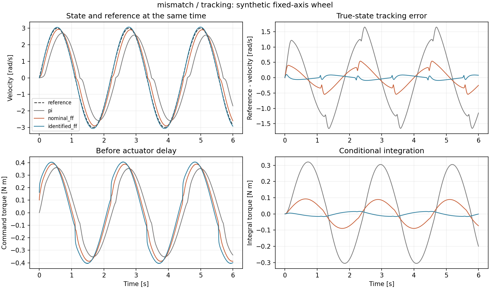
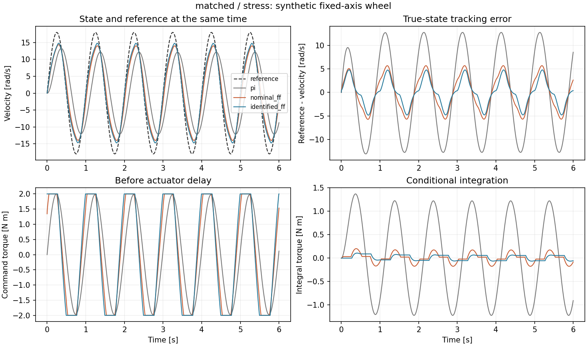

# 单轮 PI 与辨识前馈：固定配置闭环对照

这是悬空固定轴单轮的合成实验。相同 PI 增益下，比较不加前馈、名义模型前馈和日志辨识
模型前馈；不是整机 D1、轮地滚动或实机验证。实验和逐行检查方法见
[单轮闭环学习文档](../../docs/wheel_control_lab.md)。

## 运行设置

```bash
PYTHONPATH=src:.local-deps python3 scripts/evaluate_wheel_control.py \
  --output results/my_wheel_control
```

本目录使用脚本默认设置：seed 17；两条标定曲线各 3 s，闭环每回合 6 s，dt=2 ms；
kp=0.12、ki=0.6、限矩 ±2 Nm。三组共享参考、对象真值、测量噪声和初始状态。拟合只读取
两条标定 CSV，闭环输出不参与参数选择。三条参考和增益在本次正式评测前确定，未按对照
收益调整。完整参数和源文件 SHA 见 [experiment.json](experiment.json)。

共 18 回合全部完成，各保存 3000 个物理步，没有触发 30 rad/s 保护阈值。这里的“完成”
仅指完整执行轨迹，不代表误差达到了某个控制性能门槛。

## 速度 RMSE，rad/s

数值由 [metrics.csv](metrics.csv) 四舍五入得到。主指标是同一时刻的参考与仿真真值
之差，包含起步，未删样本。

| 对象 | 参考 | PI | 名义前馈 | 辨识前馈 |
| --- | --- | ---: | ---: | ---: |
| 同结构 | 正常跟踪 | 0.99769 | 0.29222 | 0.01572 |
| 同结构 | 换向 | 0.92199 | 0.27536 | 0.02000 |
| 同结构 | 饱和压力 | 8.88113 | 3.64180 | 2.73580 |
| 额外低速摩擦 | 正常跟踪 | 1.02067 | 0.30667 | 0.05681 |
| 额外低速摩擦 | 换向 | 0.93554 | 0.28205 | 0.05111 |
| 额外低速摩擦 | 饱和压力 | 8.88227 | 3.64183 | 2.73292 |

两组带前馈控制均改善了这组固定配置的跟踪误差。名义前馈与辨识前馈的对照说明，更换
标定参数在这批工况下带来了进一步改善；这不等于辨识优于所有经过专门整定的 PI 配置。



### 误差降低伴随更长的限幅时间

同结构对象的饱和工况中，名义前馈限幅比例为 43.00%，辨识前馈为 55.57%；命令力矩 RMS
分别为 1.60408、1.68922 Nm。含额外摩擦时，两组限幅比例为 43.00%、56.37%。
前馈没有创造额外力矩，峰值 18 rad/s 的参考仍跟不上，不能把这一工况描述为精确跟踪。

PI 组在该固定增益下没有触发限幅，但跟踪误差更大。限幅次数少本身不是控制性能更好的
证据；仍需一起看速度、相位和输出力矩。积分冻结比例也不等同于最终限幅比例。



### 参数拟合仍有边界

两种对象所选候选均满足优化器停止条件，连续参数没有触及搜索边界。同结构对象辨识出
2 步延迟，与合成对象的 4 ms 一致；额外摩擦对象选中 4 步，即搜索上限 8 ms，而其真实
延迟仍是 4 ms。这符合简化模型可能用其他参数吸收结构误差的现象，不能解释成测到了更长
的真实通信延迟。本实验没有使用估计延迟进行逆补偿。

## 文件与复核

每个 `matched/`、`mismatch/` 目录保留两条标定 CSV、全部拟合候选、九条闭环 CSV 和三张
图。先打开 `tracking_identified_ff.csv` 检查误差和 P/I/前馈分量，再读
`stress_identified_ff.csv` 的积分冻结与延迟后的实际力矩。所有汇总值都能由 CSV 重算。

[manifest.json](manifest.json) 覆盖运行生成的 33 个文件，不含清单自身及运行后撰写的本
README。源文件当时有未提交修改，不能仅用 HEAD 复现；应同时核对 `source_sha256`。
本次只有一套未知参数和一个噪声 seed，没有统计泛化结论。旧离线辨识结果保持不变。

本轮验收：全仓库 522 项测试通过，包含新增控制器 61 项、闭环协议 29 项和 PPO 更新
45 项检查。33 个控制产物与 6 个源文件 SHA 均匹配；另从 54000 行正式日志重算了全部
18 回合 RMSE。全仓库 Ruff 检查通过。测试产生的 15 条警告来自本机既有 Matplotlib
依赖，二维结果图已人工查看；这里不依赖其不可用的 3D projection。
